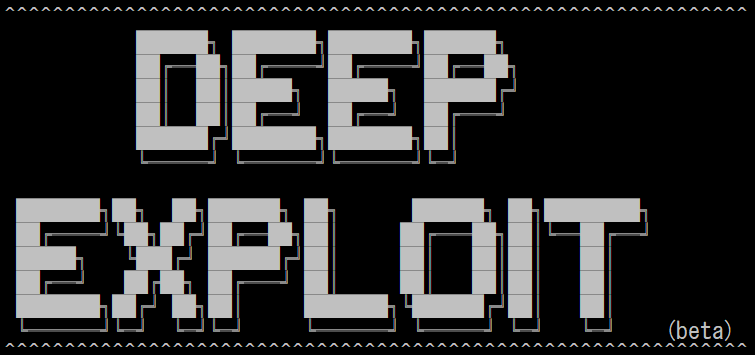
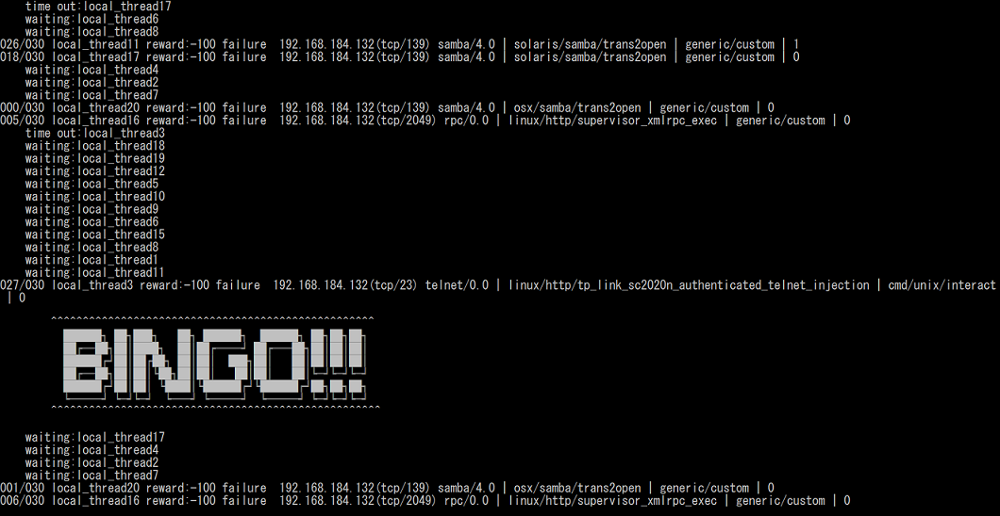
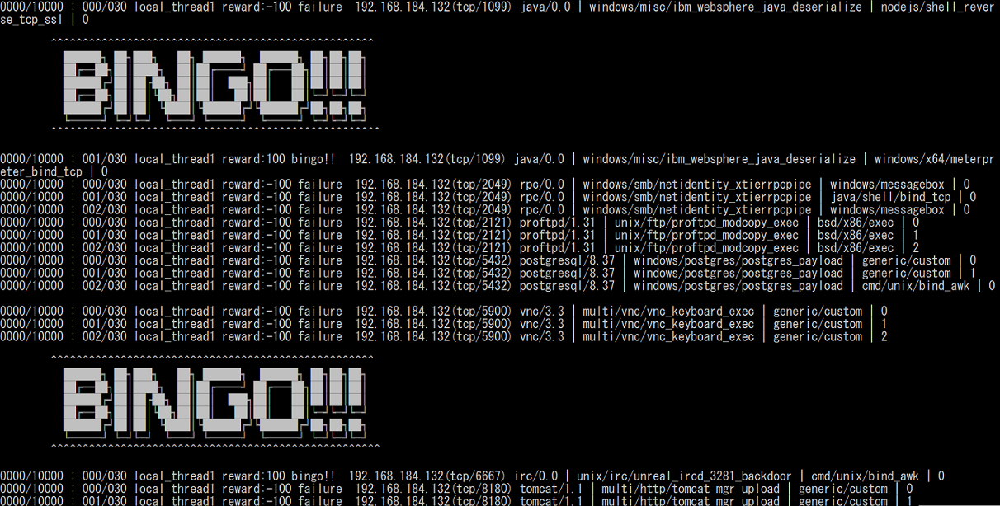

# Deep Exploit



Deep Exploit is **fully automated penetration tool** linked with Metasploit.  
Deep Exploit's key features are following.  

 * **Execute "Exploit" at pinpoint**.  
 Deep Exploit doesn't execute useless "Exploit".  
 It executes "Exploit" at pinpoint (minimum 1 attempt).  
 * **Operation is very easy**.  
 You only need to execute the command once.  
 It is very easy!!  
 * **Self-learning**.  
 No need learning data.  
 Deep Exploit can learn method of exploitation using Metasploit by itself (uses Reinforcement learning).  
 * **Learning time is very fast**.  
 Deep Exploit is distributed learning by multi agents.  
 So, I adopted an advanced machine learning model called [A3C](https://arxiv.org/pdf/1602.01783.pdf).  

Current Deep Exploit is a beta version.  
Deep Exploit beta can execute following.  

 * Intelligence gathering.  
 * Threat modeling.  
 * Vulnerability analysis.  
 * Exploitation.  

But, it cannot execute following.  
These are future works.  

 * Post-Exploitation.  
 * Assessment of asset value.  
 * Reporting.  

### System overview


### System component


### Usage
#### Step.1 Launch Metasploit Framework
You launch Metasploit on the remote server that installed Metasploit Framework such as Kali Linux.
```
root@kali:~# msfconsole
______________________________________________________________________________
|                                                                              |
|                   METASPLOIT CYBER MISSILE COMMAND V4                        |
|______________________________________________________________________________|
     \\                                  /                      /
      \\     .                          /                      /            x
       \\                              /                      /
        \\                            /          +           /
         \\            +             /                      /
          *                        /                      /
                                  /      .               /
   X                             /                      /            X
                                /                     ###
                               /                     # % #
                              /                       ###
                     .       /
    .                       /      .            *           .
                           /
                          *
                 +                       *

                                      ^
####      __     __     __          #######         __     __     __        ####
####    /    \\ /    \\ /    \\      ###########     /    \\ /    \\ /    \\      ####
################################################################################
################################################################################
# WAVE 4 ######## SCORE 31337 ################################## HIGH FFFFFFFF #
################################################################################
                                                          https://metasploit.com


      =[ metasploit v4.16.15-dev                         ]
+ -- --=[ 1699 exploits - 968 auxiliary - 299 post        ]
+ -- --=[ 503 payloads - 40 encoders - 10 nops            ]
+ -- --=[ Free Metasploit Pro trial: http://r-7.co/trymsp ]

msf >
```

#### Step.2 Launch RPC Server
You launch RPC Server of Metasploit following.
```
msf> load msgrpc ServerHost=192.168.220.144 ServerPort=55553 User=test Pass=test1234
[*] MSGRPC Service: 192.168.220.144:55553
[*] MSGRPC Username: test
[*] MSGRPC Password: test1234
[*] Successfully loaded plugin: msgrpc
```
 * ServerHost  
 Your Server IP address.
 * ServerPort  
 Any port number.
 * User  
 Any user name using authentication (default => msf)
 * Pass  
 Any password using authentication (default => random string)

#### Step.3 Train Deep Exploit
You execute Deep Exploit with training mode on the client machine.
```
local@client:~$ python DeepExploit.py -t 192.168.184.132 -m train
```
 * command options  
   * -t  
   IP address of training vulnerable host such as Metasploitable2.  
   * -m  
   Execution mode "train".

 * ex) learning with 20 threads.
 

#### Step.4 Test using trained Deep Exploit
You execute Deep Exploit with testing mode on the client machine.
```
local@client:~$ python DeepExploit.py -t 192.168.184.129 -m test
```
 * command options  
   * -t  
   IP address of test target host.  
   * -m  
   Execution mode "test".

 * ex) testing with 1 thread.
 

## Operation check environment
 * Kali Linux 2017.3 (Guest OS on VMWare)  
   * Memory: 8.0GB  
   * Metasploit Framework 4.16.15-dev  
 * Windows 10 Home 64-bit (Host OS)  
   * CPU: Intel(R) Core(TM) i7-6500U 2.50GHz  
   * Memory: 16.0GB  
   * Python 3.6.1（Anaconda3）  
   * tensorflow 1.4.0  
   * Keras 2.1.2  
   * msgpack 0.4.8
   * docopt 0.6.2

## Licence

[Apache License 2.0](https://github.com/13o-bbr-bbq/machine_learning_security/blob/master/Recommender/LICENSE)

## Author

[Isao Takaesu](https://github.com/13o-bbr-bbq)
