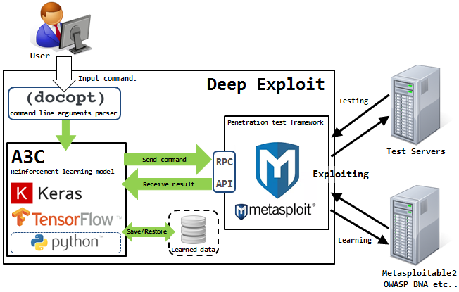
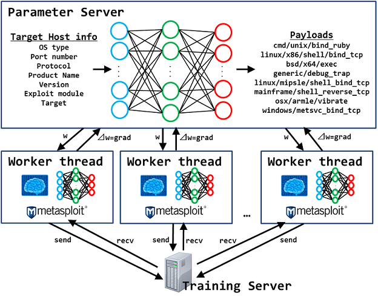
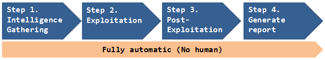

# Deep Exploit
**Fully automatic penetration test tool using Deep Reinforcement Learning.**  

---
### Presentation
 * February 17th,2018: [SECCON YOROZU 2018](https://2017.seccon.jp/news/seccon-yorozu.html)
 * August 9th,2018: [Black Hat USA 2018 Arsenal](https://www.blackhat.com/us-18/arsenal/schedule/index.html#deep-exploit-11908)
 * August 10th,2018: [DEF CON 26! AI Village](https://aivillage.org/posts/accepted-talks/)
 * October 24th,2018: [CSS2018](https://www.iwsec.org/ows/2018/)
 * November 3rd,2018: [AV TOKYO 2018 Hive](http://ja.avtokyo.org/avtokyo2018/event)
 * December 6th,2018: [Black Hat EURO 2018 Arsenal](https://www.blackhat.com/eu-18/arsenal/schedule/#deep-exploit-fully-automatic-penetration-test-tool-using-machine-learning-13320)  

### Cooperation
 * [HITB+ AI Challenge](https://aichallenge.cyberweek.ae/)  
 
### Demonstration
See the [demo page](https://github.com/13o-bbr-bbq/machine_learning_security/wiki/Demo).  

### Documentation (Installation, Usage)
See the project's [wiki](https://github.com/13o-bbr-bbq/machine_learning_security/wiki) for installation, usage and changelog.  

## Overview
DeepExploit is **fully automated penetration test tool** linked with **[Metasploit](https://www.metasploit.com/)**.  

DeepExploit identifies the status of all opened ports on the target server and **executes the exploit at pinpoint using Machine Learning**. It's key features are following.  

 * **Efficiently execute exploit**.  
 DeepExploit can **execute exploits at pinpoint** (minimum 1 attempt) using Machine Learning.  

 * **Deep penetration**.  
 If DeepExploit succeeds the exploit to the target server, it further executes the exploit to other internal servers.  
 
 * **Self-learning**.  
 DeepExploit can learn how to exploitation by itself (uses **Reinforcement Learning**).  
 It is not necessary for humans to prepare learning data.  
 
 * **Learning time is very fast**.  
 Generally, reinforcement learning takes a lot of time.  
 So, DeepExploit uses **distributed learning by multi agents**.  
 We adopted an advanced machine learning model called **[A3C](https://arxiv.org/pdf/1602.01783.pdf)**.  

 * **Powerful intelligence gathering**  
 To gather the information of software operated on the target server is very important for successful the exploitation. DeepExploit can identify product name and version using following methods.  
   * Port scanning  
   * Machine Learning (Analyze HTTP responses gathered by Web crawling)  
   * Contents exploration  

### Abilities of "Deep Exploit".  
 Current DeepExploit's version is a **beta**.  
 But, it can fully automatically execute following actions:  

 * Intelligence gathering.  
 * Threat modeling.  
 * Vulnerability analysis.  
 * Exploitation.  
 * Post-Exploitation.  
 * Reporting.  

### Your benefits.
 By using our DeepExploit, you will benefit from the following.  

 For pentester:  
 (a) They can greatly improve the test efficiency.  
 (b) The more pentester uses DeepExploit, DeepExploit learns how to method of exploitation using machine learning. As a result, accuracy of test can be improve.  

 For Information Security Officer:  
 (c) They can quickly identify vulnerabilities of own servers. As a result, prevent that attackers attack to your servers using vulnerabilities, and protect your reputation by avoiding the negative media coverage after breach.  

 Since attack methods to servers are evolving day by day, there is no guarantee that yesterday's security countermeasures are safety today. It is necessary to quickly find vulnerabilities and take countermeasures. Our DeepExploit will contribute greatly to keep your safety.  

| Note |
|:-----|
| If you are interested, please use them in an environment **under your control and at your own risk**. And, if you execute the DeepExploit on systems that are not under your control, it may be considered an attack and you may have legally liability for your action. |

### System component.  
  

DeepExploit consists of the **machine learning model (A3C)** and **Metasploit**.  
The A3C executes exploit to the target servers via **RPC API**.  

The A3C is developped by Keras and Tensorflow that famous ML framework based on Python. It is used to **self-learn exploit's way** using deep reinforcement learning. The self-learned's result is stored to **learned data that reusable**.  

Metasploit is most famous penetration test tool in the world. It is used to **execute an exploit to the target servers** based on instructions from the A3C.  

#### How to Train?  
  

DeepExploit learns how to exploitation by itself using advanced machine learning model called A3C.  

The A3C consists of **multiple neural networks**.  
This model receives the **training server information** such as the OS type, product name, product version, etc as inputs of neural network, and outputs the **payload** according to the input information. The point is, exploitation is successful when this model **outputs a optimal payload according to the input information**.  

In training, this model **executes more than 10,000 exploits** to the training servers via Metasploit while **changing the combination of the input information**. This model is **updating the weights** of the neural network according to the **exploitation results (rewards)**, which will **gradually optimized the neural network**.  

After training, this model can **output the optimal payload** according to the input information.  
In order to shorten the training time, training is executed by **multithreading**.  

Therefore, **learning by using various training servers**, DeepExploit can execute accurate exploit according to various situations.  
So, DeepExploit uses training servers such as metasploitable3, metasploitable2, owaspbwa for learning.  

 * ex) Training servers  
 [metasploitable2](https://sourceforge.net/projects/metasploitable/files/Metasploitable2/)  
 [metasploitable3](https://github.com/rapid7/metasploitable3)  
 [others](https://www.vulnhub.com/)  

---

## Processing flow
  

### Step 1. Intelligence Gathering.  
 * Intelligence Gathering movie.  
 [](http://www.youtube.com/watch?v=ZJFrpgwV5go)

#### Port scan
DeepExploit gathers the target server information such as **OS type**, **Opened port**, **Product name**, **Product version** using **[Nmap](https://nmap.org/)**. As a Nmap result, DeepExploit can extract below information.  

 * ex) Nmap result.  

 | Idx | OS    | Port# | product | version |
 |:---:|:-----:|:-----:|:-------:|:-------:|
 | 1   | Linux | 21    | vsftpd  | 2.3.4   |
 | 2   | Linux | 22    | ssh     | 4.7p1   |
 | 3   | Linux | 23    | telnet  | -       |
 | 4   | Linux | 25    | postfix | -       |
 | 5   | Linux | 53    | bind    | 9.4.2   |
 | 6   | Linux | 80    | apache  | 2.2.8   |
 | 7   | Linux | 5900  | vnc     | 3.3     |
 | 8   | Linux | 6667  | irc     | -       |
 | 9   | Linux | 8180  | tomcat  | -       |

#### Examination of Web ports  
As a Nmap result, if web ports such as 80, 8180 are opened, then the DeepExploit executes below examination.  

 1. Contents discovery.  
 By the DeepExploit executes contents exploration, it can identify Web products using found product's default contents.  

 ex) Contents exploration result.  

 | Idx | Port# | found content             | product    |
 |:---:|:-----:|:-------------------------:|:----------:|
 | 1   | 80    | /server-status            | apache     |
 | 2   | 80    | /wp-login.php             | wordpress  |
 | 3   | 8180  | /core/misc/drupal.init.js | drupal     |
 | 4   | 8180  | /CFIDE/                   | coldfusion |

 2. Analysis of HTTP responses.  
 The DeepExploit gathers numerous HTTP responses from Web Apps on the Web Port using [Scrapy](https://scrapy.org/).  
 And, by the DeepExploit analyzes gathered HTTP responses using Signature (string matching pattern) and Machine Learning, it can identify Web products.  

 HTTP response sample is below.  

 ```
 HTTP/1.1 200 OK
 Date: Tue, 06 Mar 2018 06:56:17 GMT
 Server: OpenSSL/1.0.1g
 Content-Type: text/html; charset=UTF-8
 Set-Cookie: f00e68432b68050dee9abe33c389831e=0eba9cd0f75ca0912b4849777677f587;  path=/;
 Etag: "409ed-183-53c5f732641c0"

 …snip…

 <form action="/example/confirm.php">
 ```
 By the DeepExploit uses Signature, it can easily identify two products that **OpenSSL** and **PHP**.  
 ```
 Server: OpenSSL/1.0.1g
 confirm.php
 ```

 It is very easy.  
 In addition, by the DeepExploit uses Machine Learning, it can identify more products that **Joomla!** and **Apache**.  
 ```
 Set-Cookie: f00e68432b68050dee9abe33c389831e=0eba9cd0f75ca0912b4849777677f587;
 ```

 This is feature of Joomla!.  

 ```
 Etag: "409ed-183-53c5f732641c0"
 ```
 This is feature of Apache.  

  Beforehand, by the DeepExploit learned these features using Machine Learning (Naive Bayes), it can identify products that couldn't identify by Signature.  

### Step 2. Exploitation.  
The DeepExploit execute the exploit to the first target server using **trained data** and **identified product information**.  
It can execute exploits at **pinpoint** (minimum 1 attempt).  

If the DeepExploit succeeds the exploitation, then **session will be open between DeepExploit and first target server**.  

### Step 3. Post-Exploitation.  
The DeepExploit executes the pivoting using opened session in Step 2.  
Afterwards, the DeepExploit that do not have direct connection to the internal server can execute exploits **through the first server (=compromised server)**. As a result, the DeepExploit is repeating Step1 to Step3 in the internal server through compromised server.  

### Step 4. Generate report.  
The DeepExploit generates a scan report that **summarizes vulnerabilities**.  
Report sample is below.  

 * ex) Report.  
 

---

## Operation check environment
 * Hardware  
   * OS: Kali Linux 2018.2  
   * CPU: Intel(R) Core(TM) i7-6500U 2.50GHz  
   * GPU: None  
   * Memory: 8.0GB  
 * Software  
   * Metasploit Framework 4.16.48-dev  
   * Python 3.6.5rc1  
   * beautifulsoup4==4.6.0  
   * docopt==0.6.2  
   * Jinja2==2.10  
   * Keras==2.1.6  
   * msgpack-python==0.5.6  
   * numpy==1.13.3  
   * pandas==0.23.0  
   * tensorflow==1.8.0  

---

## More information

[MBSD Blog](https://www.mbsd.jp/blog/20180228.html)  
Sorry, now Japanese only.  
English version is coming soon.  

---

## Reference
* [β-VAE: LEARNING BASIC VISUAL CONCEPTS WITH A CONSTRAINED VARIATIONAL FRAMEWORK](https://openreview.net/references/pdf?id=Sy2fzU9gl&fbclid=IwAR0ToM3wj4gBJFQBkTF-rvD2RKTfmEWyBQ_So-VNZOOHWMbEJLvxxh3VfHw)
* [Understanding disentangling in β-VAE](https://arxiv.org/abs/1804.03599)

---

## Licence

[Apache License 2.0](https://github.com/13o-bbr-bbq/machine_learning_security/blob/master/DeepExploit/LICENSE)

---

## SNS

 * [Slack](https://deepexploit.slack.com/)

## Developer

Isao Takaesu  
takaesu235@gmail.com  
[https://twitter.com/bbr_bbq](https://twitter.com/bbr_bbq)
