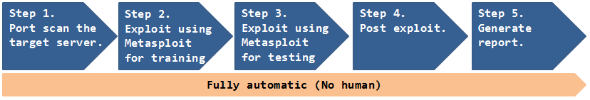
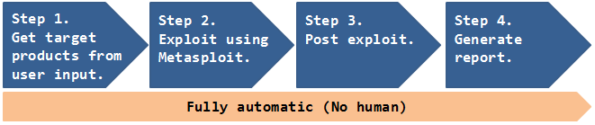

# Deep Exploit
**Fully automatic penetration test tool using Machine Learning.**  

---
**Deep Exploit** at **[Black Hat USA 2018 Arsenal](https://www.blackhat.com/us-18/arsenal/schedule/index.html#deep-exploit-11908)**.  

## Overview
DeepExploit is **fully automated penetration tool** linked with **Metasploit**.  
It has two exploitation modes.  

 * Intelligence mode  
 DeepExploit identifies the status of all opened ports on the target server and **executes the exploit at pinpoint using Machine Learning**.  
 * Brute force mode  
 DeepExploit **executes exploits thoroughly using all combinations of "Exploit module", "Target" and "Payload"** of Metasploit corresponding to user's indicated product name and port number.  

 DeepExploit's key features are following.  

 * **Self-learning**.  
 DeepExploit can learn how to exploitation by itself (uses **reinforcement learning**).  
 It is not necessary for humans to prepare learning data.  
 * **Efficiently execute exploit**.  
 DeepExploit can **execute exploits at pinpoint** (minimum 1 attempt) using self-learned data.  
 * **Deep penetration**.  
 If DeepExploit succeeds the exploit to the target server, it further executes the exploit to other internal servers.  
 * **Operation is very easy**.  
 Your only operation is to input **one command**.  
 It is very easy!!  
 * **Learning time is very fast**.  
 Generally, learning takes a lot of time.  
 So, DeepExploit uses **distributed learning by multi agents**.  
 We adopted an advanced machine learning model called **[A3C](https://arxiv.org/pdf/1602.01783.pdf)**.  

### Abilities of "Deep Exploit".  
 Current DeepExploit's version is a beta.  
 But, it can fully automatically execute following actions:  

 * Intelligence gathering.  
 * Threat modeling.  
 * Vulnerability analysis.  
 * Exploitation.  
 * Post-Exploitation.  
 * Reporting.  

### Your benefits.
 By using our DeepExploit, you will benefit from the following.  

 For pentester:  
 (a) They can greatly improve the test efficiency.  
 (b) The more pentester uses DeepExploit, DeepExploit learns how to method of exploitation using machine learning. As a result, accuracy of test can be improve.  

 For Information Security Officer:  
 (c) They can quickly identify vulnerabilities of own servers. As a result, prevent that attackers attack to your servers using vulnerabilities, and protect your reputation by avoiding the negative media coverage after breach.  

 Since attack methods to servers are evolving day by day, there is no guarantee that yesterday's security countermeasures are safety today. It is necessary to quickly find vulnerabilities and take countermeasures. Our DeepExploit will contribute greatly to keep your safety.  

| Note |
|:-----|
| If you are interested, please use them in an environment **under your control and at your own risk**. |

### System component.  
  

DeepExploit consists of the **machine learning model (A3C)** and **Metasploit**.  
The A3C executes exploit to the target servers via **RPC API**.  

The A3C is developped by Keras and Tensorflow that famous ML framework based on Python. It is used to **self-learn exploit's way** using deep reinforcement learning. The self-learned's result is stored to **learned data that reusable**.  

Metasploit is most famous penetration test tool in the world. It is used to **execute an exploit to the target servers** based on instructions from the A3C.  

---

## Processing flow
### Intelligence mode
  

#### Step 1. Port scan the training servers.  
DeepExploit gathers information such as **OS**, **opened port number**, **product name**, **protocol** on the target server.  
So, it executes the port scanning to training servers.  
After port scanning, it executes two Metasploit's command (`hosts` and `services`) via RPC API.  

 * ex) The result of `hosts` command.  
 ```
 Hosts
 =====
 
 address          mac                name  os_name  os_flavor  os_sp  purpose  info  comments
 -------          ---                ----  -------  ---------  -----  -------  ----  --------
 192.168.220.145  00:0c:29:16:3a:ce        Linux               2.6.X  server
 ```

DeepExploit gets **OS type** using regular expression from result of `hosts` command.  
In above example, DeepExploit gets OS type as **Linux**.  

 * ex) The result of `services` command.  
 ```
 Services
 ========
 
 host             port  proto  info
 ----             ----  -----  ----
 192.168.220.145  21    tcp    vsftpd 2.3.4
 192.168.220.145  22    tcp    OpenSSH 4.7p1 Debian 8ubuntu1 protocol 2.0
 192.168.220.145  23    tcp    Linux telnetd
 192.168.220.145  25    tcp    Postfix smtpd
 192.168.220.145  53    tcp    ISC BIND 9.4.2
 
 ...snip...
 
 192.168.220.145  5900  tcp    VNC protocol 3.3
 192.168.220.145  6000  tcp    access denied
 192.168.220.145  6667  tcp    UnrealIRCd
 192.168.220.145  8009  tcp    Apache Jserv Protocol v1.3
 192.168.220.145  8180  tcp    Apache Tomcat/Coyote JSP engine 1.1
 
 RHOSTS => 192.168.220.145
 ```

DeepExploit gets other information such as **opened port numbers**, **protocol types**, **product name**, **product version** using regular expression from result of `service` command.  

In above example, DeepExploit gets following information from the target server.  

| Idx | OS    | Port# | Protocol | product | version |
|:---:|:-----:|:-----:|:--------:|:-------:|:-------:|
| 1   | Linux | 21    | tcp      | vsftpd  | 2.3.4   |
| 2   | Linux | 22    | tcp      | ssh     | 4.7p1   |
| 3   | Linux | 23    | tcp      | telnet  | -       |
| 4   | Linux | 25    | tcp      | postfix | -       |
| 5   | Linux | 53    | tcp      | bind    | 9.4.2   |
| 6   | Linux | 5900  | tcp      | vnc     | 3.3     |
| 7   | Linux | 6667  | tcp      | irc     | -       |
| 8   | Linux | 8180  | tcp      | tomcat  | -       |

#### Step 2. Training.  
  

DeepExploit learns how to method of exploitation using advanced machine learning model called A3C.  

The A3C consists of **multiple neural networks**.  
The neural networks takes the information of the training server gathered in Step1 as input and outputs some kinds of **Payload**. And the A3C uses the **output Payload to Exploit to the training server** via Metasploit. In accordance with the result (success / failure) of Exploit, the A3C **updates the weight of the neural network** (parameter related to attack accuracy). By performing the above processing (learning) with a combination of various inputs, an optimum Payload for input information is gradually output.  
In order to shorten the learning time, we execute this processing in **multi threads**.  

Therefore, **learning by using various training servers**, DeepExploit can execute accurate exploit according to various situations.  
So, DeepExploit uses training servers such as metasploitable3, metasploitable2, owaspbwa for learning.  

 * Training servers (one example)  
 [metasploitable2](https://sourceforge.net/projects/metasploitable/files/Metasploitable2/)  
 [metasploitable3](https://github.com/rapid7/metasploitable3)  
 [others](https://www.vulnhub.com/)  

#### Step 3. Testing.  
DeepExploit execute exploit to the testing server **using learned result** in Step2.  
It can execute exploits at **pinpoint** (minimum 1 attempt).  

#### Step 4. Post exploit.  
If DeepExploit succeeds in Exploit of the testing server, it executes **exploit to the internal servers** with the testing server as a springboard.  

#### Step 5. Generate report.  
DeepExploit generates a report that **summarizes vulnerabilities**.  
Report's style is html.  

### Brute force mode
  

#### Step 1. Getting target products.  
DeepExploit receives a target product name list from the user via the console.  
Each product names are separated by "@" mark.  

* ex) Target product name list.  
 ```
 wordpress@joomla@drupal@tikiwiki
 ```

| Note |
|:-----|
| The specified product name must be a name that can be recognized by the Metasploit `search` command. |

#### Step 2. Exploit.  
DeepExploit takes **Exploit modules**, **Targets**, **Payloads** of Metasploit corresponding to the specified products and **executes exploit thoroughly** using all combinations of them.

#### Step 3. Post exploit.  
If DeepExploit succeeds in Exploit of the testing server, it executes **exploit to the internal servers** with the testing server as a springboard.  

#### Step 4. Generate report.  
DeepExploit generates a report that **summarizes vulnerabilities**.  
Report's style is html.  

---

## Installation
#### Step.0 Git clone DeepExploit's repository.  
```
local@client:~$ git clone https://github.com/13o-bbr-bbq/machine_learning_security.git
```

#### Step.1 Install required packages.
```
local@client:~$ cd machine_learning_security/DeepExploit
local@client:~$ python install -r requirements.txt
```

#### Step.2 Change the setting of Keras.
Keras is library of machine learning linked with Tensorflow.  
So, you need to edit Keras config file "`keras.json`" before run Deep Exploit.  

```
local@client:~$ cd "your home directory"/.keras
local@client:~$ vim keras.json
keras.json
{
    "epsilon": 1e-07, 
    "floatx": "float32", 
    "image_data_format": "channels_last", 
    "backend": "tensorflow"
}
```

You rewrite the element of "backend" to "tensorflow".  
Installation is over.  

## Usage
### Common
#### Step.0 Initialize Metasploit DB
Firstly, you initialize metasploit db (postgreSQL) using msfdb command.

```
root@kali:~# msfdb init
```

#### Step.1 Launch Metasploit Framework
You launch Metasploit on the remote server that installed Metasploit Framework such as Kali Linux.
```
root@kali:~# msfconsole
______________________________________________________________________________
|                                                                              |
|                   METASPLOIT CYBER MISSILE COMMAND V4                        |
|______________________________________________________________________________|
     \\                                  /                      /
      \\     .                          /                      /            x
       \\                              /                      /
        \\                            /          +           /
         \\            +             /                      /
          *                        /                      /
                                  /      .               /
   X                             /                      /            X
                                /                     ###
                               /                     # % #
                              /                       ###
                     .       /
    .                       /      .            *           .
                           /
                          *
                 +                       *

                                      ^
####      __     __     __          #######         __     __     __        ####
####    /    \\ /    \\ /    \\      ###########     /    \\ /    \\ /    \\      ####
################################################################################
################################################################################
# WAVE 4 ######## SCORE 31337 ################################## HIGH FFFFFFFF #
################################################################################
                                                          https://metasploit.com


      =[ metasploit v4.16.15-dev                         ]
+ -- --=[ 1699 exploits - 968 auxiliary - 299 post        ]
+ -- --=[ 503 payloads - 40 encoders - 10 nops            ]
+ -- --=[ Free Metasploit Pro trial: http://r-7.co/trymsp ]

msf >
```

#### Step.2 Launch RPC Server
You launch RPC Server of Metasploit following.
```
msf> load msgrpc ServerHost=192.168.220.144 ServerPort=55553 User=test Pass=test1234
[*] MSGRPC Service: 192.168.220.144:55553
[*] MSGRPC Username: test
[*] MSGRPC Password: test1234
[*] Successfully loaded plugin: msgrpc
```

 |msgrpc options|description|
 |:---|:---|
 |ServerHost|IP address of your server that launched Metasploit. Above example is `192.168.220.144`.|
 |ServerPort|Any port number of your server that launched Metasploit. Above example is `55553`.|
 |User|Any user name using authentication (default => msf). Above example is `test`.|
 |Pass|Any password using authentication (default => random string). Above example is `test1234`.|

#### Step.3 Edit config file.
You have to change following value in [`config.ini`](https://github.com/13o-bbr-bbq/machine_learning_security/blob/master/DeepExploit/config.ini)

```
...snip...

[Common]
server_host : 192.168.220.144
server_port : 55553
msgrpc_user : test
msgrpc_pass : test1234

...snip...

[Metasploit]
lhost       : 192.168.220.144
```

 |config|description|
 |:---|:---|
 |server_host|IP address of your server that launched Metasploit. Your setting value `ServerHost` in Step2.|
 |server_port|Any port number of your server that launched Metasploit. Your setting value `ServerPort` in Step2.|
 |msgrpc_user|Metasploit's user name using authentication. Your setting value `User` in Step2.|
 |msgrpc_pass|Metasploit's password using authentication. Your setting value `Pass` in Step2.|
 |lhost|IP address of your server that launched Metasploit. Your setting value `ServerHost` in Step2.|

### Intelligence mode
#### Step.4 Train Deep Exploit
You execute Deep Exploit with training mode on the client machine.

```
local@client:~$ python DeepExploit.py -t 192.168.184.132 -m train
```

 |command options|description|
 |:---|:---|
 |-t, --target |IP address of training vulnerable host such as Metasploitable2.|
 |-m, --mode   |Execution mode "train".|

 * Demo) learning with 10 threads.  
 [](http://www.youtube.com/watch?v=BHJB-gWucp4)

#### Step.5 Test using trained Deep Exploit
You execute Deep Exploit with testing mode on the client machine.

```
local@client:~$ python DeepExploit.py -t 192.168.184.129 -m test
```

 |command options|description|
 |:---|:---|
 |-t, --target |IP address of test target host.|
 |-m, --mode   |Execution mode "test".|

 * Demo) testing with 1 thread.  
 [](http://www.youtube.com/watch?v=lbNj2us4mIw)

#### Step.6 Check scan report
Please check scan report using any web browser.  

```
local@client:~$ firefox "Deep Exploit root path"/report/DeepExploit_report.html
```

### Brute force mode
#### Step.4 Brute force Deep Exploit
You execute DeepExploit with brute force mode on the client machine.

```
local@client:~$ python DeepExploit.py -t 192.168.184.132 -p 80 -s wordpress@joomla@drupal@tikiwiki
```

 |command options|description|
 |:---|:---|
 |-t, --target  | IP address of test target host.         |
 |-p, --port    | Indicate port number of target server.  |
 |-s, --service | Indicate product name of target server. |

 * Demo) Brute force mode.  
 Coming soon!!  

#### Step.5 Check scan report
Please check scan report using any web browser.  

---

## Tips
#### 1. How to change "Exploit module's option".
When Deep Exploit exploits, it uses **default value** of Exploit module options.  
If you want to change option values, please input any value to `"user_specify"` in [`exploit_tree.json`](https://raw.githubusercontent.com/13o-bbr-bbq/machine_learning_security/master/DeepExploit/data/exploit_tree.json) as following.  

```

"unix/webapp/joomla_media_upload_exec": {
    "targets": {
        "0": [
            "generic/custom",
            "generic/shell_bind_tcp",
            "generic/shell_reverse_tcp",

...snip...

        "TARGETURI": {
            "type": "string",
            "required": true,
            "advanced": false,
            "evasion": false,
            "desc": "The base path to Joomla",
            "default": "/joomla",
            "user_specify": "/my_original_dir/"
        },
```
Above example is to change value of `TARGETURI` option in exploit module "`exploit/unix/webapp/joomla_media_upload_exec`" to "`/my_original_dir/`" from "`/joomla`".  

---

## Operation check environment
 * Kali Linux 2017.3 (Guest OS on VMWare)  
   * Memory: 8.0GB  
   * Metasploit Framework 4.16.15-dev  
 * Windows 10 Home 64-bit (Host OS)  
   * CPU: Intel(R) Core(TM) i7-6500U 2.50GHz  
   * Memory: 16.0GB  
   * Python 3.6.1（Anaconda3）  
   * tensorflow 1.4.0  
   * Keras 2.1.2  
   * msgpack 0.4.8
   * docopt 0.6.2

---

## More information

[MBSD Blog](https://www.mbsd.jp/blog/20180228.html)  
Sorry, now Japanese only.  
English version is coming soon.  

---

## Licence

[Apache License 2.0](https://github.com/13o-bbr-bbq/machine_learning_security/blob/master/DeepExploit/LICENSE)

---

## Contact us

Isao Takaesu  
takaesu235@gmail.com  
[https://twitter.com/bbr_bbq](https://twitter.com/bbr_bbq)
