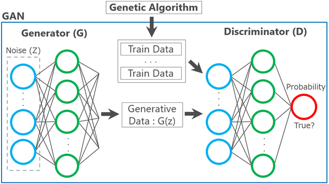

# DeepGenerator
**Fully automatically generate injection codes for web application assessment using Genetic Algorithm and Generative Adversarial Networks.**

---
DeepGenerator can fully automatically generate numerous injection codes for detecting web app vulnerabilities.  
Current version is Proof of Concept. However, it can generate injection codes such as reflected Cross Site Scripting (XSS).  

Following injection codes were generated by DeepGenerator.  
```
<script>al¥u0065rt();</script></tr><th/
<iframe/onload=alert();>size=<command
<video><source onerror=javascript:alert();>kind=
<svg/<canvas/<select/onload=confirm(1);>
<object/src=x onload=alert();¥n<script type="text/javascript">
```

   

Please refer to this [blog](https://www.mbsd.jp/blog/20170921.html) for detail explanation of DeepGenerator.  

## Processing flow
DeepGenerator consists of two algorithms that Genetic Algorithm (GA) and Generative Adversarial Networks (GAN).  
The injection codes are generated in two steps.  

 1. Gather the components of injection codes.  
 2. Create some injection codes using Genetic Algorithm.  
 3. Generate numerous injection codes using Generative Adversarial Networks.  

## Installation
### Step.0 Git clone DeepGenerator's repository.
```
PS C:\> git clone https://github.com/13o-bbr-bbq/machine_learning_security.git
```

### Step.1 Install required python packages.
```
PS C:\> cd machine_learning_security/Generator
PS C:\machine_learning_security\Generator> pip -V
pip 10.0.1 from c:\users\itaka\anaconda3\lib\site-packages\pip (python 3.6)
PS C:\machine_learning_security\Generator> pip install -r requirements.txt
```

### Step.2 Get the web driver for selenium.
[!] I use the Google chrome driver in this example.  

You have to download the [chrome driver](http://chromedriver.chromium.org/downloads) for selenium.  
And you have to move downloaded driver file to `web_drivers` directory.  

```
PS C:\machine_learning_security\Generator> mkdir web_drivers
PS C:\machine_learning_security\Generator> mv chromedriver.exe web_drivers
PS C:\machine_learning_security\Generator> ls .\web_drivers


    Directory: C:\machine_learning_security\Generator\web_drivers


Mode                LastWriteTime         Length Name
----                -------------         ------ ----
-a----       2018/07/27     12:32        6737408 chromedriver.exe
```

### Step.3 Get html checker (tidy).
[!] I use the `tidy 5.4.0 win64` in this example.  

You have to download the [`tidy 5.4.0 win64`](http://binaries.html-tidy.org/).  
And you have to move tidy directory to DeepGenerator root.  

```
PS C:\users\itaka\Downloads> mv tidy-5.4.0-win64 C:\machine_learning_security\Generator\
PS C:\users\itaka\Downloads> ls C:\machine_learning_security\Generator


    Directory: C:\machine_learning_security\Generator


Mode                LastWriteTime         Length Name
----                -------------         ------ ----
d-----       2018/09/18      6:39                .idea
d-----       2018/09/11     16:10                gene
d-----       2018/09/11     14:55                html
d-----       2018/09/10      7:05                img
d-----       2018/09/14     11:46                result
d-----       2018/09/11     14:28                tidy-5.4.0-win64
d-----       2018/09/10      8:02                web_drivers
d-----       2018/09/13      7:46                weight
d-----       2018/09/13     15:19                __pycache__
-a----       2018/09/13     11:36           1477 config.ini
-a----       2018/09/13     15:15          17510 gan_main.py
-a----       2018/09/11     15:41          14595 ga_main.py
-a----       2018/09/11     13:26           3697 generator.py
-a----       2018/09/11     11:30           4911 util.py
```

## Usage
### Step.0 Execute DeepGenerator
```
PS C:\machine_learning_security\Generator> python generator.py
[+] Launched : chrome 68.0.3440.106
[+] 1/10 Create individuals using Genetic Algorithm.
[+] Evaluating html place : body_tag
[+] Create population.
[*] Created individual : [74, 59, 50, 24, 28].
[*] Created individual : [61, 49, 66, 18, 4].
[*] Created individual : [38, 47, 4, 9, 22].

...snip...

[*] Evaluation individual in body_tag: 97/100 in 1 generation
[*] Evaluation individual in body_tag: 98/100 in 1 generation
[*] Evaluation individual in body_tag: 99/100 in 1 generation
[*] Evaluation individual in body_tag: 100/100 in 1 generation
[+] 1 generation result: Min=-1.8, Max=0, Avg=-0.92.
[+] Evaluate individual : 2/1000 generation.
[*] Evaluation individual in body_tag: 1/100 in 2 generation
[*] Evaluation individual in body_tag: 2/100 in 2 generation
```

### Step.1 Check generated injection codes.
```
PS C:\machine_learning_security\Generator> cd result
PS C:\machine_learning_security\Generator\result> ls
```

## Operation check environment
* Hardware  
  * OS: Windows 10  
  * CPU: Intel(R) Core(TM) i7-6500U 2.50GHz  
  * GPU: None  
  * Memory: 8.0GB  
* Software  
  * Python 3.6.0  
  * Jinja2==2.10  
  * Keras==2.1.6  
  * numpy==1.13.3  
  * pandas==0.23.0  
  * selenium==3.14.0  

## Licence
[Apache License 2.0](https://github.com/13o-bbr-bbq/machine_learning_security/blob/master/Generator/LICENSE)

## Contact us
Isao Takaesu  
takaesu235@gmail.com  
[https://twitter.com/bbr_bbq](https://twitter.com/bbr_bbq)
