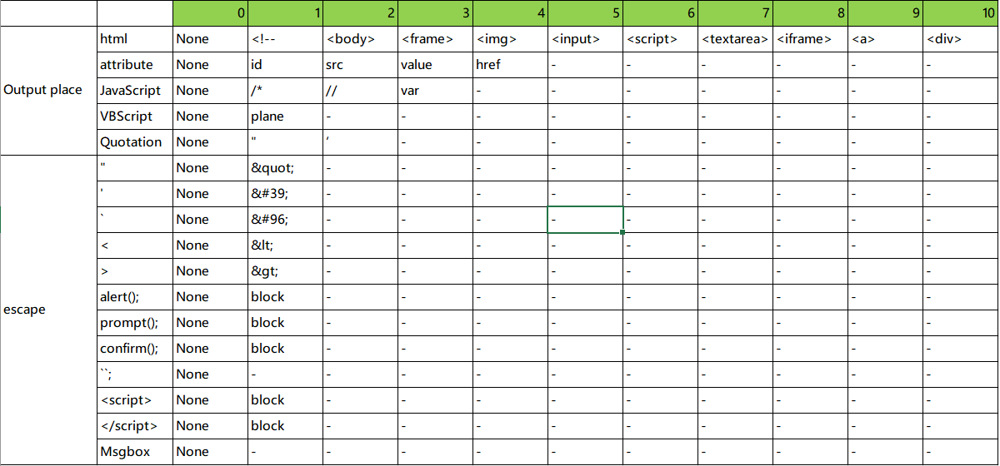

# PyRecommender
**Recommends optimal injection code for you.**

---
PyRecommender can recommend optimal injection code for detecting web app vulnerabilities.  
Current PyRecommender's version is beta, it only supports reflective Cross Site Scripting (RXSS).  

Please refer to this [blog](https://www.mbsd.jp/blog/20170707.html) for detail explanation of some of this tool.  

### system overview


## Description
PyRecommender has two subsystems.  
 * Investigator
 * Recommender

### Investigator
**Investigator** investigates possibility of vulnerability while crawling target web apps. In the detail, it sends crafted HTTP requests to each query parameters. And, it vectorizes output places of parameter values and escaping type of symbols / script strings for RXSS.

### Recommender
**Recommender** computes recommended optimal injection code using vectorized values by Investigator and recommends it to you.  
By the way, Recommender has recommendation engine realized by **Machine learning (Multilayer perceptron)**.  

#### Running example
```
Recommender> python main.py http://192.168.0.6/
Using Theano backend.
Using gpu device 0: GeForce GTX 965M (CNMeM is disabled, cuDNN 5110)

target url: http://192.168.0.6/xss/reflect/onmouseover_unquoted?in=changeme5, parameter: in
feature: [5, 3, 0, 0, 1, 1, 1, 0, 0, 0, 0, 0, 0, 0, 1, 1, 0]
Loading learned data from recommender.h5
('126', 0.78671795)
('5', 0.18429208)
('53', 0.019127412)
Elapsed time  :2.6320002079[sec]

target url: http://192.168.0.6/xss/reflect/onmouseover_div_unquoted?in=changeme6, parameter: in
feature: [10, 5, 0, 0, 1, 1, 1, 0, 0, 0, 0, 0, 0, 0, 1, 1, 0]
Loading learned data from recommender.h5
('130', 0.90387237)
('110', 0.074135423)
('138', 0.0083016483)
Elapsed time  :0.283999919891[sec]
```

Above numbers (130, 110, 126 e.g.,) are corresponding each injection code.  
You have to **train PyRecommender** using such as [this data set](https://github.com/13o-bbr-bbq/machine_learning_security/blob/master/Recommender/train_data/train_xss.csv).  

#### Explanatory variable
##### Output places of parameter values
 |variable|description|
 |:---|:---|
 |op_html|HTML tag types.|
 |op_attr|Attribute types.|
 |op_js|Output places in JavaScript .|
 |op_vbs|Output places in VBScript.|
 |op_quot|Quotation types.|

##### Escaping types
 |variable|description|
 |:---|:---|
 |esc_double|Double quotation (") is Pass (0) or Fail (1).|
 |esc_single|Single quotation (') is Pass (0) or Fail (1).|
 |esc_back|Back quotation (\`) is Pass (0) or Fail (1).|
 |esc_left|Left symbol (<) is Pass (0) or Fail (1).|
 |esc_right|Right symbol (>) is Pass (0) or Fail (1).|
 |esc_alert|Script string (alert();) is Pass (0) or Fail (1).|
 |esc_prompt|Script string (prompt();) is Pass (0) or Fail (1).|
 |esc_confirm|Script string (confirm();) is Pass (0) or Fail (1).|
 |esc_balert|Script string (alert\`\`;) is Pass (0) or Fail (1).|
 |esc_sscript|Script tag (<script>) is Pass (0) or Fail (1).|
 |esc_escript|Script tag (</script>) is Pass (0) or Fail (1).|
 |esc_msgbox|Script tag (Msgbox();) is Pass (0) or Fail (1).|

#### Response variable
 |variable|description|
 |:---|:---|
 |label|label name.|
 |inspection_strings|Inspection strings corresponding each labels.|

PyRecommender converts above features to vectors using predefined convertion table.  
Conversion table is following.  

 .

## Usage
### Train
```
Recommender> python main.py TRAIN
```

 * Demo movie  
 [](https://www.youtube.com/watch?v=V2sqJIfYiKk)

### Recommend
Recommender>python main.py [target url]  
```
Recommender> python main.py http://192.168.0.6/
```
`http://192.168.0.6/` is URL of target web app.  

 * Demo movie  
 [](https://www.youtube.com/watch?v=0PlQM1NwXlw)

## Operation check environment
* Python 2.7.12 (Anaconda2)
* pandas 0.18.1
* requests 2.13.0
* beautifulsoup4 4.5.1 
* numpy 1.12.1
* scikit-learn 0.18.1
* keras 1.1.1

## Licence

[Apache License 2.0](https://github.com/13o-bbr-bbq/machine_learning_security/blob/master/Recommender/LICENSE)

## Contact us

Isao Takaesu  
takaesu235@gmail.com  
[https://twitter.com/bbr_bbq](https://twitter.com/bbr_bbq)
