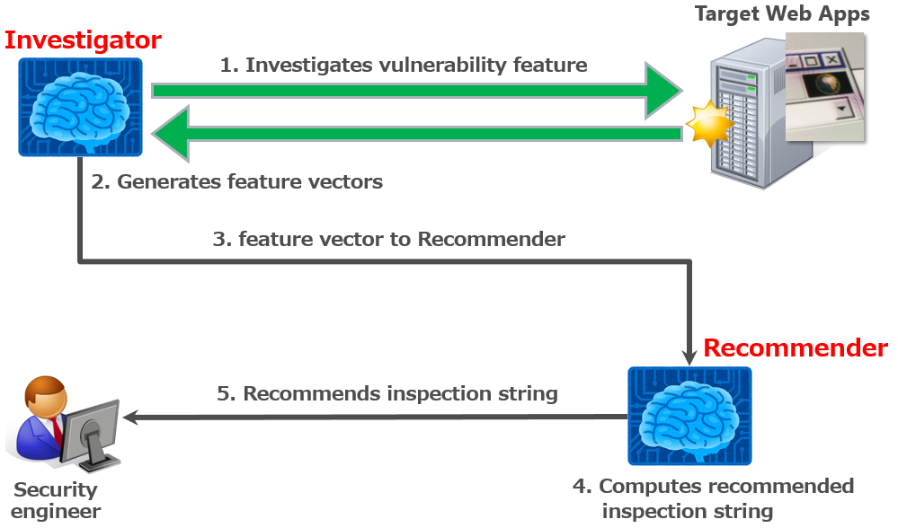

# PyRecommender
**Recommends optimal injection code for you.**

---
PyRecommender can **recommend optimal injection code for detecting web app vulnerabilities**.  
Current PyRecommender's version is beta, it only supports reflective Cross Site Scripting (RXSS).  

Please refer to this [blog](https://www.mbsd.jp/blog/20170707.html) for detail explanation of some of this tool.  

## Description



PyRecommender consists two subsystems.  
 * Investigator
 * Recommender

### Investigator
**Investigator** investigates possibility of vulnerability while crawling target web apps. In the detail, it sends crafted HTTP requests to each query parameters. And, it vectorizes output places of parameter values and escaping type of symbols / script strings for RXSS.

### Recommender
**Recommender** computes recommended optimal injection code using vectorized values by Investigator and recommends it to you. By the way, Recommender has recommendation engine realized by **Machine learning (Multilayer perceptron)**.  

#### Running example
* Training.  
pyRecommender is model of supervised learning.  
So, You have to **train PyRecommender** using training data such as [sample data set](https://github.com/13o-bbr-bbq/machine_learning_security/blob/master/Recommender/train_data/train_xss.csv).  

```
local@client:~$ python main.py TRAIN
Using TensorFlow backend.
[*] Loading train data and Create label.
[*] Training model..
[+] Train samples: 1410
_________________________________________________________________
Layer (type)                 Output Shape              Param #   
=================================================================
dense_1 (Dense)              (None, 50)                900       
_________________________________________________________________
activation_1 (Activation)    (None, 50)                0         
_________________________________________________________________
dropout_1 (Dropout)          (None, 50)                0         
_________________________________________________________________
dense_2 (Dense)              (None, 100)               5100      
_________________________________________________________________
activation_2 (Activation)    (None, 100)               0         
_________________________________________________________________
dropout_2 (Dropout)          (None, 100)               0         
_________________________________________________________________
dense_3 (Dense)              (None, 100)               10100     
_________________________________________________________________
activation_3 (Activation)    (None, 100)               0         
_________________________________________________________________
dropout_3 (Dropout)          (None, 100)               0         
_________________________________________________________________
dense_4 (Dense)              (None, 141)               14241     
_________________________________________________________________
activation_4 (Activation)    (None, 141)               0         
=================================================================
Total params: 30,341
Trainable params: 30,341
Non-trainable params: 0
_________________________________________________________________
Train on 1015 samples, validate on 113 samples
Epoch 1/1000

  32/1015 [..............................] - ETA: 10s - loss: 4.9794 - acc: 0.0000e+00
 416/1015 [===========>..................] - ETA: 0s - loss: 5.0210 - acc: 0.0072     
 832/1015 [=======================>......] - ETA: 0s - loss: 4.9810 - acc: 0.0096
1015/1015 [==============================] - 1s 504us/step - loss: 4.9619 - acc: 0.0108 - val_loss: 4.8834 - val_acc: 0.0088
Epoch 2/1000

  32/1015 [..............................] - ETA: 0s - loss: 4.7992 - acc: 0.0312
 416/1015 [===========>..................] - ETA: 0s - loss: 4.8381 - acc: 0.0168
 768/1015 [=====================>........] - ETA: 0s - loss: 4.8196 - acc: 0.0195
1015/1015 [==============================] - 0s 149us/step - loss: 4.8007 - acc: 0.0177 - val_loss: 4.7378 - val_acc: 0.0000e+00

...snip...

Epoch 999/1000

  32/1015 [..............................] - ETA: 0s - loss: 0.1324 - acc: 0.9375
 480/1015 [=============>................] - ETA: 0s - loss: 0.2703 - acc: 0.8438
 928/1015 [==========================>...] - ETA: 0s - loss: 0.2592 - acc: 0.8491
1015/1015 [==============================] - 0s 124us/step - loss: 0.2593 - acc: 0.8463 - val_loss: 0.2351 - val_acc: 0.8142
Epoch 1000/1000

  32/1015 [..............................] - ETA: 0s - loss: 0.1828 - acc: 0.9688
 480/1015 [=============>................] - ETA: 0s - loss: 0.2484 - acc: 0.8708
 928/1015 [==========================>...] - ETA: 0s - loss: 0.2671 - acc: 0.8610
1015/1015 [==============================] - 0s 121us/step - loss: 0.2708 - acc: 0.8581 - val_loss: 0.2387 - val_acc: 0.8142
[*] Finish training.
[*] Evaluation.
[+] Test loss: 0.3130897362815573
[+] Test acc: 0.7801418448170871
[+] Saved model: "Your environment path"/Recommender/src/../trained_data/recommender.h5
```
* Recommend.  
You can execute pyRecommender after training.  

```
local@client:~$ python main.py https://192.168.220.129/wavsep/active/index-xss.jsp
Using TensorFlow backend.
2018-06-06 14:20:49 [scrapy.utils.log] INFO: Scrapy 1.5.0 started (bot: scrapybot)
2018-06-06 14:20:49 [scrapy.utils.log] INFO: Versions: lxml 3.7.3.0, libxml2 2.9.4, cssselect 1.0.3, parsel 1.4.0, w3lib 1.19.0, Twisted 17.5.0, Python 3.6.1 |Anaconda custom (64-bit)| (default, May 11 2017, 13:25:24) [MSC v.1900 64 bit (AMD64)], pyOpenSSL 17.0.0 (OpenSSL 1.0.2o  27 Mar 2018), cryptography 1.8.1, Platform Windows-7-6.1.7601-SP1

...snip...

2018-06-06 14:20:58 [scrapy.core.engine] DEBUG: Crawled (200) <GET https://192.168.220.129/wavsep/active/Reflected-XSS/RXSS-Detection-Evaluation-GET/index.jsp> (referer: https://192.168.220.129/wavsep/active/index-xss.jsp)
2018-06-06 14:21:04 [scrapy.core.engine] DEBUG: Crawled (200) <GET https://192.168.220.129/wavsep/active/Reflected-XSS/RXSS-Detection-Evaluation-COOKIE-Experimental/index.jsp> (referer: https://192.168.220.129/wavsep/active/index-xss.jsp)
2018-06-06 14:21:05 [scrapy.core.scraper] DEBUG: Scraped from <200 https://192.168.220.129/wavsep/active/Reflected-XSS/RXSS-Detection-Evaluation-GET/index.jsp>

...snip...

[*] Loading train data and Create label.
----------------------------------------------------------------------------------------------------------------------------------
[*] Target url: https://192.168.220.129/wavsep/active/Reflected-XSS/RXSS-Detection-Evaluation-GET/Case02-Tag2TagScope.jsp?userinput=textvalue
Parameter: userinput
[*] Feature: [7, 0, 0, 0, 0, 0, 0, 0, 0, 0, 0, 0, 0, 0, 0, 0, 0]
[*] Loading trained data: C:\Users\i.takaesu\Documents\GitHub\Recommender\src\../trained_data\recommender.h5
[*] Recommended.
[+] Rank	     Injection code	                         Probability
=============================================================================
[+] 1	        </textarea><script>alert();</script>	   0.9992570281028748
[+] 2	        <script>alert();</script>	              0.0006935920100659132
[+] 3	        <script>alert();</script>	              3.7410824006656185e-05
[*] Elapsed time :0.4894998073577881[sec]
----------------------------------------------------------------------------------------------------------------------------------
[*] Target url: https://192.168.220.129/wavsep/active/Reflected-XSS/RXSS-Detection-Evaluation-GET/Case24-Js2ScriptTag.jsp?userinput=1234
Parameter: userinput
[*] Feature: [6, 0, 0, 0, 0, 1, 1, 1, 1, 1, 0, 0, 0, 1, 1, 1, 0]
[*] Loading trained data: C:\Users\i.takaesu\Documents\GitHub\Recommender\src\../trained_data\recommender.h5
[*] Recommended.
[+] Rank	     Injection code	Probability
=============================================================================
[+] 1	        </textarea>	 0.9942600727081299
[+] 2	        src=saivs.js 	                           0.0057328855618834496
[+] 3	        </textarea>	6.2975282162369695e-06
[*] Elapsed time :0.439500093460083[sec]

...snip...
```

Injection codes are displayed in order of recommendation.  
And, `Probability` indicates accuracy of recommendation.  

 |Note|
 |:---|
 |Recommendation's accuracy depend on quality of training data. So, you have to prepare the high quality training data.|

## Training data.
Training data consists of **explanatory variable** and **response variable**.  

#### Explanatory variable
Explanatory variable indicates feature that **behavior of web app**.  
It consists two fields.  

##### 1. Output places of parameter values
This field indicates where the **input parameter value to the web app will be output**.  

 |variable|description|
 |:---|:---|
 |op_html|HTML tag types.|
 |op_attr|Attribute types.|
 |op_js|Output places in JavaScript .|
 |op_vbs|Output places in VBScript.|
 |op_quot|Quotation types.|

##### 2. Escaping types
This field indicates how the **input values are escaped** by the web app.  

 |variable|description|
 |:---|:---|
 |esc_double|Double quotation (") is non-escape (0) or escape (1).|
 |esc_single|Single quotation (') is non-escape (0) or escape (1).|
 |esc_back|Back quotation (\`) is non-escape (0) or escape (1).|
 |esc_left|Left symbol (<) is non-escape (0) or escape (1).|
 |esc_right|Right symbol (>) is non-escape (0) or escape (1).|
 |esc_alert|Script string (alert();) is non-escape (0) or escape (1).|
 |esc_prompt|Script string (prompt();) is non-escape (0) or escape (1).|
 |esc_confirm|Script string (confirm();) is non-escape (0) or escape (1).
 |esc_balert|Script string (alert\`\`;) is non-escape (0) or escape (1).
 |esc_sscript|Script tag (<script>) is non-escape (0) or escape (1).
 |esc_escript|Script tag (</script>) is non-escape (0) or escape (1).
 |esc_msgbox|Script tag (Msgbox();) is non-escape (0) or escape (1).

#### Response variable
The response variable indicates the **answer (injection code) corresponding to the explanatory variable**.  

 |variable|description|
 |:---|:---|
 |label|injection code.|
 |label is expressed number.|Inspection code is expressed string.|

### Conversion rule.
PyRecommender uses the **conversion table** to convert the behavior of the web app into a numerical value.  

 * Conversion table  
 
 ||value|0|1|2|3|4|5|6|7|8|9|10|
 |:---|:---|:---|:---|:---|:---|:---|:---|:---|:---|:---|:---|:---|
 |Place|html tag|None|`<!---->`|`<body>`|`<frame>`|``|`<input>`|`<script>`|`<textarea>`|`<iframe>`|`<a>`|`<div>`|
 ||attribute|None|`id`|`src`|`value`|`href`|-|-|-|-|-|-|
 ||JavaScript|None|`/**/`|`//`|`var`|-|-|-|-|-|-|-|
 ||VBScript|None|plane|-|-|-|-|-|-|-|-|-|
 ||Quotation|None|`"`|`'`|-|-|-|-|-|-|-|-|
 |Escape|`"`|non-escape|escape|-|-|-|-|-|-|-|-|-|
 ||`'`|non-escape|escape|-|-|-|-|-|-|-|-|-|
 ||`|non-escape|escape|-|-|-|-|-|-|-|-|-|
 ||`<`|non-escape|escape|-|-|-|-|-|-|-|-|-|
 ||`>`|non-escape|escape|-|-|-|-|-|-|-|-|-|
 ||`alert();`|non-escape|escape|-|-|-|-|-|-|-|-|-|
 ||`prompt();`|non-escape|escape|-|-|-|-|-|-|-|-|-|
 ||`confirm();`|non-escape|escape|-|-|-|-|-|-|-|-|-|
 ||alert``;|non-escape|escape|-|-|-|-|-|-|-|-|-|
 ||`<script>`|non-escape|escape|-|-|-|-|-|-|-|-|-|
 ||`</script>`|non-escape|escape||-|-|-|-|-|-|-|-|-|
 ||`Msgbox()`|non-escape|escape|-|-|-|-|-|-|-|-|-|

## Installation
#### Step.0 Git clone pyRecommender's repository.
```
local@client:~$ git clone https://github.com/13o-bbr-bbq/machine_learning_security.git
```

#### Step.1 Install required packages.
```
local@client:~$ cd machine_learning_security/Recommender
local@client:~$ python install -r requirements.txt
```

#### Step.2 Change the setting of Keras.
Keras is library of machine learning linked with Tensorflow.  
So, you need to edit Keras config file "keras.json" before run pyRecommender.  

```
local@client:~$ cd "your home directory"/.keras
local@client:~$ vim keras.json
keras.json
{
    "epsilon": 1e-07, 
    "floatx": "float32", 
    "image_data_format": "channels_last", 
    "backend": "tensorflow"
}
```

## Usage
### Train
```
local@client:~$ python main.py TRAIN
```

### Recommend
```
local@client:~$ python main.py TEST "target url of crawling origin."
```

|NOTE|
|:---|
|You must indicate target url that include port number. Example is "http://example.com:80/path/".|

## Operation check environment
* Python 3.6.1 (Anaconda3)
* beautifulsoup4==4.6.0
* Keras==2.1.6
* numpy==1.14.3
* pandas==0.23.0
* requests==2.14.2
* scikit-learn==0.19.0
* Scrapy==1.5.0
* tensorflow==1.8.0

## Licence

[Apache License 2.0](https://github.com/13o-bbr-bbq/machine_learning_security/blob/master/Recommender/LICENSE)

## Contact us

Isao Takaesu  
takaesu235@gmail.com  
[https://twitter.com/bbr_bbq](https://twitter.com/bbr_bbq)
