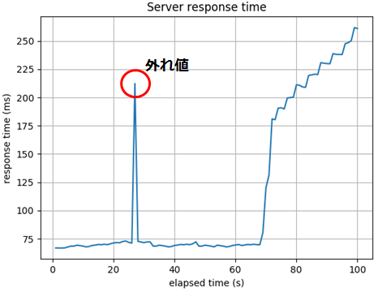
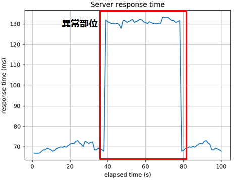
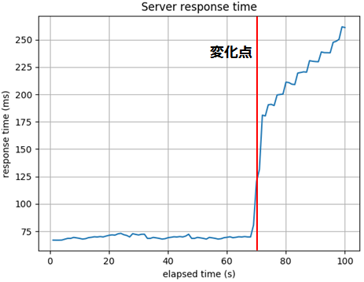
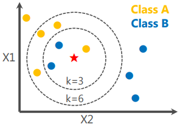
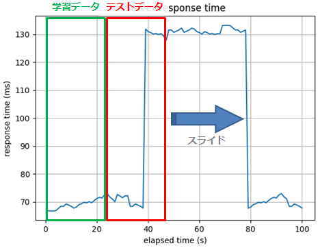

###### 編集中

## 3.0. 目的
本ブログは、**異常検知システムの実装**を通して、**異常検知アルゴリズム**の手法の一つである**K近傍法**を理解することを目的としています。  

## 3.1. 異常検知
**異常検知**（Anomaly Detection）とは、ソフトウエアやセンサー等によって収集された膨大なログを基に、正常時のデータパターンから乖離したパターンを即時または事前に検知する技術です。機器の故障検知やDoSの予兆検知、セキュリティ以外の分野では、消費者の購買パターンの変化を捉えてマーケティングに活かす例等があります。  
異常検知の手法は大きく以下の3つに分類されます。  

 * 外れ値検知  
 通常は起こりえない**データ点**を検知する手法。  
 急激なデータの変化を検知することができる。  

 

 * 異常部位検知  
 異常が起きている**部分時系列**を検知する手法。  
 データ全体から異常が発生している異常部位を検知することができる。  

 

 * 変化点検知  
 時系列データの**パターンが変化する箇所**を検知する手法。  
 データ傾向の変化を検知することができる。  

 

### 3.1.1. 本ブログにおける異常検知のコンセプト
異常検知は様々なタスクに応用できますが、本ブログでは**脆弱性診断対象サーバの異常検知**を例にします。脆弱性診断では、複数スレッドで対象サーバにリクエストを大量送信することでサーバに負荷が掛かり、レスポンス速度が徐々に低下していくことがあります。また、細工した特殊なリクエストを送信することで、サーバ内のアプリケーションがハングアップし、サーバが応答を返さなくなることが起こり得ます。

そこで本ブログでは、このような**突然のレスポンス速度低下**を異常部位検知で、**緩やかなレスポンス速度の低下**を変化点検知で検知します。この2つの検知技術を実現する機械学習アルゴリズムは数多く存在しますが、今回は**K近傍法**と呼ばれるアルゴリズムで実装していきます。  

## 3.2. K近傍法（K Nearest Neighbor）入門の入門
K近傍法は、**各データ間の距離**を利用して、データを予め用意したクラスに**分類**するアルゴリズムです。先ず、学習データをベクトル空間上にプロットし、新たなデータ（分類したいデータ）が得られたら、その地点から距離が近い順に任意の**K個**のデータを取得し、多数決で新たなデータが属するクラスを分類します。  

 

上記の図は、2つの特徴（X1とX2）を持った2クラスのデータをベクトル空間上にプロットした様子を示しており、黄色のデータがクラスA、青色のデータがクラスB、星印のデータが新たに得られた（分類したい）未知のデータです。  

例えば、**K=3**と設定した場合、未知のデータから**距離の近い順**に**3個（K=3）**のデータを取得します。すると、青色データ（クラスB）が2個、黄色データ（クラスA）が1個となるため、2対1の多数決で「**未知のデータはクラスB**です！」と分類されます。  

次に、**K=6**と設定した場合、未知のデータから**距離の近い順に**6個（K=6）**のデータを取得します。すると、黄色データ（クラスA）が4個、青色データ（クラスB）が2個となるため、4対2の多数決で「**未知のデータはクラスA**です！」と分類されます。  

このようにK近傍法では、分類したいデータの近くに「**どのクラスに属するデータが多いのか？**」という単純なタスクを解くことで、未知のデータを何れかのクラスに分類することができます。  
ここで注意が必要なのが、設定する**Kの数により分類結果が異なる**ということです。上述したように、K=3の場合はクラスBに分類されましたし、K=6の場合はクラスAに分類されました。よって、K近傍法を使用する際は、学習データの特性を見極めた上で、**Kを適切に設定**することが重要になります。  

なお、上述した例では、データを2次元（2つの特徴量）のベクトル空間にプロットしましたが、3次元以上（3つ以上の特徴量）でも分類することは可能です。  

以上で、K近傍法/特異スペクトル変換法入門の入門は終了です。  
次節では、これらの手法を使用した異常検知システムの構築手順と実装コードを解説します。  

## 3.3. 異常検知システムの実装
本ブログでは、下記の機能を持つ異常検知システムを構築します。  

 * 対象サーバの**突然の**レスポンス速度低下を検知  
 * 対象サーバの**緩やかな**レスポンス速度低下を検知  

これを実現するために、上述した異常検知手法の1つである「異常部位検知」をK近傍法で実装していきます。  

### 3.3.1. 監視対象のログ
サーバの速度低下を検知するためには、対象サーバのレスポンス速度をリアルタイムで監視する必要があります。本ブログでは、後述するクライアントプログラムが出力する下記形式のログ（CSV）を監視対象とします。  

```
2017-11-30 10:59:07,309:INFO:Response_time:0.006153472933349818
2017-11-30 10:59:07,839:INFO:Response_time:0.015501713315341004
2017-11-30 10:59:08,370:INFO:Response_time:0.016543465025740556
2017-11-30 10:59:08,900:INFO:Response_time:0.017254916596882275
2017-11-30 10:59:09,431:INFO:Response_time:0.01859057944814646
2017-11-30 10:59:09,961:INFO:Response_time:0.01849447517034042
2017-11-30 10:59:10,491:INFO:Response_time:0.017165343677761236
2017-11-30 10:59:11,022:INFO:Response_time:0.01790058805554473
2017-11-30 10:59:11,526:INFO:Response_time:0.017987361820942738
2017-11-30 10:59:12,073:INFO:Response_time:0.018597110806832795

...snip...

2017-11-30 10:59:58,631:INFO:Response_time:0.01800275716642119
2017-11-30 10:59:59,161:INFO:Response_time:0.017817546495109582
2017-11-30 10:59:59,691:INFO:Response_time:0.016603646830773755
2017-11-30 11:00:00,670:INFO:Response_time:0.5057683560336912
2017-11-30 11:00:01,728:INFO:Response_time:0.5166332712076738
2017-11-30 11:00:02,758:INFO:Response_time:0.5162292600203884
2017-11-30 11:00:03,774:INFO:Response_time:0.5164559914719149
2017-11-30 11:00:04,803:INFO:Response_time:0.5171254557372151
2017-11-30 11:00:05,833:INFO:Response_time:0.5169952950891172
2017-11-30 11:00:06,862:INFO:Response_time:0.5175220025145677
```

1カラム目はログを記録した時刻（hh:mm:ss.000）、2カラム目はレスポンス速度（sec）を表しています。  
なお、レスポンス速度は、クライアントがサーバにHTTPリクエストを送信してからレスポンスを受信するまでの時間を計測しています。  

### 3.3.2. ログの監視方法
監視対象ログのタイムスタンプを一定時間間隔でチェックし、タイムスタンプが更新された場合に新たなログが記録されたと判断し、ログからレスポンス速度を取得していきます。  

### 3.2.3. 検証用のクライアント/サーバ
本ブログでは簡易的なクライアントとサーバを使用し、**レスポンス速度に様々な変化を付けたログ**をリアルタイムに生成します。  

#### 検証用サーバ  
サーバはPythonのWebフレームワーク`tornado`で実装しています。  
ポート`8888`で接続を待ち受け、パラメータ「`param`」に設定された値（`normal` or `attack` or `load`）に応じてレスポンス応答時間を調整します。例えば、「`param=normal`」の場合は「`0.01`(sec)」で応答、「`param=attack`」の場合は「`0.5`(sec)」で応答します。また、「`param=load`」の場合は、リクエストを受信する度に「`0.01`(sec)」ずつ応答速度を遅くしていきます。  

* 検証用サーバのコード  

```
#!/bin/env python
# -*- coding: utf-8 -*-
import time
import tornado.httpserver
import tornado.ioloop
import tornado.options
import tornado.web
from tornado.options import define, options
define('port', default=8888, help='run on the given port.', type=int)


class WebHandler(tornado.web.RequestHandler):
    base_time = 0.0

    def get(self):
        param = self.get_argument('param')
        # Normal response time.
        if param == 'normal':
            WebHandler.base_time = 0.01
        # Heavy response time.
        if param == 'attack':
            WebHandler.base_time = 0.5
        # Increasing response time.
        if param == 'load':
            WebHandler.base_time += 0.01
        time.sleep(WebHandler.base_time)

if __name__ == '__main__':
    tornado.options.parse_command_line()
    application = tornado.web.Application([(r'/', WebHandler)])
    http_server = tornado.httpserver.HTTPServer(application)
    http_server.listen(options.port)
    tornado.ioloop.IOLoop.instance().start()
```
※簡易的な実装のため、コードの詳解は行いません。  

#### クライアント  
クライアントも`tornado`で実装しています。  
クライアントは「`0.2`(sec)」間隔でサーバにリクエストを送信し、リクエスト送信からレスポンス受信までの時間を計測し、これをサーバのレスポンス速度としてログに記録します。クライアントは「`REQ_MODE`」で指定されたモードに応じて、送信するパラメータ値を変化させます。例えば、「`REQ_MODE=rapidly`」の場合は「`param=normal`」、「`REQ_MODE=slowly`」の場合は「`param=attack`」をセットします。なお、「`REQ_MODE=complex`」の場合は「`normal`, `rapidly`, `slowly`」を織り交ぜて送信します。  

このように、「`REQ_MODE`」の値を切り替えることで、様々なレスポンス速度が含まれたログを生成することができます。  

 * 検証用クライアント

```
#!/bin/env python
# -*- coding: utf-8 -*-
import sys
import time
import tornado.httpclient
from logging import getLogger, FileHandler, StreamHandler, Formatter

MAX_COUNT = 300
REQ_MODE = 'rapidly'
WAIT_TIME = 0.5
MODE_N = 'normal'
MODE_A = 'attack'
MODE_L = 'load'
LOG_NAME = '..\\log\\server_response.csv'
TARGET = 'http://127.0.0.1:8888/?param='

if __name__ == '__main__':
    # Setting logger.
    logger = getLogger('LoggingMockClient')
    logger.setLevel(20)
    fh = FileHandler(LOG_NAME)
    logger.addHandler(fh)
    sh = StreamHandler()
    logger.addHandler(sh)
    formatter = Formatter('%(asctime)s,%(levelname)s,%(message)s')
    fh.setFormatter(formatter)
    sh.setFormatter(formatter)

    # Pseudo scan.
    value = ''
    for idx in range(MAX_COUNT):
        if REQ_MODE == 'complex':
            if 0 <= idx < 50:
                value = MODE_N
            elif 50 <= idx < 100:
                value = MODE_A
            elif 100 <= idx < 200:
                value = MODE_N
            elif 200 <= idx:
                value = MODE_L
        elif REQ_MODE == 'rapidly':
            if 0 <= idx < 100:
                value = MODE_N
            else:
                value = MODE_A
        elif REQ_MODE == 'slowly':
            if 0 <= idx < 100:
                value = MODE_N
            else:
                value = MODE_L
        else:
            print('Invalid mode.')
            sys.exit(1)

        # Send request, measure response time.
        http_client = tornado.httpclient.HTTPClient()
        start = time.perf_counter()
        response = http_client.fetch(TARGET + value)
        elapsed_time = time.perf_counter() - start
        http_client.close()

        # Logging.
        logger.log(20, 'Response_time:' + str(elapsed_time))

        time.sleep(WAIT_TIME)

    print('finish!!')
```
※簡易的な実装のため、コードの詳解は行いません。  

### 3.2.4. K近傍法による異常部位検知
K近傍法では、学習データと新たなデータ（テストデータ）の距離を計算することで分類することを上述しました。よって、時系列データをリアルタイムに監視してレスポンス速度の正常 or 異常を分類するためには、下図のように学習データの部分時系列とテストデータの部分時系列をそれぞれ抽出し、部分時系列間の距離を計算します。そして、距離が近い場合は正常（レスポンス速度に大きな変化は無し）と判断し、距離が遠い場合は異常（レスポンス速度に大きな変化が有る）と判断することで異常検知を行います。  

　

ここで重要なのが、部分時系列に含まれるデータ数、すなわちウィンドウサイズです。例えばウィンドウサイズが小さい場合は細かな変化を検知できる反面、ノイズを拾い易くなります（False Positive）。一方、ウィンドウサイズが大きい場合はノイズの影響を緩和できる反面、微妙な変化を見逃す可能性が高まります（False Negative）。よって、監視対象のデータ特性に合わせて、適切なウィンドウサイズを決定する必要があります。  

なお、リアルタイムに異常部位検知を行う場合は、新たなデータが得られる度に学習データとテストデータのウィンドウを時系列方向にスライドさせながら、上記の処理を行っていきます。  

これで、監視対象ログの準備と異常検知の方法が整いました。  
次節では実際にサンプルコードを実行し、レスポンス速度の異常を検知できるのか検証します。  

### 3.2.5. サンプルコード及び実行結果
#### 3.2.5.1. サンプルコード
本ブログではPython3を使用し、簡易的な異常検知システムを実装しました。  
本システムの大まかな処理フローは以下のとおりです。  

 1. ログの監視
 2. ログからレスポンス速度を取得
 3. K近傍法による異常部位検知

```
#!/bin/env python
# -*- coding: utf-8 -*-
import os
import time
import datetime
import codecs
import re
import numpy as np
from logging import getLogger, FileHandler, StreamHandler, Formatter
from stat import *
from sklearn.neighbors import NearestNeighbors

# Anomaly detection parameters.
WINDOW_SIZE = 10
RATE_WARNING = 0.5
RATE_ERROR = 0.8
MSG_WARNING = 'Warning'
MSG_ERROR = 'Error'
K = 1

# Surveillance directory and file.
BASE = '..\\'
DIR = BASE + 'log\\'
LOCAL_LOG = 'anomaly_detection.csv'
TARGET_LOG = 'server_response.csv'

# Regulation of Window slide.
max_count = 0
old_count = 0


# Monitor log files.
def watch():
    # Setting logger.
    logger = getLogger('LoggingAnomalyDetection')
    logger.setLevel(20)
    fh = FileHandler(DIR + LOCAL_LOG)
    logger.addHandler(fh)
    sh = StreamHandler()
    logger.addHandler(sh)
    formatter = Formatter('%(levelname)s,%(message)s,%(message)s')
    fh.setFormatter(formatter)
    sh.setFormatter(formatter)

    # Get first timestamp.
    timestamp = time.mktime(datetime.datetime.now().utctimetuple())
    while True:
        for file in os.listdir(DIR):
            if TARGET_LOG in file:
                file_timestamp = os.stat(DIR + file)[ST_MTIME]
                if timestamp < file_timestamp:
                    # Update timestamp.
                    timestamp = file_timestamp

                    # Read log.
                    fin = codecs.open(DIR + file, encoding='utf-8')
                    content = fin.read()
                    fin.close()

                    # Judgement.
                    check_logs(content, logger)
        # Wait.
        time.sleep(0.5)


# Judgement of anomaly detection.
def check_logs(content, logger):
    global max_count
    global old_count
    # Extract response time from log.
    all_res_time = re.findall('Response_time\:(\d{1,100}\.\d{1,100})*', content)
    if len(all_res_time) == 0:
        return

    all_res_time = list(map(float, all_res_time))
    response_time = all_res_time[old_count:]
    response_time = list(map(float, response_time))
    max_count = len(all_res_time)

    # Anomaly detection
    if len(all_res_time) > 0:
        # Abnormal part detection.
        anomaly_detection(response_time, logger)


# Select log step by window size.
def emb(lst, dim):
    emb = np.empty((0, dim), float)
    for idx in range(len(lst) - dim + 1):
        tmp = np.array(lst[idx: idx + dim])[::-1].reshape((1, -1))
        emb = np.append(emb, tmp, axis=0)
    return emb


# Anomaly detection using K-NearestNeighbors.
def anomaly_detection(res_time, logger):
    global max_count
    global old_count
    if len(res_time) < WINDOW_SIZE * 2:
        return

    # Get train data.
    train_data = res_time[0: WINDOW_SIZE]
    train = emb(train_data, WINDOW_SIZE)

    # Get test data.
    test_data = res_time[len(train_data): max_count]
    test = emb(test_data, WINDOW_SIZE)
    old_count += WINDOW_SIZE

    # Fit.
    clf = NearestNeighbors(n_neighbors=K)
    clf.fit(train)

    # Calculate distances.
    distances = clf.kneighbors(test)[0]

    # Judge anomaly detection.
    for d in distances:
        now_date = str(datetime.datetime.now().strftime('%H:%M:%S.%f')[:-3])
        if RATE_WARNING <= d[0] < RATE_ERROR:
            ''' Any notice. ex) posting slack, sending email and terminate scanner. '''
            logger.log(30, now_date, str(d[0]))
        elif RATE_ERROR <= d[0]:
            ''' Any notice. ex) posting slack, sending email and terminate scanner. '''
            logger.log(40, now_date, str(d[0]))
        else:
            logger.log(20, now_date, str(d[0]))

if __name__ == '__main__':
    watch()
```

#### 3.2.5.2. コード解説
今回はK近傍法の実装に、機械学習ライブラリの**scikit-learn**を使用しました。  
※scikit-learnの使用方法は[公式ドキュメント](http://scikit-learn.org/stable/)を参照のこと。  

##### パッケージのインポート
```
from sklearn.neighbors import NearestNeighbors
```

scikit-learnのK近傍法パッケージ「`NearestNeighbors`」をインポートします。  
このパッケージには、K近傍法で分類を行うためのクラスが収録されています。  

##### ログの監視
```
BASE = '..\\'
DIR = BASE + 'log\\'
LOCAL_LOG = 'anomaly_detection.csv'
TARGET_LOG = 'server_response.csv'

...snip...

def watch():

...snip...

    timestamp = time.mktime(datetime.datetime.now().utctimetuple())
    while True:
        for file in os.listdir(DIR):
            if TARGET_LOG in file:
                file_timestamp = os.stat(DIR + file)[ST_MTIME]
                if timestamp < file_timestamp:
                    # Update timestamp.
                    timestamp = file_timestamp

                    # Read log.
                    fin = codecs.open(DIR + file, encoding='utf-8')
                    content = fin.read()
                    fin.close()

                    # Judgement.
                    check_logs(content, logger)
        # Wait.
        time.sleep(0.5)
```

ディレクトリ`log`を`0.5`(sec)間隔で監視し、クライアントが出力するログ`server_response.csv`のタイムスタンプをチェックします（`file_timestamp = os.stat(DIR + file)[ST_MTIME]`）。タイムスタンプが更新されていた場合（新たなログが書き込まれた場合）、ログを読み込んだ上で（`content = fin.read()`）、異常検知の判定メソッド`check_logs`を呼び出します。  

##### 学習データとテストデータのロード
```
# Get train data.
train_data = res_time[0: WINDOW_SIZE]
train = emb(train_data, WINDOW_SIZE)

# Get test data.
test_data = res_time[len(train_data): max_count]
test = emb(test_data, WINDOW_SIZE)
old_count += WINDOW_SIZE
```

新たなデータ（`res_time`）が得られたら、学習データとテストデータの部分時系列を重複しないように抽出します。今回はウィンドウサイズを10（WINDOW_SIZE = 10）に設定したため、学習データとテストデータの部分時系列は「10次元のデータ」になります。  

##### モデルの作成と学習の実行
```
# Fit.
clf = NearestNeighbors(n_neighbors=K)
clf.fit(train)
```

`NearestNeighbors`でK近傍法モデルを作成します。  
今回は学習データとテストデータの部分時系列の距離を計算するため、Kは1としています。  
そして、学習データ「`train`」を`fit`に渡すことで、モデルの学習が行われます。    

##### 学習データとテストデータ間の距離を計算
```
# Calculate distances.
distances = clf.kneighbors(test)[0]
```

上記で作成したモデル「clf」の`kneighbors`の引数にテストデータ「`test`」を渡すことで、学習データとテストデータの各部分時系列間の距離「`distances`」を求める事ができます。  

##### 異常部位の判定
```
for d in distances:
    now_date = str(datetime.datetime.now().strftime('%H:%M:%S.%f')[:-3])
    if RATE_WARNING <= d[0] < RATE_ERROR:
        ''' Any notice. ex) posting slack, sending email and terminate scanner. '''
        logger.log(30, now_date, str(d[0]))
    elif RATE_ERROR <= d[0]:
        ''' Any notice. ex) posting slack, sending email and terminate scanner. '''
        logger.log(40, now_date, str(d[0]))
    else:
        logger.log(20, now_date, str(d[0]))
```

予め定義した閾値（`RATE_WARNING`、`RATE_ERROR`）と距離を比較し、異常部位の検知有無に応じて任意の処理を行います。今回は、現在時刻`now_date`（hh:mm:ss.000）と距離`d[0]`のロギングを行っています。なお、経験則から、距離が`RATE_WARNING = 0.5`以上の場合は**警告**、`RATE_ERROR = 0.8`以上の場合は**エラー（異常検知）**としています。  

#### 3.2.5.3. 実行結果

## 3.3. おわりに

## 3.4. 動作条件
 * Python 3.6.1（Anaconda3）
 * numpy==1.11.3
 * scikit-learn==0.19.0
