## 4.0. 目的
本ブログは、**ログ分析システムの実装**を通して、機械学習アルゴリズムの一つである**K平均法**を理解することを目的としています。  

## 4.1. ログ分析
ログ分析とは、システムに対するユーザの操作やデータ通信の履歴等を記録したログを分析し、不審な操作や通信等を把握する技術です。セキュリティ以外では、Webサイトの閲覧ログを分析し、マーケティングや商品のレコメンドに利用する事例があります。  

ログ分析の手法は数多く存在しますが、本ブログでは**クラスタリング**と呼ばれる手法を用いてログ分析を行います。  

| クラスタリング（Clustering）|
|:--------------------------|
| 様々な属性を持つデータが混ざり合ったデータ群から、**似た性質を持つデータを分けて集める**技術。集められたデータはクラスタと呼ばれる。|

分析対象のログをクラスタリングする事で、膨大なログを**正常データのクラスタ**・**異常（不正操作の疑い）データのクラスタ**等のようなグループに分ける事が可能となります。これにより、ログ分析の作業を大幅に効率化する事ができます。  

以下に、代表的なクラスタリング手法を示します。  

 * 階層的クラスタリング  
 クラスタリング結果を木構造で出力する手法。  
 縦軸はDepth（＝データの類似度）を示し、**浅いデータほど他データとの類似度が低い**ことを示す。  
 下図は階層的クラスタリングの代表的な手法である**Ward法**を用いて、[Iris flower dataset](https://en.wikipedia.org/wiki/Iris_flower_data_set)（3品種のIris「setosa, versicolor, virginica」データが150件含まれたデータセット）をクラスタリングした結果である。  
 
 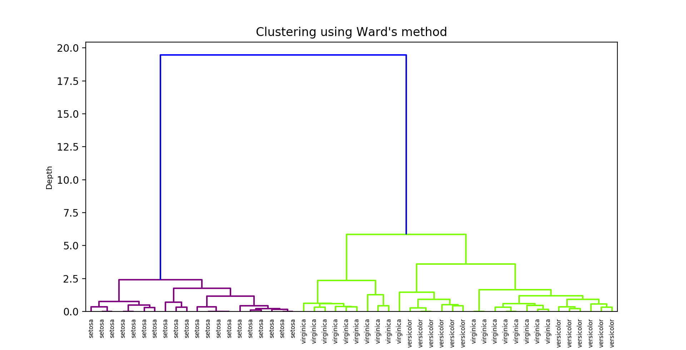  

 紫色の線で示したsetosaは他品種（versicolor, virginia）と比べてデータの特徴が大きく異なるため、完全にクラスタリングされている事が分かる（Depthは**浅い**）。一方、黄緑色の線で示したversicolorとvirginicaはデータの特徴が似ているため、幾つかのデータが混ざり合ってクラスタリングされている事が分かる（Depthは**深い**）。  

 * 非階層的クラスタリング  
 データの特徴量を基に、**予め指定された数のクラスタを作成**する手法。  
 下図は、非階層的クラスタリングの代表的な手法である**K平均法**を用いて、Iris flower datasetを2つの特徴量（petal width(花弁の幅)
 , petal length（花弁の長さ））を基にクラスタリングした結果である。  
 
 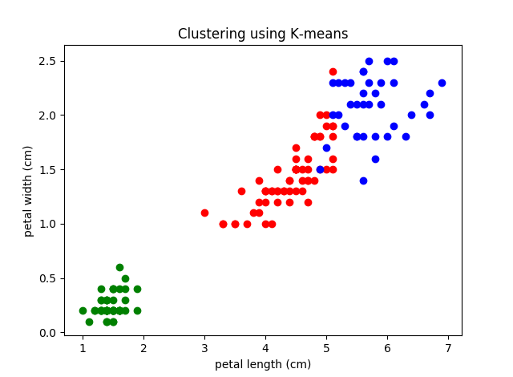  

 紫色はsetosa、黄緑色はversicolor、青色はvirginicaのデータを示している。  
 Ward法の結果と同じく、setosaは他品種と比べてデータの特徴が大きく異なるため、完全にクラスタリングされている事が分かる。一方、versicolorとvirginicaはデータの特徴が似ているため、2つのクラスタ境界が一部重複している事が分かる。  

このように、クラスタリングを行うことで、**膨大なデータを自動的に分類**することができます。  
なお、クラスタリングでできることは**データの自動分類のみ**です。上図では、各クラスタリング手法を分かり易く解説するためにデータの種類（setosa, virsicolor..）に言及していますが、実際には**クラスタリングされた結果を人間等が観察**し、**各クラスタが何のデータを示しているのかを判断**する必要があります。  

### 4.1.1. 本ブログにおけるログ分析のコンセプト
本ブログでは**サーバのアクセスログをクラスタリング**し、ログの中から**攻撃の痕跡を探る**タスクを例とします。  

サーバを運用していると、正常通信だけではなく、**攻撃的な通信**（探索行為やExploit等）が来ることもあります。対策を取らずにこのような通信を放置していると、サーバがダウンしたり、乗っ取られてしまうことも考えられるため、攻撃の有無や攻撃の種類をある程度絞り込んだ上で適切な対策を講じる必要があります。  

そこで本ブログでは、アクセスログを**非階層的クラスタリング**で分析し、**攻撃の有無**や**攻撃の種類**を探る事にします。そして、これを**K平均法**で実装します。  

## 4.2. K平均法（K means Clustering）入門の入門
K平均法は、クラスタの平均を使用し、**予め与えられた数（K）のクラスタを作成**することで、**データを自動分類するアルゴリズム**です。なお、1章から3章で取り上げた機械学習アルゴリズムは教師データを必要とする教師あり学習でしたが、K平均法は教師データを必要としない**教師なし学習**に分類されます。  

| 教師なし学習（Unsupervised Learning）|
|:--------------------------|
| 答え（ラベル）が付与されていないデータ群に対し、データの背後にある本質的な構造（データ構造や法則等）を見つけるための手法。|

ところで、教師データが無いにも関わらず、どのようにしてデータを自動分類するのでしょうか？  
以下、図を用いてクラスタリングの流れを解説していきます。  
なお、本例では「K=3」、データの次元は2次元（＝特徴量は2つ）に設定しています。  

 1. 分類対象データのプロット  
 クラスタリングしたいデータをプロットします。  
 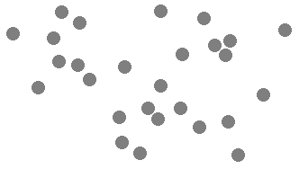  

 2. 重心点の初期値を決定  
 K個の点をランダムに決定します。  
 本例では「K=3」としましたので、3個の重心点（m\[0\], m\[1\], m\[2\]）が選択されます。  
 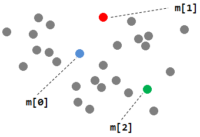  

 3. 初期クラスタの作成  
 重心点以外の各データについて、**最も距離の近い重心点を決定**します。  
 各重心点（m\[0\], m\[1\], m\[2\]）を中心に**3個のクラスタが作成**されます。  
 ※黒い実線はクラスタ境界を示す。  
 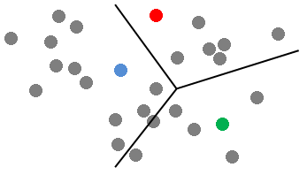  

 4. 重心点の更新  
 **各クラスタ内のデータの平均値**を計算し、**重心点を更新**します。  
 以下のように重心点がが移動します。  
 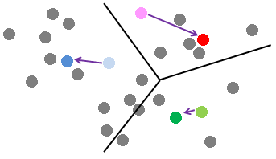  

 5. クラスタの再作成  
 更新された重心点を中心に、クラスタを再作成します。  
 以下のようにクラスタの境界が更新されます。  
 ※破線が古いクラスタ境界、実線は新しいクラスタ境界を示す。  
   
 
 6. 収束条件の確認  
 収束条件（※）を満たしているのか確認します。  
 満たしている場合はクラスタリングを終了します（7）。  
 満たしていない場合は重心点の更新とクラスタ再作成を繰り返します（4～5）。  
 ※収束条件は任意ですが、「クラスタの作成回数が閾値以上」「更新時の重心点の移動距離が閾値以下」等が一般的のようです。  

 7. クラスタリング完了  
 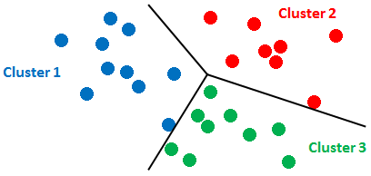  

このように、**重心点の更新とクラスタ再作成**というシンプルな計算を繰り返すことで、データを自動分類することができます。  

なお、K平均法では、Kの数に応じてクラスタ数（＝データ分類のカテゴリ数）が決定されるため、**Kを適切に設定することが重要**です。また、上述したように、K平均法ではデータをクラスタリングするのみであり、**各クラスタの意味**を示すことはできません。よって、各クラスタの意味は人間が分析して判断する必要があります。  

なお、本例では、2次元のデータを使用しましたが、3次元以上（3つ以上の特徴量）のデータでも分類することは可能です。  

| データ間の距離（Distance） |
|:--------------------------|
| ユークリッド距離、コサイン距離、マハラノビス距離等を用いて重心点と他データ間の距離を測定。|

以上で、K平均法入門の入門は終了です。  
次節では、K平均法を使用したログ分析システムの構築手順と実装コードを解説します。  

## 4.3. ログ分析システムの実装
本ブログでは、以下の機能を持ったログ分析システムを構築します。  

 1. アクセスログ内のデータを複数のクラスタに分類可能  
 2. 各クラスタの成分を可視化可能  

本システムは、ログを予め決められた数（K）のクラスタに分類します。  
そして、**各クラスタに含まれるデータの特徴量（以下、成分）をグラフ化**し、後から人間が分析し易い形で出力します。  

### 4.3.1. 分析対象ログの準備
分析対象のアクセスログを準備します。  

本来であれば自社環境で収集したリアルな通信データを使用することが好ましいですが、ここでも[第1章の侵入検知](https://github.com/13o-bbr-bbq/machine_learning_security/blob/master/Security_and_MachineLearning/Chap1_IntrusionDetection.md)と同じく「[KDD Cup 1999](http://kdd.ics.uci.edu/databases/kddcup99/kddcup99.html)」のデータセットを使用します。  

KDD Cup 1999から「kddcup.data_10_percent.gz」をダウンロードし、**42カラム目のラベルを全削除**します。そして、計算時間短縮のため、**データ量を150件程度に削減**します。すると、以下のようなファイル内容となります。  

```
duration,protocol_type,service,flag,src_bytes,dst_bytes,land,wrong_fragment,urgent,hot,num_failed_logins,logged_in,num_compromised,root_shell,su_attempted,num_root,num_file_creations,num_shells,num_access_files,num_outbound_cmds,is_host_login,is_guest_login,count,srv_count,serror_rate,srv_serror_rate,rerror_rate,srv_rerror_rate,same_srv_rate,diff_srv_rate,srv_diff_host_rate,dst_host_count,dst_host_srv_count,dst_host_same_srv_rate,dst_host_diff_srv_rate,dst_host_same_src_port_rate,dst_host_srv_diff_host_rate,dst_host_serror_rate,dst_host_srv_serror_rate,dst_host_rerror_rate,dst_host_srv_rerror_rate
0,tcp,http,SF,181,5450,0,0,0,0,0,1,0,0,0,0,0,0,0,0,0,0,8,8,0,0,0,0,1,0,0,9,9,1,0,0.11,0,0,0,0,0
0,tcp,http,SF,239,486,0,0,0,0,0,1,0,0,0,0,0,0,0,0,0,0,8,8,0,0,0,0,1,0,0,19,19,1,0,0.05,0,0,0,0,0
0,tcp,http,SF,235,1337,0,0,0,0,0,1,0,0,0,0,0,0,0,0,0,0,8,8,0,0,0,0,1,0,0,29,29,1,0,0.03,0,0,0,0,0
0,tcp,http,SF,219,1337,0,0,0,0,0,1,0,0,0,0,0,0,0,0,0,0,6,6,0,0,0,0,1,0,0,39,39,1,0,0.03,0,0,0,0,0
0,tcp,http,SF,217,2032,0,0,0,0,0,1,0,0,0,0,0,0,0,0,0,0,6,6,0,0,0,0,1,0,0,49,49,1,0,0.02,0,0,0,0,0
0,tcp,http,SF,217,2032,0,0,0,0,0,1,0,0,0,0,0,0,0,0,0,0,6,6,0,0,0,0,1,0,0,59,59,1,0,0.02,0,0,0,0,0
0,tcp,http,SF,212,1940,0,0,0,0,0,1,0,0,0,0,0,0,0,0,0,0,1,2,0,0,0,0,1,0,1,1,69,1,0,1,0.04,0,0,0,0

...snip...

162,tcp,telnet,SF,1567,2738,0,0,0,3,0,1,4,1,0,0,1,0,0,0,0,0,1,1,0,0,0,0,1,0,0,4,4,1,0,0.25,0,0,0,0,0
127,tcp,telnet,SF,1567,2736,0,0,0,1,0,1,0,0,0,0,1,0,0,0,0,0,83,1,0.99,0,0,0,0.01,0.08,0,5,5,1,0,0.2,0,0,0,0,0
321,tcp,telnet,RSTO,1506,1887,0,0,0,0,0,1,0,0,0,0,1,0,0,0,0,0,151,1,0.99,0,0.01,1,0.01,0.06,0,6,6,1,0,0.17,0,0,0,0.17,0.17
45,tcp,telnet,SF,2336,4201,0,0,0,3,0,1,1,1,0,0,0,0,0,0,0,0,2,1,0,0,0.5,0,0.5,1,0,7,7,1,0,0.14,0,0,0,0.14,0.14
176,tcp,telnet,SF,1559,2732,0,0,0,3,0,1,4,1,0,0,1,0,0,0,0,0,1,1,0,0,0,0,1,0,0,8,8,1,0,0.12,0,0,0,0.12,0.12
61,tcp,telnet,SF,2336,4194,0,0,0,3,0,1,1,1,0,0,0,0,0,0,0,0,1,1,0,0,0,0,1,0,0,9,9,1,0,0.11,0,0,0,0.11,0.11
47,tcp,telnet,SF,2402,3816,0,0,0,3,0,1,2,1,0,0,0,0,0,0,0,0,1,1,0,0,0,0,1,0,0,10,10,1,0,0.1,0,0,0,0.1,0.1
```

本ファイルは、各行が1つの通信ログを表しており、カラムはログを構成する成分を表します。例えば、`duration`はホストへの接続時間、`dst_host_serror_rate`はSYNエラー率を表します。  

※各特徴量の詳細は[こちら](http://kdd.ics.uci.edu/databases/kddcup99/task.html)を参照してください。  

このファイルを「[kddcup.data_small.csv](https://github.com/13o-bbr-bbq/machine_learning_security/blob/master/Security_and_MachineLearning/dataset/kddcup.data_small.csv)」として保存します。  

### 4.3.2. クラスタ数の決定
普通の人間にはデータを目視して適切なクラスタ数を求めることは不可能ですので、何らかの方法でクラスタ数の目安を付けます。  
目安を付ける方法は複数存在しますが、今回は**シルエット分析**と呼ばれる手法を使用します。  

| シルエット分析（Silhouette Analysis）|
|:--------------------------|
| クラスタ内のサンプル密度（凝集度）を可視化し、**クラスタ間の距離が十分離れている場合に最適なクラスタ数**とみなす。|

以下はクラスタ数を「5」に設定してシルエット分析を行った例を示しています。  

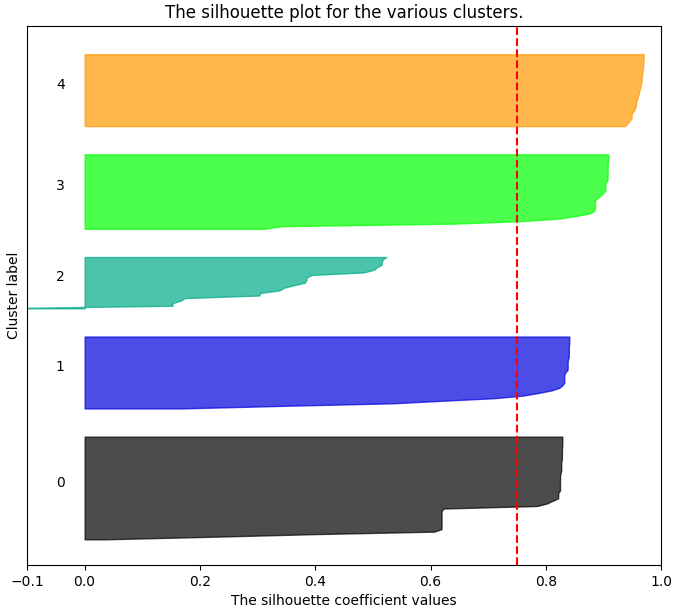

横軸の`The silhouette coefficient values`は**データが近隣のクラスタから離れている度合**を示しています。  
この値は、各クラスタが**上手く分割できていればいるほど1に近似**します（クラスタ数が適切であれば、各クラスタに含まれるデータはある程度離れる事になるため）。  

縦軸の`Cluster label`は**各クラスタのラベル**を示しています。  
各クラスタラベルの横に描かれている**シルエットの幅はクラスタのデータ数**を示しており、分割したい各種類のデータ数が一様と仮定すると**ほぼ同じ幅**になります。  

ちなみに、シルエット分析はscikit-learnを用いる事で簡単に実装できますので、本ブログではコード解説は割愛します。  
コード詳細を知りたい方は[こちら](http://scikit-learn.org/stable/auto_examples/cluster/plot_kmeans_silhouette_analysis.html)をご参照ください。  

#### 4.3.2.1. シルエット分析の実行結果
シルエット分析で適切なクラスタ数を見つけるためには、**クラスタ数を1つずつ増やしながら**各クラスタの`The silhouette coefficient values`とシルエット幅が適切であるのかを観察していきます。  
以下は、今回の分析対象のログ「kddcup.data_small.csv」に対し、クラスタ数を2～6に変えながら実行した結果を示しています。  

 * クラスタ数=2  
 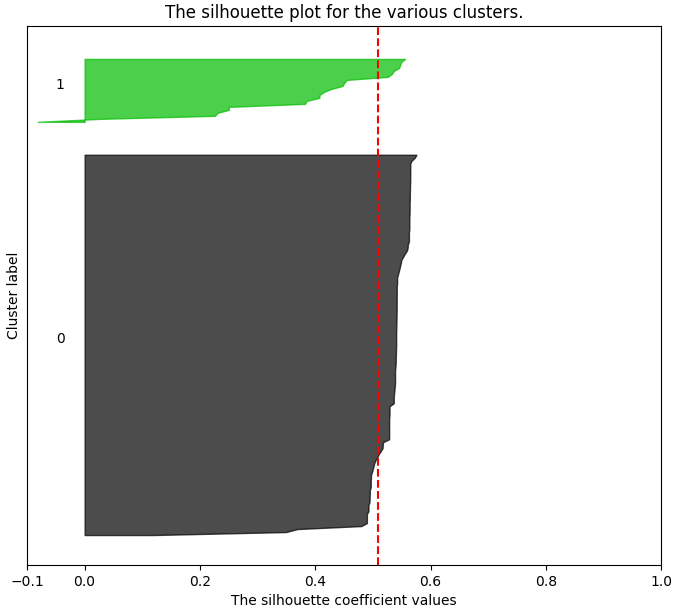  

 `Silhouette coefficient`は1から離れており、シルエットの幅にも大きな差があります。  
 よって、クラスタ数を2とするのは不適切と思われます。  

 * クラスタ数=3  
 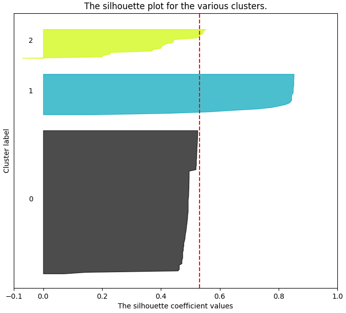  

 cluster1の`Silhouette coefficient`は1に近似していますが、cluster0, 2は離れています。また、相変わらずシルエットの幅にも大きな差があります。  
 よって、クラスタ数を3とするのも不適切と思われます。  

 * クラスタ数=4  
 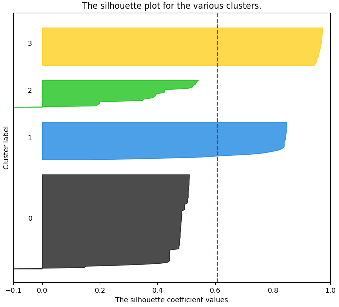  

 だいぶ良い形になってきました。  
 しかし、cluster0のシルエット幅が大きいため、もう少しクラスタ分割できそうです。  

 * クラスタ数=5  
   

 4つのクラスタの`Silhouette coefficient`が1に近似しており、シルエットの幅もほぼ均等になってきました。  
 今までで最も良い形を示しています。よって、クラスタ数を5とするのが適切だと思われます。  

 * クラスタ数=6  
 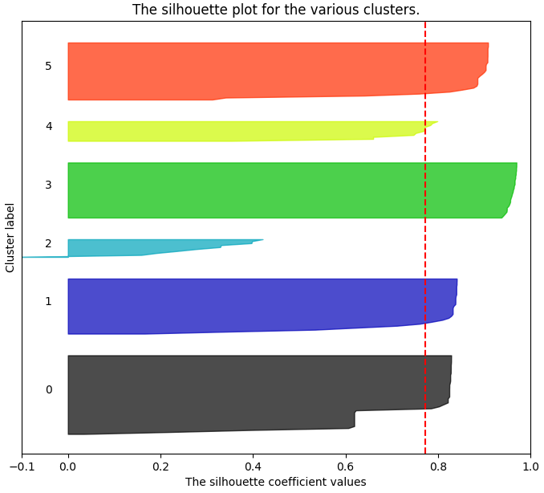  

 念のため、クラスタ数を6にしてみます。  
 `Silhouette coefficient`の変化は少ないですが、cluster2が大きく1から離れています。  
 また、cluster2, 4のシルエット幅が極端に小さくなっていることから、過剰にクラスタ分割されている思われます。  
 よって、クラスタ数を6にするのは不適切です。  

この結果から、クラスタ数が5の場合は、シルエットの幅はほぼ均等であり、`Silhouette Coefficient`も1に最も近似しています。よって、今回は**クラスタ数を5**にしてクラスタリングを実行すると良い結果が出そうです。  

これで、分析対象ログの準備とクラスタ数が整いました。  
次節では実際にサンプルコードを実行し、分析対象ログを正しくクラスタリングできるのか検証します。  

### 4.3.3. サンプルコード及び実行結果
#### 4.3.3.1. サンプルコード
本ブログではPython3を使用し、簡易的なログ分析システムを実装しました。  
※本コードは[こちら](https://github.com/13o-bbr-bbq/machine_learning_security/blob/master/Security_and_MachineLearning/src/k-means.py)から入手できます。  

本システムの大まかな処理フローは以下のとおりです。  

 1. 分析対象ログのロード  
 2. K平均法によるクラスタリング  
 3. 分析結果の可視化  

```
# -*- coding: utf-8 -*-
import os
import pandas as pd
import numpy as np
import matplotlib.pyplot as plt
from sklearn.cluster import KMeans

# Cluster number using k-means.
CLUSTER_NUM = 5

# Dataset path.
dataset_dir = os.path.join(os.path.dirname(os.path.abspath(__file__)), '../dataset')
dataset_path = os.path.join(dataset_dir, 'kddcup.data_small.csv')

# Load data.
df_kddcup = pd.read_csv(dataset_path)
df_kddcup = df_kddcup.iloc[:, [0, 7, 10, 11, 13, 35, 37, 39]]

# Normalization.
df_kddcup = (df_kddcup - df_kddcup.mean()) / df_kddcup.std()

# Transpose of matrix.
kddcup_array = np.array([df_kddcup['duration'].tolist(),
                      df_kddcup['wrong_fragment'].tolist(),
                      df_kddcup['num_failed_logins'].tolist(),
                      df_kddcup['logged_in'].tolist(),
                      df_kddcup['root_shell'].tolist(),
                      df_kddcup['dst_host_same_src_port_rate'].tolist(),
                      df_kddcup['dst_host_serror_rate'].tolist(),
                      df_kddcup['dst_host_rerror_rate'].tolist(),
                      ], np.float)
kddcup_array = kddcup_array.T

# Clustering.
pred = KMeans(n_clusters=CLUSTER_NUM).fit_predict(kddcup_array)
df_kddcup['cluster_id'] = pred
print(df_kddcup)
print(df_kddcup['cluster_id'].value_counts())

# Visualization using matplotlib.
cluster_info = pd.DataFrame()
for i in range(CLUSTER_NUM):
    cluster_info['cluster' + str(i)] = df_kddcup[df_kddcup['cluster_id'] == i].mean()
cluster_info = cluster_info.drop('cluster_id')
kdd_plot = cluster_info.T.plot(kind='bar', stacked=True, title="Mean Value of Clusters")
kdd_plot.set_xticklabels(kdd_plot.xaxis.get_majorticklabels(), rotation=0)

print('finish!!')
```

#### 4.3.3.2. コード解説
今回はK平均法の実装に、機械学習ライブラリの**scikit-learn**を使用しました。  
※scikit-learnの使用方法は[公式ドキュメント](http://scikit-learn.org/)を参照のこと。  

##### パッケージのインポート
```
import matplotlib.pyplot as plt
from sklearn.cluster import KMeans
```

scikit-learnのK平均法パッケージ「`KMeans`」をインポートします。  
このパッケージには、K平均法を行うための様々なクラスが収録されています。  

また、クラスタリング結果を可視化するために、グラフ描画パッケージ「`matplotlib`」も併せてインポートします。  

##### クラスタ数の設定
```
CLUSTER_NUM = 5
```

前節で述べたように、クラスタ数を「5」に設定します。

##### 分析対象データのロード
```
# Dataset path.
dataset_dir = os.path.join(os.path.dirname(os.path.abspath(__file__)), '../dataset')
dataset_path = os.path.join(dataset_dir, 'kddcup.data_small.csv')

# Load data.
df_kddcup = pd.read_csv(dataset_path)
df_kddcup = df_kddcup.iloc[:, [0, 7, 10, 11, 13, 35, 37, 39]]

# Normalization.
df_kddcup = (df_kddcup - df_kddcup.mean()) / df_kddcup.mean()
```

分析対象ログ「kddcup.data_small.csv」をロードしてデータを取得します。分析に使用する特徴量は、[第1章の侵入検知](https://github.com/13o-bbr-bbq/machine_learning_security/blob/master/Security_and_MachineLearning/Chap1_IntrusionDetection.md)と同じく以下の8つを使用します（`df_kddcup = df_kddcup.iloc[:, [0, 7, 10, 11, 13, 35, 37, 39]]`）。  

| Feature | Description |
|:------------|:------------|
| dst_host_serror_rate | SYNエラー率。 |
| dst_host_same_src_port_rate | 同一ポートに対する接続率。 |
| wrong_fragment | 誤りのあるfragment数。 |
| duration | ホストへの接続時間（sec）。 |
| logged_in | ログイン成功有無。 |
| root_shell | root shellの取得有無。 |
| dst_host_rerror_rate | REJエラー率。 |
| num_failed_logins | ログイン試行の失敗回数。 |

また、分析精度を上げるために、各特徴量のデータ値を正規化します（`df_kddcup = (df_kddcup - df_kddcup.mean()) / df_kddcup.mean()`）。  

##### データの行列変換
```
kddcup_array = np.array([df_kddcup['duration'].tolist(),
                      df_kddcup['wrong_fragment'].tolist(),
                      df_kddcup['num_failed_logins'].tolist(),
                      df_kddcup['logged_in'].tolist(),
                      df_kddcup['root_shell'].tolist(),
                      df_kddcup['dst_host_same_src_port_rate'].tolist(),
                      df_kddcup['dst_host_serror_rate'].tolist(),
                      df_kddcup['dst_host_rerror_rate'].tolist(),
                      ], np.float)
kddcup_array = kddcup_array.T
```

後述するクラスタリング実行用のメソッド`fit_predict`は引数に`matrix`を取るため、読み込んだデータを`numpy`の行列に変換しておきます。  

##### クラスタリングの実行
```
pred = KMeans(n_clusters=CLUSTER_NUM).fit_predict(kddcup_array)
```

scikit-learnのK平均法用クラス「`KMeans(n_clusters=CLUSTER_NUM)`」でK平均法モデルを作成します。  
本モデルを作成する際の引数にクラスタ数「`n_clusters`」を指定します。  

そして、`KMeans`のメソッド「`fit_predict`」に行列変換した分析対象ログを渡すことで、クラスタリングが実行されます。  

##### クラスタリング結果の可視化
```
cluster_info = pd.DataFrame()
for i in range(CLUSTER_NUM):
    cluster_info['cluster' + str(i)] = df_kddcup[df_kddcup['cluster_id'] == i].mean()
cluster_info = cluster_info.drop('cluster_id')
kdd_plot = cluster_info.T.plot(kind='bar', stacked=True, title="Mean Value of Clusters")
kdd_plot.set_xticklabels(kdd_plot.xaxis.get_majorticklabels(), rotation=0)
```

クラスタリング結果を、`matplotlib`の**積み上げ棒グラフ**で出力します。  

#### 4.3.3.3. 実行結果
それでは早速実行してみましょう。  

```
PS C:\Security_and_MachineLearning\src> python k-means.py
```

実行すると、以下のグラフが表示されます。  

 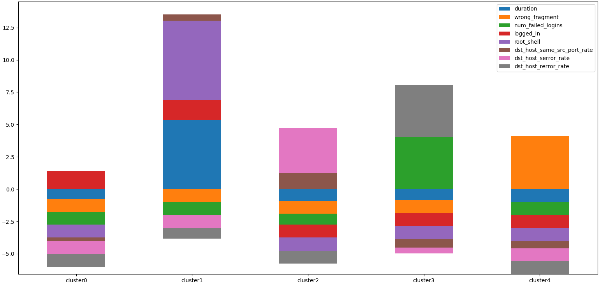

グラフを見ると、**5つのクラスタが作成**され、**各クラスタに含まれるデータの成分が色付きで表示**されている事が分かります。それでは、各クラスタの成分を一つずつ見ながら、各クラスタが何を表しているのか推測していきましょう。  

 * cluster1  
 `root_shell`（root shellの取得有無）と`duration`（ホストへの接続時間）の成分が他クラスタよりも大きいことが分かります。  
 「ホストへの接続時間が長い」「root権限が与えられるケースが多い」といった特徴から、筆者は**Buffer Overflow**のクラスタと推測しました。  

 * cluster2  
 `dst_host_serror_rate`（SYNエラー率）と`dst_host_same_src_port_rate`（同一ポートに対する接続率）の成分が他クラスタよりも大きいことが分かります。  
 「SYNエラー率が高い」「同一ポートに対する接続割合が多い」といった特徴から、筆者は**Nmapによる探索**または**SYN Flood**のクラスタと推測しました。  

 * cluster3  
 `dst_host_rerror_rate`（REJエラー率）と`num_failed_logins`（ログイン試行の失敗回数）の成分が他クラスタよりも大きいことが分かります。  
 「REJエラー率が高い」「ログイン試行の失敗回数が多い」といった特徴から、筆者は**パスワード推測**のクラスタと推測しました。  

 * cluster4  
 `wrong_fragment`（誤りのあるfragment数）が他クラスタよりも大きいことが分かります。  
 「誤りのあるフラグメント」が多いといった特徴から、筆者は**Teardrop**のクラスタと推測しました。  

 * cluster0  
 成分には大きな偏りがありません。  
 よって、筆者は**正常通信**のクラスタと推測しました。  

今回の分析対象ログ「`kddcup.data_small.csv`」をK平均法で分析した結果、4種類の攻撃（Buffer Overflow, Nmap/SYN Flood, Guess Password, Teardrop）を受けている可能性がある事が分かりました。  

## 4.4. おわりに
クラスタリングを用いてログを分析することで、サーバは**4種類の攻撃を受けている可能性**がある事が推測できました。更にこの分析結果を基に、「ログの更なる深堀」や「同時刻に記録された他ログの詳細分析」を行うことで**攻撃の種類を特定**し、適切な対策を講じることができるかもしれません。  

このようにK平均法は手軽に実装でき、処理速度も速いため、ご興味を持たれた方がおりましたら、身近にある様々なタスクに利用してみる事をお勧めします。  

## 4.5. 動作条件
 * Python 3.6.1
 * matplotlib 2.0.2
 * numpy 1.13.3
 * pandas 0.20.3
 * scikit-learn 0.19.0

### CHANGE LOG
* 2019.01.09 : 初稿  
* 2019.01.10 : 追加（注釈「データ間の距離」を追加）  
