## 7.0. 目的
本ブログは、**顔認証システムの実装**を通して、**Convolutional Neural Network**と呼ばれる**画像分類アルゴリズム**の使用方法を理解することを目的とします。  

 <div align="center">
 <figure>
 <br>
 <figurecaption>本ブログで実装する顔認証システム</figurecaption><br>
 <br>
 </figure>
 </div>

## 7.1. 顔認証とは
顔認証（Face Authentication）とは、Wikipediaによると「監視カメラのデジタル画像から、人間を自動的に識別するためのコンピュータ用アプリケーションです。ライブ画像内の顔と思われる部分を抜き出し、顔画像データベースと照合することで識別を行います。」と説明されています。  

顔認証システムは様々な用途で使用されており、例えば中国では、[天網](https://courrier.jp/news/archives/114613/)と呼ばれる数秒間で20億もの人物を識別できる顔認証システムが運用されていると言われています。身近な利用例としては、空港の[顔認証ゲート](http://www.moj.go.jp/nyuukokukanri/kouhou/nyuukokukanri07_00168.html)やApple iPhoneの[Face ID](https://support.apple.com/en-us/HT208109)などが挙げられます。また、物体認識において高い精度を誇るDeep Learning技術の登場により、Deep Learningベースの顔認証システムも続々と登場しています。  

## 7.2. コンセプト
本ブログでは、顔認証をDeep Learning技術で実装することにします。  

Deep Learningで顔認証を実装するためには、先ずは何らかの**カメラで対象の人物を撮影**してデジタル画像化します。そして、画像の中から**顔を検出**します。最後に、予め用意した画像データベースなどと検出した顔画像を**照合**し、一致する顔の有無を判定します。**一致度が閾値以上**の顔が存在する場合は**認証成功**、存在しない場合は**認証失敗**とします。  

各工程をもう少し深堀します。  

### 7.2.1. 人物の撮影
何らかのカメラを使用し、**対象人物の全体像または部分像を画像として取り込みます**。  
何らかのカメラとは用途によって様々です。先の例で挙げた天網であれば、街中に配置された監視カメラを通じて市民の画像を取り込みますし、顔認証ゲートであれば、ゲートに内蔵されたカメラで出入国者の顔画像を取り込みます。  

本ブログでは実装を容易にするため、ラップトップPCに内蔵されている**Webカメラ**を使用することにします。  
Webカメラを使用することで、以下のようにカメラの前にいる人物の画像を連続で取り込むことができます。  

 <div align="center">
 <figure>
 <br>
 <figcaption>Webカメラで取り込まれた画像</figcaption><br>
 <br>
 </figure>
 </div>

### 7.2.2. 顔の検出
何らかの方法で、Webカメラで取り込んだ画像から人物の**顔を抽出**します。  

顔抽出には様々な手法が存在しますが、本ブログでは**カスケード分類器**と呼ばれる手法を採用します。  

| カスケード分類器（Cascade Classifier）|
|:--------------------------|
| [Paul Viola氏によって提案](https://www.cs.cmu.edu/~efros/courses/LBMV07/Papers/viola-cvpr-01.pdf)され、Rainer Lienhart氏によって改良された物体検出アルゴリズム。対象の画像を複数の探索ウィンドウ領域に分割し、各探索ウィンドウ領域の画像を学習済み分類器に入力していく。分類器は**N個**用意されており、各分類器はそれぞれ「顔画像である」or「顔画像ではない」と判定していく。そして、1～N個の分類器が一貫して「顔画像である」と判定した場合のみ、当該探索ウィンドウ領域の画像は「顔画像である」と判定する。一方、途中で分類器が「顔画像ではない」と判定すれば処理を終了し、「探索ウィンドウ領域には顔画像はなかった」と判定され、探索ウィンドウは次にスライドしていく。|

カスケード分類器をフルスクラッチで実装するのは少々面倒ですが、[**OpenCV**](https://opencv.org/)と呼ばれるコンピュータビジョン向けライブラリを使用すると、容易に実装することが可能です。なお、本ブログではカスケード分類器の詳細な説明は割愛しますが、詳細を知りたい方は「[Haar Feature-based Cascade Classifier for Object Detection](http://opencv.jp/opencv-2.2/c/objdetect_cascade_classification.html)」をご覧いただければと思います。  

| OpenCV|
|:--------------------------|
| オープンソースのコンピュータビジョン向けライブラリ。画像処理・画像解析および機械学習などの機能を持ち、C/C++、Java、Python、MATLABなどに対応してる。また、クロスプラットフォームであり、Unix系OS、Linux、Windows、Android、iOSなどで動作する。|

### 7.2.3. 顔の照合
検出された顔画像を何らかの方法で照合し、対象人物の認証可否を決定します。  

照合方法は顔認証システムによって様々です。予め認証する人物の顔画像をデータベースに登録しておき、検出された顔との一致度合を計算する方法もあれば、iPhone XのFace IDのように、赤外線センサで計測した顔の立体構造の一致度合を計算する方法もあります。  

本ブログでは、近年顔認証システムへの利用が進んでいる**Deep Learning**技術を使用することにします。具体的には、画像認識の分野で高い識別精度を誇る**Convolutional Neural Network**（以下、CNN）と呼ばれるDeep Learning技術の一種を使用することにします。  

CNNは数年前に発表された技術であり、存在自体もメジャーであるため、本ブログでは簡単な仕組みの解説に留めます。詳しく知りたいという方は、@icoxfog417氏のブログ「[Convolutional Neural Networkとは何なのか](https://qiita.com/icoxfog417/items/5fd55fad152231d706c2)」を参照いただければと思います。このブログには、CNNの基礎が丁寧に分かり易く書かれているためお勧めです。  

本ブログでは、上記の3ステップの処理を実装しながら顔認証システムを実装していきます。  

## 7.3. Convolutional Neural Network（CNN）とは
CNNは通常の**Neural NetworkにConvolution（畳み込み）を追加**したネットワークであり、認識対象の画像に対して**高い頑健性**（ロバスト性）を持ちます。これにより、ネットワークに入力される画像を**高精度に分類**することができます。  

ところで、CNNはどのようにして頑健性を獲得しているのでしょうか？  
その説明に入る前に、先ずは通常のNeural Networkを簡単に説明します。  

### 7.3.1. Neural Networkの概要
ここでは、Neural Networkの概要を簡単に説明します。  

Neural Networkは**層**と**ノード**から構成される「人間の神経回路網を模した**ネットワーク**」であり、**ベクトル化**された入力データを**入力層**から受け取り、**出力層**から答えを出力します。入力層と出力層の間には1つ以上の**隠れ層**が存在し（隠れ層は**中間層**とも呼ばれる）、Neural Networkの**表現力**を高める役割を持ちます（表現力の詳細は後述します）。  

Neural Networkは分類問題の他、回帰問題にも利用することが可能ですが、本ブログでは分類問題にフォーカスして説明を行います。  
それでは、画像分類の例を用いてNeural Networkの挙動を見ていきましょう。  

以下の例は、筆者（Isao Takaesu）の顔画像をNeural Networkで分類している様子を表しています。図中の青い丸印は「入力層のノード」、緑の丸印は「隠れ層のノード」、赤い丸印は「出力層のノード」を表しており、各ノードはネットワークで接続されています。なお、**出力層の各ノードには、予め分類の答え（以下、クラス）を紐づけておきます**。  

 <div align="center">
 <figure>
 <br>
 <figcaption>Neural Networkで画像分類の様子</figcaption><br>
 <br>
 </figure>
 </div>

 * 入力層（Input layer）  
 入力層はベクトル化した入力画像を受け取る役割を持ちます。  
 ところで、画像のベクトル化とは何でしょうか？画像は**pixel値の集合**であるため、画像の**pixel値を1pixelずつ抽出**して並べていくと、ベクトルとして 表現することができます（通常は各pixel値を正規化した上で並べる）。例えば、**128x128pixelのRGB画像**は**49,152**（=128x128x3）個の要素を持つベクトルとして表現できます。ベクトル化された入力画像（以下、信号）は入力層の各ノードに入力され、ネットワークで連結された**隠れ層の各ノードに伝搬**していきます。  

 * 隠れ層（Hidden layer）  
 隠れ層はNeural Networkの表現力を高める役割を持ちます。  
 ところで、この表現力とは何でしょうか？仮に隠れ層がないネットワーク（**単純パーセプトロン**と呼ぶ）を考えてみましょう。単純パーセプトロンは入力層と出力層のみで構成されるため、入力データを1本の直線（Desision Boundary）で分類します。このため、下図のような2クラスのデータを1本の直線で分類することができます。これを**線形分離可能**と言います。  

 <div align="center">
 <figure>
 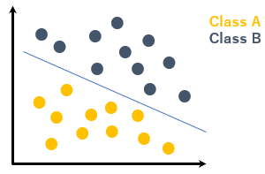<br>
 <figcaption>線形分離可能</figcaption><br>
 <br>
 </figure>
 </div>

 では、下図のような4クラスのデータはどうでしょうか？  
 見ての通り、1本の直線では4クラスを分類することはできません。これを**線形分類不可能**と言います。  

 <div align="center">
 <figure>
 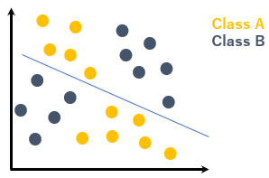<br>
 <figcaption>線形分離不可能</figcaption><br>
 <br>
 </figure>
 </div>

 このように、隠れ層が無い単純パーセプトロンは2クラスの分類しかできないため、表現力が低いと言えます。  
 この問題を解決するためには、**複数回の線形分離**に相当する判定を行えば良いと考えられます。その役割を担うのが隠れ層であり、1つ以上の隠れ層を入力層と出力層の間に入れることで、**複数クラスのデータを分類することが可能**となります（**表現力が高い**）。  

 <div align="center">
 <figure>
 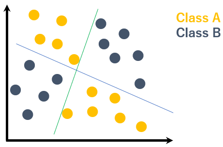<br>
 <figcaption>Neural Networkの表現力が高い</figcaption><br>
 <br>
 </figure>
 </div>

 * 出力層（Output layer）  
 出力層は分類結果を出力する役割を持ちます。  
 入力層⇒隠れ層と伝搬してきた信号は出力層の各ノードに保持されます。出力層の各ノードにはクラスが紐づいていますので、最も大きな値を持ったノード（活性化したノード）に紐づくクラスををNeural Networkの答えとします（活性化の詳細は後述します）。  

このように、Neural Networkでは、入力層から隠れ層を経由して出力層に**信号を伝搬**することで、入力データの分類を行います。  

### 7.3.2. 信号の伝搬
ここでは、信号の伝搬について簡単に説明します。  

Neural Networkに入力された信号は、単純に左から右に流すのではなく、各層で**活性化**されて伝搬していきます。  
下図を使用して活性化の様子を見ていきましょう。  

 <div align="center">
 <figure>
 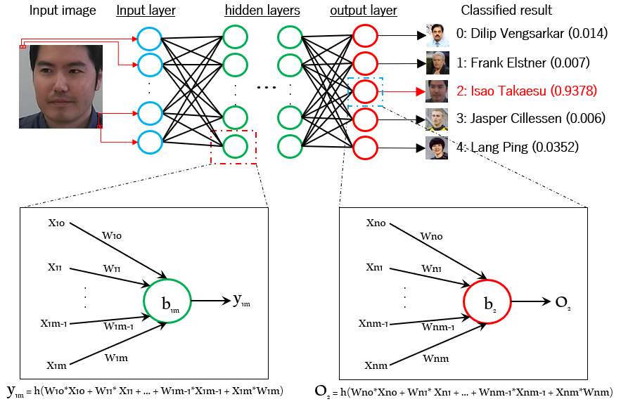<br>
 <figcaption>信号がノードを伝搬するイメージ</figcaption><br>
 <br>
 </figure>
 </div>

**隠れ層のm番目ノード**と、**出力層の3番目ノード**にフォーカスします。  

先ずは、上図の左側の吹き出しを見てみましょう。  
この吹き出しは隠れ層のm番目ノードを表しており、入力層から伝搬される信号を「X」、ノード間の**重み**を「W」、ノードの**バイアス**を「b」で表しています。また、信号を活性化する**活性化関数**を「h」で表し、隠れ層から出力される信号を「y」で表しています。  

| 重み（weight）|
|:--------------------------|
| Neural Networkの分類精度に大きな影響を与えるパラメータ。Neural Networkの**学習**では、学習データ（データとクラス（答え））を基に、**データに対応する出力層のノードに信号が集まるように重みを繰り返し更新**する（重みの最適化）。重みが最適化されると、入力信号に対応する出力層のノードが最も活性化されるように信号が伝搬される。なお、重みは学習前に**初期化**する必要があり、**活性化関数**の種類に応じて最適な初期化方法を採用する。代表的な初期化方法として、「Xavierの初期値」や「Heの初期値」などがある。なお、単純にゼロ初期化をすると、上手く学習できないことが知られている。|

| バイアス（bias）|
|:--------------------------|
| ノードへの入力信号を微調整するためのパラメータ。重みと同様に学習することで最適化される。|

| 活性化関数（Activation Function）|
|:--------------------------|
| ノードへの「信号入力の総和」を**活性化させる方法を決定付ける**関数。シグモイド関数、ソフトマックス関数、ReLU関数、恒等関数など、様々な種類が存在する。Neural Networkの分類精度を高めるために、活性化関数を使用する層（隠れ層 or 出力層）や、分類クラス数などに応じて最適な活性化関数を採用する必要がある。|

隠れ層のm番目ノードは、入力層から伝搬してきた信号「X10 ~ X1m」と、（入力層と隠れ層の）ノード間にある重み「W10 ~ W1m」を**積算**して**和**を取り、これにバイアス値「b1m」を足し合わせた値を受け取ります。そして、この**信号を活性化関数「h」で活性化させて**ノードの出力値「y1m」とし、次のノードに伝搬させます（この様子は、吹き出しの下にある数式で表しています）。  

ここで、上述した「信号を活性化関数で活性化」とはどういうことでしょうか？  
これを理解するために、代表的な活性化関数の入出力値を見てみましょう。  

* シグモイド関数（Sigmoid function）  
シグモイド関数はNeural Networkの**隠れ層で使用される活性化関数**です。  
下図のように、入力値（Input）を**0.0～1.0の範囲**の値に変換して出力（Output）します。  

 <div align="center">
 <figure>
 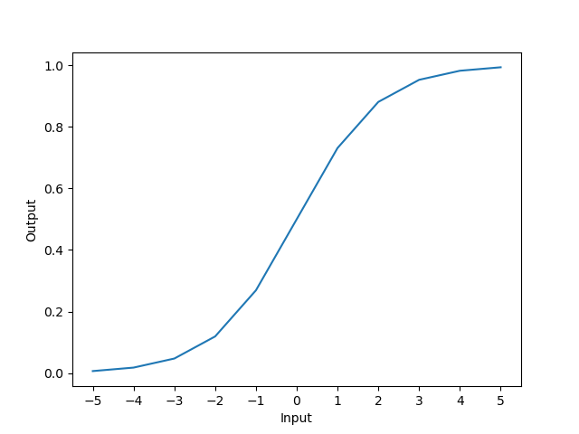<br>
 <figcaption>シグモイド関数</figcaption><br>
 <br>
 </figure>
 </div>

 シグモイド関数は古くからNeural Networkの隠れ層で使われてきましたが、高い表現力を得るために隠れ層を増やしていくと、**勾配消失問題**と呼ばれるNeural Networkの学習が進まなくなる問題が発生します。このため、最近ではあまり使われなくなってきています（勾配消失問題は次節で解説します）。  

 * ReLU  
 ReLUはNeural Networkの**隠れ層で使用される活性化関数**です。  
 下図のように、入力値（Input）が**0を超えた**場合は入力値をそのまま出力（Output）し、入力値が**0以下**の場合は0を出力します。  
 
 <div align="center">
 <figure>
 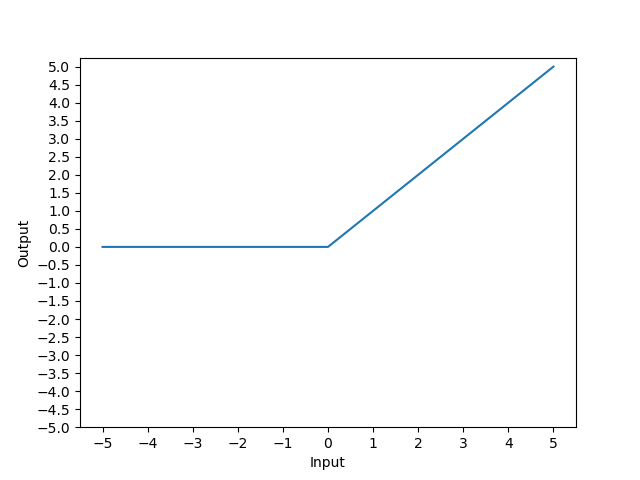<br>
 <figcaption>ReLU</figcaption><br>
 <br>
 </figure>
 </div>

 ReLUは隠れ層を増やしても勾配消失が起きにくい（Neural Networkの学習が安定する）ため、現在ではよく使われています。  

 * 恒等関数（Identity function）  
 恒等関数はNeural Networkの**出力層で使用される活性化関数**です。  
 下図のように、入力値（Input）をそのまま出力（Output）します。  
 
 <div align="center">
 <figure>
 <br>
 <figcaption>恒等関数</figcaption><br>
 <br>
 </figure>
 </div>

 恒等関数は出力層の活性化を省略したのと同じ挙動になるため、回帰問題（入力に対する値を予測するなど）に使われます。  

 * ソフトマックス関数（softmax function）  
 ソフトマックス関数はNeural Networkの**出力層で使用される活性化関数**です。  
 以下のように、**入力値（Input）に対する出力値（Output）の合計が1**になるように変換します。  
 
 ```
  Output layer | Input | Output
 -------------------------------------------
     node[0]   |   5   | 0.6364086465588309
     node[1]   |   2   | 0.031684920796124276
     node[2]   |   3   | 0.08612854443626872
     node[3]   |   4   | 0.23412165725273665
     node[4]   |   1   | 0.011656230956039607
 -------------------------------------------
 ```

 上記の例は、出力層（Output layer）のノード「`node[0], node[1], node[2], node[3], node[4]`」が「`5, 2, 3, 4, 1`」の値を保持している様子を表しています。これらの値をソフトマックス関数で変換すると、それぞれ「`0.6364086465588309, 0.031684920796124276, 0.08612854443626872,0.23412165725273665, 0.011656230956039607`」となります。これらの出力値をよく観察してみてください。すると、**入力値に応じて出力値の大小が変化**し、また**出力値の合計値は1**になっていることが分かるかと思います（ノード数が10、20と増えても出力値の合計は1になる）。出力値の合計が1になることから、これらの出力値は**確率**と見なすことができます。このような特性から、ソフトマックス関数は**3クラス以上の確率付き分類**に使われます。  

このように、活性化関数には様々な種類が存在することが分かっていただけたかと思います。  

ところで、上記の画像分類例で示したNeural Networkでは、どのような活性化関数を使用すれば良いでしょうか？  
本例では、筆者の顔画像（128x128pixelのRGB画像（49,152ベクトル））を入力信号として受け取り、`0.9378`の確率でクラス「`Isao-Takaesu`」に分類しています。Neural Networkが選択し得るクラスは5個、そして確率付きで分類していることから、出力層の活性化関数にはソフトマックス関数を採用した方が良いと考えられます。また、入力信号のサイズが大きく、5クラスの分類を行う必要があることから（高い表現力が必要）、隠れ層の活性化関数にはReLUを採用した方が良いと考えられます。  

このように、Neural Networkで解きたい問題（回帰 or 分類（2クラス or マルチクラス））や入力信号を考慮して、最適な活性化関数を採用する必要があることが分かっていただけたかと思います。  

このように、Neural Networkに入力された信号は、活性化されながら出力層に向かって伝搬していきます。このことから、Neural Networkへの入力データに対する正しい出力を得るためには、各ノード間に存在する**重みの値を最適化**する必要があります。この重みを最適化することを、Neural Networkでは**学習**と呼びます。  

### 7.3.3. Neural Networkの学習
ここでは、Neural Networkの学習について簡単に説明します。  

前節の「重み」でも述べたように、Neural Networkの学習では学習データを基に**重みの値を最適化**します。  
この「重みを最適化」する上で重要になるのが、**誤差関数**です。  

| 誤差関数（Loss Function）|
|:--------------------------|
| Neural Networkの**精度の悪さ**を数値化する関数。損失関数とも呼ばれる。学習時に誤差関数を使用することで、Neural Networkが学習データに対して**どれだけ適合していないか**を知ることができる。Neural Networkでは、この誤差関数の値を最小化するように重みの最適化を行う。2乗和誤差、クロスエントロピー誤差など、様々な誤差関数が存在する。|

誤差関数はNeural Networkの出力（答え）を**精度の悪さを示す数値**に変換します。このことから、Neural Networkの学習は「誤差関数の出力値を最小化するように重みを更新する」と言い換えることができます。誤差関数には様々な種類が存在しますが、本ブログではマルチクラス分類で使用される**クロスエントロピー誤差関数**を見ていきます。  

クロスエントロピー誤差関数の出力値をグラフ化したものを以下に示します。  

 <div align="center">
 <figure>
 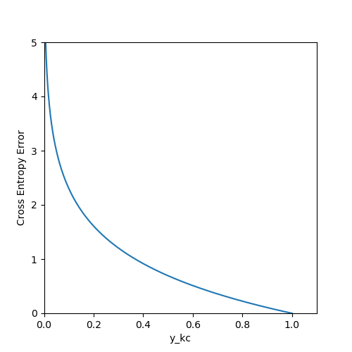<br>
 <figcaption>クロスエントロピー誤差関数の出力</figcaption><br>
 <br>
 </figure>
 </div>

横軸「`y_kc`」は、**学習データのラベルに対応するNeural Networkの出力値**、縦軸は`y_kc`に対するクロスエントロピー誤差を表しています。`y_kc`が小さいほどクロスエントロピー誤差は大きくなり、`y_kc`が大きいほどクロスエントロピー誤差は小さくなることが分かります。  

ところで、「学習データのラベルに対応するNeural Networkの出力値（`y_kc`）」とは何でしょうか？  
以下のような学習データで考えてみましょう。  

 <div align="center">
 <figure>
 <br>
 <figcaption>学習データの一例</figcaption><br>
 <br>
 </figure>
 </div>

これは、上記の画像分類例で示したNeural Networkの学習データとなります。学習に使用するデータ（顔画像）とそれに対応するクラス（答え）がペアになっています。この学習データではクラスは各人の名前になっていますが、これは人間が扱い易くしているためであり、Neural Networkの学習ではこれを**ベクトル化**する必要があります。  

例えば、クラスの並びが`['Dilip-Vengsarkar', 'Frank-Elstner', 'Isao-Takaesu', 'Jasper-Cillessen', 'Lang-Ping']`の場合、`Isao-Takaesu`のとある学習データの正解クラスをベクトルで表すと`[0, 0, 1, 0, 0]`となります。また、`Dilip-Vengsarkar`の正解クラスをベクトルで表すと、`[1, 0, 0, 0, 0]`となります。このように、学習データに対応する部分は`1`、それ以外は`0`になるように正解クラスをベクトル化したものを**one-hot-vector**と呼び、one-hot-vector化することを**one-hot-encoding**と呼びます。  

 <div align="center">
 <figure>
 <br>
 <figcaption>one-hot-vectorで表現した正解クラス</figcaption><br>
 <br>
 </figure>
 </div>

なぜone-hot-vectorがNeural Networkの学習に役立つのでしょうか。それは、誤差を求める上で不可欠だからです。  
例えば、Neural Networkの学習時において、以下の画像（`Isao-Takaesu`）を学習するとしましょう。  

 <div align="center">
 <figure>
 <br>
 <figurecaption>Isao-Takaesuの学習データ</figurecaption><br>
 <br>
 </figure>
 </div>

上述した通り、この学習データの正解クラスをone-hot-vectorで表すと`[0, 0, 1, 0, 0]`となります。  
この時、Neural Networkは以下の答え（`Output`）を出したとします（答えはソフトマックス関数で活性化、出力層（`Output layer`）の各ノード（`node[0] ~ node[4]`）はそれぞれ「`Dilip-Vengsarkar, Frank-Elstner, Isao-Takaesu, Jasper-Cillessen, Lang-Ping`」に紐づいているとする）。  

```
 Output layer | Output  | t | y_kc     | cross entropy error
-------------------------------------------------------------
    node[0]   | 0.43641 | 0 |  0       |  0
    node[1]   | 0.03168 | 0 |  0       |  0
    node[2]   | 0.18613 | 1 |  0.18613 |  1.6813099246718954
    node[3]   | 0.23412 | 0 |  0       |  0
    node[4]   | 0.11166 | 0 |  0       |  0
-------------------------------------------------------------
```

正解ラベルを`t`とすると、`t`と`Output`を乗算することで学習データ「`Isao-Takaesu`」に対応するNeural Networkの答え「`y_kc`」が得られます。そして、この`y_kc`をクロスエントロピー誤差関数に入力すると、学習データ「`Isao-Takaesu`」に対するNeural Networkの誤差「`1.6813099246718954`」を求めることができます（他の学習データも同じ要領で誤差を求めていきます）。  

このようにNeural Networkの答えに対する誤差を数値化することができました。  
次に、この誤差を最小化するために、**勾配法**と呼ばれる手法を用いて**重みの値を最適化**していきます。  

| 勾配消失問題（Vanishing gradient problem）|
|:--------------------------|
| 勾配が消失することで学習が進まなくなる問題。Neural Networkの学習では、Neural Networkの予測値と実際の答えの誤差を最小化するために**勾配**（gradient）とよばれる|

このようにして、Neural Networkの重みが最適化されていきます。  

なお、学習の成否には**学習率**や**ミニバッチ学習**なども大きく影響します。また、出力層で求めた誤差を基に、層を遡りながら各層の重みを更新する手法「**誤差逆伝搬法**（Backpropagation）」も重要なテクニックですが、やや解説が複雑になるため、「入門の入門」である本ブログでは解説を割愛します。  

### 7.3.3. Neural Networkによる画像分類の限界
Neural Networkでは、**分類対象の画像を1pixel単位で受け取る**ことを上述しました。  

例えば「32×32pixel」の白黒画像の場合、入力信号は1024（=32x32）のベクトルとなりますね。このため、**入力画像のレイアウトが少しでも異なると、入力信号のベクトルは大きく異なってしまいます**。入力信号が大きく異なるということは、入力に対する最適な出力を得ることが困難である、と言い換えることができます。  

下図は、レイアウトが異なる2枚の顔画像（Isao Takaesu）です。  

 <div align="center">
 <figure>
 <br>
 <figurecaption>Neural Networkでは同じ人物として認識することが困難</figurecaption><br>
 <br>
 <br>
 </figure>
 </div>

レイアウトや色味などが異なるため、Neural Networkでは2つを同じ人物として認識することは非常に困難です。このように、Neural Networkの「**1pixel単位で入力を受け取る**」という構造が、画像分類における頑健性低下の大きな要因となります。  

ところで、世の中に存在するあらゆる筆者の顔画像を使用して学習を行えば、筆者の認識精度は向上するかもしれません。しかし、それではあまりに**学習コストが掛かり過ぎ**ますし、筆者の新たな顔画像に対応することが困難となります（汎化性能が低い）。  

### 7.3.4. CNNの頑健性
前節で挙げたNeural Networkの頑健性の低さを克服するために、CNNではConvolutionと呼ばれるテクニックを使用します。  

CNNは分類対象の画像を（Neural Networkのように）1pixel単位で受け取るのではなく、**複数のpixelを纏めた領域**（4x4pixelの領域など）として受け取ります。この纏めた領域を**フィルタ**と呼び、**フィルタを1つの特徴量として畳み込み**ます。  

そして、**フィルタを少しずつスライドさせながら畳み込みを繰り返し**ていき、入力画像全体が畳み込まれたレイヤ「**Convolution Layer**」を作成します。このConvolution LayerをNeural Networkと同様に出力方向に繋げていくことでネットワークを構築します。  

下図は、顔認識を行うCNNの概念図を表しています。  

 <div align="center">
 <figure>
 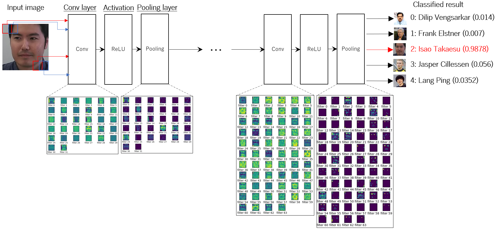<br>
 <figurecaption>CNNは頑健性が高い</figurecaption><br>
 <br>
 </figure>
 </div>

このCNNは、入力画像の特徴量を畳み込む層「Conv」、画像の圧縮を行う層「Pooling」、畳み込まれた特徴量から最終的な判断を行う層「FC」、そして、Neural Networkと同様に入力信号を活性化させる活性化関数「Activation」で構成されます。  

入力画像を任意のサイズのフィルタを使用して畳み込み、Conv layerを作成します。Convの吹き出しは実際に畳み込まれた入力画像を示しており、（少々見辛いですが）畳み込むことで入力画像のエッジを抽出しているように見えます。そして、これを活性化関数で整えた後に圧縮してPooling layerを作成しています。Poolingの吹き出しは実際に圧縮された畳み込み画像を示しており、（これも見辛いですが）画像が圧縮されていることが分かります。  

この処理を複数回行い、最後にFCにて前層の全要素を接続し、CNNの出力を決定します。  

このように、CNNでは「点（pixel）」ではなく「フィルタ（領域）」での特徴抽出が可能になるため、入力画像のレイアウトが異なる場合でも、その**差異を吸収**することができます。この畳み込みによりCNNは高い頑健性を誇るため、分類対象画像に対する柔軟性を持ち、それ故に高精度の画像分類を実現できます。  

以上でCNN入門の入門は終了です。  

次節では、CNNを使用した顔認証システムの構築手順とサンプルコードを解説します。

## 7.4. 顔認証システムの実装
本ブログで実装する顔認証システムは、大きく以下の4ステップで認証を行います。  

 1. 顔認識モデルの作成  
 2. Webカメラから顔画像を取得  
 3. 顔認識モデルで顔画像を分類  
 4. 分類確率と閾値を比較して認証成否を判定    

### 7.4.1. 顔認識モデルの作成
本ブログで使用するCNNは教師あり学習のため、先ずは学習データを用意します。  

#### 7.4.1.1. 学習データの準備
本ブログでは、著名な顔画像データセットである「[**VGGFACE2**](http://www.robots.ox.ac.uk/~vgg/data/vgg_face2/)」を学習データに使用します。  

| VGGFACE2|
|:--------------------------|
| 大規模な顔画像データセット。Google画像検索からダウンロードされた**9,000人以上**の人物の顔画像が**330万枚以上**収録されており、年齢・性別・民族・職業・顔の向き・顔の明るさ（照明具合）など、様々なバリエーションの顔画像が存在する。ダウンロードにはアカウントの登録が必要。|

本ブログでは、VGGFACE2から無作為に選んだDilip Vengsarkar氏、Frank Elstner氏、Jasper Cillessen氏、Lang Ping氏の4人と、筆者を学習させることにします。すなわちこの5人が、本ブログで実装する顔認証システムで認証可能な人物となります。  

 <div align="center">
 <figure>
 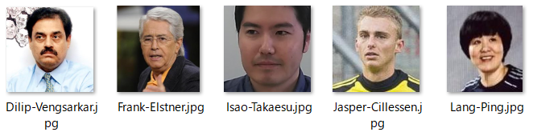<br>
 <figurecaption>認証対象の人物</figurecaption><br>
 </figure>
 </div>

当然ながら筆者の顔画像はVGGFACE2に含まれていないため、顔画像収集用のサンプルコード[`record_face.py`](src/defensive_chap7/record_face.py)を用いて収集しました。このコードは、Webカメラから**0.5秒間隔**で画像を取り込み、画像に含まれる顔部分を抽出し、JPEG形式で保存します。  

 * 顔画像収集プログラムの実行  
 ```
 your_root_path> python3 record_face.py
 1/100 Capturing face image.
 2/100 Capturing face image.
 3/100 Capturing face image.
 ...snip...
 98/100 Capturing face image.
 99/100 Capturing face image.
 100/100 Capturing face image.
 ```

プログラムの実行が完了すると、自動的に「`original_image`」ディレクトリが作成され、そのサブディレクトリとして「`Isao-Takaesu`」が作成されます。このサブディレクトリ配下に収集した顔画像が保存されます。  

 * 収集された顔画像
 ```
 /your_root_path/original_image/Isao-Takaesu> ls
 Isao-Takaesu_1.jpg
 Isao-Takaesu_2.jpg
 Isao-Takaesu_3.jpg
 ... snip ...
 Isao-Takaesu_98.jpg
 Isao-Takaesu_99.jpg
 Isao-Takaesu_100.jpg
 ```

なお、サブディレクトリ名「`Isao-Takaesu`」が、**顔認証時のクラス名**となります。  
もし、あなたが任意の人物を認証対象としたい場合は、コード中の`FILE_NAME`の値を変更してください。  

#### 7.4.1.2 データセットの作成
顔画像の収集が完了しましたので、データセット生成用のサンプルコード「[`create_dataset.py`](src/defensive_chap7/create_dataset.py)」を用いてCNNの学習データと精度評価用のテストデータを作成します。  

ここで、コードを実行する前に、VGGFACE2から選んだ4人のサブディレクトリを「`original_image`」配下に作成します（筆者のサブディレクトリは前節で作成済み）。  

 * 認証対象人物のサブディレクリを作成  
 ```
 your_root_path\original_image> mkdir Dilip-Vengsarkar Frank-Elstner Jasper-Cillessen Lang-Ping
 your_root_path\original_image> ls
 Dilip-Vengsarkar
 Frank-Elstner
 Isao-Takaesu
 Jasper-Cillessen
 Lang-Ping
 ```

なお、前節でも述べましたが、これらサブディレクトリ名が、顔認証時のクラス名となります（大事なことなので2回書きます）。  
そして、4人の顔画像をVGGFACE2からコピーして各サブディレクトリにペーストし、データセット生成用のサンプルコードを実行します。  

 * データセット生成用プログラムの実行  
 ```
 your_root_path> python3 create_dataset.py
 ```

プログラムの実行が完了すると、自動的に「`dataset`」ディレクトリが作成され、サブディレクトリとして学習データ格納用の「`train`」ディレクトリと、精度評価用テストデータ格納用の「`test`」ディレクトリが作成されます。各ディレクトリには、「`original_image`」からコピーした画像が「7対3（学習データ：7、テストデータ：3）」の割合で格納されます。  

#### 7.4.1.3 学習の実行
学習データの準備ができましたので、学習用するサンプルコード「[`train.py`](src/defensive_chap7/train.py)」を実行します。  

 * 学習用プログラムの実行  
 ```
 your_root_path> python3 train.py
 ```

このコードは、`dataset/train`配下の学習データと`dataset/test`配下のテストデータを使用して顔認識モデルを作成します。  
プログラムの実行が完了すると、自動的に「`model`」ディレクトリが作成され、その配下に学習済みのモデル「`cnn_face_auth.h5`」が保存されます。  

### 7.4.2. サンプルコード及び実行結果
#### 7.4.2.1. サンプルコード
本ブログではPython3を使用し、簡易的な顔認証システムを実装しました。
※本コードは[こちら](https://github.com/13o-bbr-bbq/machine_learning_security/blob/master/Security_and_MachineLearning/src/defensive_chap7/face_auth.py)から入手できます。

本システムの大まかな処理フローは以下のとおりです。

 1. Webカメラから対象人物の映像を取得
 2. 取得した映像から顔部分の切り出し
 3. 切り出した顔画像を学習済みCNNモデルで分類
 4. 閾値を基に許容 or 拒否を判定

```
#!/bin/env python
# -*- coding: utf-8 -*-
import os
import cv2
import numpy as np
from datetime import datetime
from keras.preprocessing import image
from keras.models import load_model

# Full path of this code.
full_path = os.path.dirname(os.path.abspath(__file__))

# dataset path.
dataset_path = os.path.join(full_path, 'dataset')
test_path = os.path.join(dataset_path, 'test')

# Model path.
model_path = os.path.join(full_path, 'model')
trained_model = os.path.join(model_path, 'cnn_face_auth.h5')

MAX_RETRY = 50
THRESHOLD = 80.0

# Generate class list.
classes = os.listdir(test_path)
nb_classes = len(classes)

# Dimensions of training images.
img_width, img_height = 128, 128

# Load model.
print('Load trained model: {}'.format(trained_model))
model = load_model(trained_model)

# Execute face authentication.
capture = cv2.VideoCapture(0)
for idx in range(MAX_RETRY):
    # Read 1 frame from VideoCapture.
    ret, captured_image = capture.read()

    # Execute detecting face.
    gray_image = cv2.cvtColor(captured_image, cv2.COLOR_BGR2GRAY)
    cascade = cv2.CascadeClassifier(os.path.join(full_path, 'haarcascade_frontalface_default.xml'))
    faces = cascade.detectMultiScale(gray_image,
                                     scaleFactor=1.1,
                                     minNeighbors=2,
                                     minSize=(img_width, img_height))

    if len(faces) == 0:
        print('Face is not found.')
        continue

    for face in faces:
        # Extract face information.
        x, y, width, height = face
        face_image = captured_image[y:y + height, x:x + width]
        if face_image.shape[0] < img_width:
            continue
        resized_face_image = cv2.resize(face_image, (img_width, img_height))

        # Save image.
        file_name = os.path.join(dataset_path, 'tmp_face.jpg')
        cv2.imwrite(file_name, resized_face_image)

        # Transform image to 4 dimension tensor.
        img = image.img_to_array(image.load_img(file_name, target_size=(img_width, img_height)))
        x = image.img_to_array(img)
        x = np.expand_dims(x, axis=0)
        x = x / 255.0

        # Prediction.
        preds = model.predict(x)[0]
        predict_idx = np.argmax(preds)

        # Final judgement.
        judge = 'Reject'
        prob = preds[predict_idx] * 100
        if prob > THRESHOLD:
            judge = 'Unlock'
        msg = '{} ({:.1f}%). res="{}"'.format(classes[predict_idx], prob, judge)
        print(msg)

        # Draw frame to face.
        cv2.rectangle(captured_image,
                      (x, y),
                      (x + width, y + height),
                      (255, 255, 255),
                      thickness=2)

        # Get current date.
        date = datetime.now().strftime('%Y%m%d%H%M%S%f')[:-3]
        print_date = datetime.strptime(date[:-3], '%Y%m%d%H%M%S').strftime('%Y/%m/%d %H:%M:%S')

        # Display raw frame data.
        cv2.putText(captured_image, msg, (10, 40), cv2.FONT_HERSHEY_SIMPLEX, 1, (0, 255, 0), 2, cv2.LINE_AA)
        cv2.putText(captured_image, print_date, (10, 450), cv2.FONT_HERSHEY_SIMPLEX, 1, (0, 255, 0), 2, cv2.LINE_AA)
        cv2.imshow('Face Authorization', captured_image)

        file_name = os.path.join(dataset_path, 'tmp_face' + str(idx) + '_.jpg')
        cv2.imwrite(file_name, captured_image)

    # Waiting for getting key input.
    k = cv2.waitKey(500)
    if k == 27:
        break

# Termination (release capture and close window).
capture.release()
cv2.destroyAllWindows()

print('Finish.')
```

#### 7.4.2.2. コード解説
今回はCNNの実装に、Deep Learningライブラリの**Keras**を使用しました。  
Kerasの使用方法は[公式ドキュメント](https://keras.io/ja/)を参照のこと。  

#####  OpenCVのインポート
```
import cv2
```

Webカメラからの画像取得、および顔部分の切り出しを行うため、コンピュータビジョン向けライブラリ「`cv2`（OpenCV）」をインポートします。  
このパッケージには、Webカメラの制御や画像の加工、顔認識を行うための様々なクラスが収録されています。  

##### CNN用パッケージのインポート
```
from keras.preprocessing import image
from keras.models import load_model
```

学習済みモデルのロード、および認証対象画像を扱うためのKerasパッケージをインポートします。  

##### Pathの定義
```
# Model path.
model_path = os.path.join(full_path, 'model')
trained_model = os.path.join(model_path, 'cnn_face_auth.h5')
```

前節で作成した学習済みモデル（`cnn_face_auth.h5`）のPathを定義します。  

##### 認証の試行回数と閾値の定義
```
MAX_RETRY = 50
THRESHOLD = 80.0
```

`MAX_RETRY`は顔認証を試行する最大回数、`THRESHOLD`は認証成功の閾値となります（CNNの分類確率が閾値を超えた場合に認証成功とする）。  

##### 学習済みモデルのロード
```
# Load model.
print('Load trained model: {}'.format(trained_model))
model = load_model(trained_model)
```

ここでは、前節で学習した結果（学習済みのモデル）をCNNアーキテクチャにロードして認識モデルを作成しています。  
これにより、CNNモデルは学習した状態、すなわち、顔画像の照合が実行できる状態になります。  

##### Webカメラの定義
```
# Execute face authentication.
capture = cv2.VideoCapture(0)
```

`cv2.VideoCapture(0)`でWebカメラのインスタンスを作成します。  
この1行のみでOpenCVを介してWebカメラの制御を取得することができます。なお、`VideoCapture`の引数はカメラの識別IDですが、ラップトップに複数のカメラが接続されていれば、それぞれのカメラにユニークなIDが割り当てられます。今回は1つのWebカメラを使用しますので、引数は`0`となります。  

##### Webカメラからの画像取り込み 
```
# Read 1 frame from VideoCapture.
ret, captured_image = capture.read()
```

Webカメラのインスタンス`capture`のメソッドである`read()`を呼び出すと、Webカメラで撮影した1フレーム分の画像が戻り値として返されます。なお、画像はBGRの画素値を持った配列になっています（RGBではないことに注意してください）。  

##### 取り込んだ画像から顔の検出
```
# Execute detecting face.
gray_image = cv2.cvtColor(captured_image, cv2.COLOR_BGR2GRAY)
cascade = cv2.CascadeClassifier(os.path.join(full_path, 'haarcascade_frontalface_default.xml'))
faces = cascade.detectMultiScale(gray_image,
                                 scaleFactor=1.1,
                                 minNeighbors=2,
                                 minSize=(128, 128))
```

OpenCVに備わっているカスケード分類器を使用し、Webカメラで取り込んだ画像から**顔を抽出**します。  
上記のコードでは、カスケード分類器に画像を入力する前に、画像をグレースケールに変換します（`cv2.cvtColor()`）。これは、カスケード分類器は**顔の輪郭など（色の濃淡）を特徴**として「顔 or 顔ではない」を判定するため、BGRのようなカラー画像よりもグレースケールの方が精度が向上します。  

次に、カスケード分類器のインスタンスを作成します(`cv2.CascadeClassifier`）。引数の「`haarcascade_frontalface_default.xml`」は、OpenCVプロジェクトが予め用意した「顔の特徴を纏めたデータセット」です。このデータセットを引数として渡すのみで、顔検出が可能なカスケード分類器を作成することができます。  

なお、このデータセットは[OpenCVのGitHubリポジトリ](https://github.com/opencv/opencv/tree/master/data/haarcascades)で公開されています。本ブログでは「顔検出」を行うため、このデータセットのみを使用していますが、リポジトリを見ると分かる通り、「目」「体」「笑顔」等の特徴を纏めたデータセットも配布されています。つまり、このようなデータセットを使うことで、「目の検出」「体の検出」「笑顔の検出」等を実現することも可能です。  

最後に、作成したカスケード分類器のメソッド「`detectMultiScale`」にグレースケールにした画像を渡すと、戻り値として「検出した顔画像部分の座標」が返されます。なお、画像に複数の顔が写っている場合は、複数の座標が配列で返されます。  

##### 顔画像の前処理
```
# Extract face information.
x, y, width, height = face
face_image = captured_image[y:y + height, x:x + width]
if face_image.shape[0] < img_width:
    continue
resized_face_image = cv2.resize(face_image, (img_width, img_height))

# Save image.
file_name = os.path.join(dataset_path, 'tmp_face.jpg')
cv2.imwrite(file_name, resized_face_image)
```

カスケード分類器で検出した**顔画像部分の座標**を使用し、Webカメラから取り込んだ画像（`captured_image`）から**顔画像部分のみを切り出し**ます（`captured_image[y:y + height, x:x + width]`）。`x`、`y`、`width`、`height`は、カスケード分類器で検出した顔部分の座標。そして、切り出した顔画像を`cv2.resize`にて、128x128pixelの画像にリサイズします。  

なお、顔画像をリサイズするのは、**CNNに入力する画像は一定のサイズにする必要がある**ためであり、リサイズするサイズは任意です。  
本ブログでは、CNNアーキテクチャに合わせて`128`に設定しています。  

リサイズされた画像は一時的にローカルファイルとして保存します（`file_name`）。  

##### 入力画像の正規化
```
# Transform image to 4 dimension tensor.
img = image.img_to_array(image.load_img(file_name, target_size=(img_width, img_height)))
x = image.img_to_array(img)
x = np.expand_dims(x, axis=0)
x = x / 255.0
```

顔画像をベクトル化した上で、これをを正規化します（`x`）。  

##### 顔画像の照合
```
# Prediction.
preds = model.predict(x)[0]
predict_idx = np.argmax(preds)

# Final judgement.
judge = 'Reject'
prob = preds[predict_idx] * 100
if prob > THRESHOLD:
    judge = 'Unlock'
```

正規化した顔画像をCNNモデルに入力し（`model.predict(x)[0]`）、照合結果である出力（`preds`）を取得します。  
`preds`には全てのクラスと予測精度が格納されていますので、**最も予測精度が高いクラス（認証対象人物の名前）と予測精度のセット**を取得します。  

最後に、予測精度が閾値（今回は`THRESHOLD = 95.0`）を超えていた場合に、`Unlock`（認証成功）のラベルを返します（認証が成功した後の処理は任意）。  

#### 7.4.2.2. 実行結果
それでは、早速作成した顔認証システムを起動してみます。  

以下のように、PCのカメラから周りの画像を取り込み、人物の顔を正確に認識していることが見て取れます。  
以下の場合、識別結果（Unlock）と人物名（Isao Takaesu）、そして認識精度（96.8%）を返しており、Unlockは認証成功を表しています。

 <div align="center">
 <figure>
 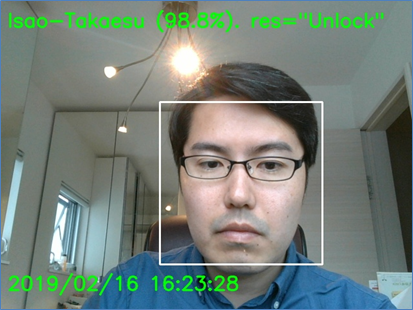<br>
 <figurecaption>顔認証に成功した様子</figurecaption><br>
 <br>
 </figure>
 </div>

一方、学習していない人物（Brian Austin Green氏）の場合はReject（認証失敗）を返します。  
また、認識精度も低くなっていることが分かります。

 <div align="center">
 <figure>
 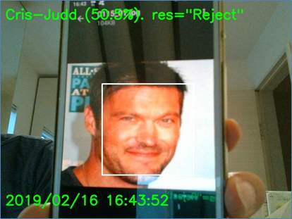<br>
 <figurecaption>顔認証に失敗した様子</figurecaption><br>
 <br>
 </figure>
 </div>

このように、CNNを使用することで（簡易的ではありますが）顔認証システムを実装することができました。  

## 7.5. おわりに
本ブログでは、VGGFACE2と自撮りした筆者の顔画像を学習データとして使用して、簡易的な顔認証システムを実装しました。  
もし、あなたの身の回りの人物を顔認証したい場合は、本ブログで示した顔画像収集用コードを使用して学習データを収集し、CNNで学習させることでこれを実現することができます。  

本ブログを読んでCNNにご興味を持たれた方は、ご自身で学習データを収集し、お手製の顔認証システムを作成しながらCNNの理解を深める事を推奨致します。  

## 7.6. 動作条件
 * Python 3.6.8
 * Keras 2.2.5
 * opencv-python 4.1.2.30
 * matplotlib 3.0.3
 * numpy 1.16.1

### CHANGE LOG
* 2020.01.14 : 初稿  
* 2020.01.15 : 更新（説明を追加）  
