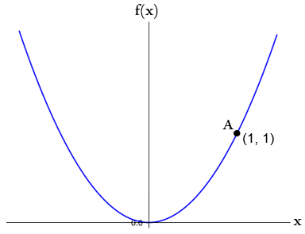
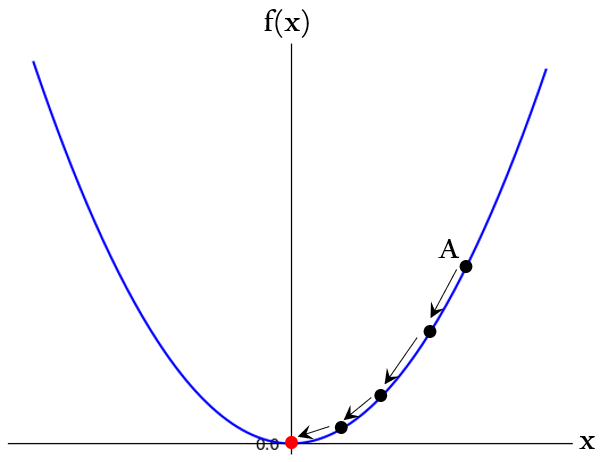
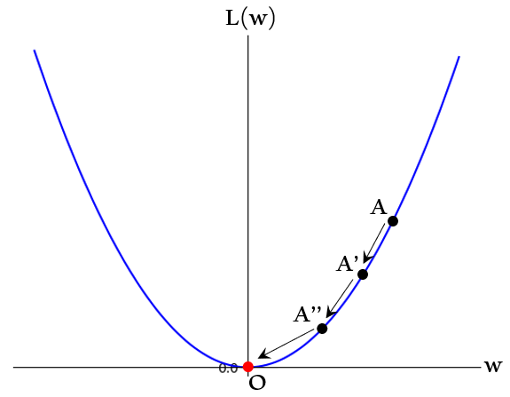
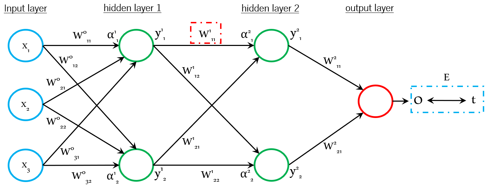
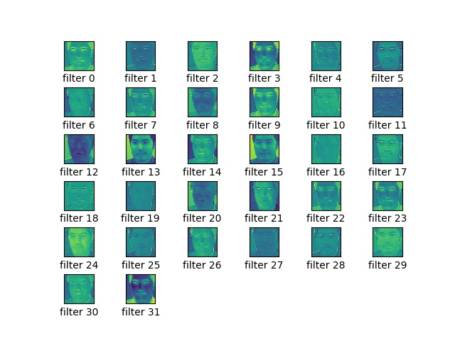
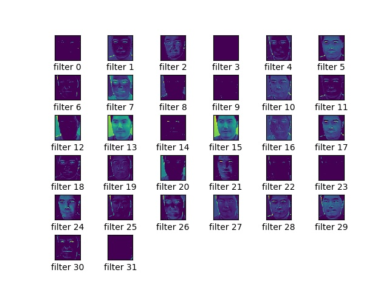

## 7.0. 目的
本ブログは、**顔認証システムの実装**を通して、**Convolutional Neural Network**と呼ばれる**画像分類アルゴリズム**の使用方法を理解することを目的とします。  

 <div align="center">
 <figure>
 <br>
 <figurecaption>本ブログで実装する顔認証システム</figurecaption><br>
 <br>
 </figure>
 </div>

## 7.1. 顔認証とは
顔認証（Face Authentication）とは、Wikipediaによると「監視カメラのデジタル画像から、人間を自動的に識別するためのコンピュータ用アプリケーションです。ライブ画像内の顔と思われる部分を抜き出し、顔画像データベースと照合することで識別を行います。」と説明されています。  

顔認証システムは様々な用途で使用されており、例えば中国では、[天網](https://courrier.jp/news/archives/114613/)と呼ばれる数秒間で20億もの人物を識別できる顔認証システムが運用されていると言われています。身近な利用例としては、空港の[顔認証ゲート](http://www.moj.go.jp/nyuukokukanri/kouhou/nyuukokukanri07_00168.html)やApple iPhoneの[Face ID](https://support.apple.com/en-us/HT208109)などが挙げられます。また、物体認識において高い精度を誇るDeep Learning技術の登場により、Deep Learningベースの顔認証システムも続々と登場しています。  

## 7.2. コンセプト
本ブログでは、顔認証をDeep Learning技術で実装することにします。  

Deep Learningで顔認証を実装するためには、先ずは何らかの**カメラで対象の人物を撮影**してデジタル画像化します。そして、画像の中から**顔を検出**します。最後に、検出した顔と顔画像データベースを**照合**し、一致する顔の有無を判定します。**一致度合が閾値以上**の顔が存在する場合は**認証成功**、存在しない場合は**認証失敗**とします。  

各工程をもう少し深堀してみましょう。  

### 7.2.1. 人物の撮影
何らかのカメラを使用し、**対象人物の全体像または部分像を画像として取り込みます**。  
「何らかのカメラ」は用途によって異なります。先の例で挙げた天網であれば、街中に設置された監視カメラになりますし、顔認証ゲートであれば、ゲートに内蔵されたカメラになります。  

本ブログでは実装を容易にするため、ラップトップPCに内蔵されている**Webカメラ**を使用することにします。  
Webカメラを使用することで、以下のようにカメラの前にいる人物の画像を連続で取り込むことができます。  

 <div align="center">
 <figure>
 <br>
 <figcaption>Webカメラで取り込まれた画像</figcaption><br>
 <br>
 </figure>
 </div>

### 7.2.2. 顔の検出
何らかの方法で、Webカメラで取り込んだ画像から人物の**顔を抽出**します。  
顔抽出には様々な手法が存在しますが、本ブログでは**カスケード分類器**と呼ばれる手法を採用します。  

| カスケード分類器（Cascade Classifier）|
|:--------------------------|
| [Paul Viola氏によって提案](https://www.cs.cmu.edu/~efros/courses/LBMV07/Papers/viola-cvpr-01.pdf)され、Rainer Lienhart氏によって改良された物体検出アルゴリズム。対象の画像を複数の探索ウィンドウ領域に分割し、各探索ウィンドウ領域の画像を学習済み分類器に入力していく。分類器は**N個**用意されており、各分類器はそれぞれ「顔画像である」or「顔画像ではない」と判定していく。そして、1～N個の分類器が一貫して「顔画像である」と判定した場合のみ、当該探索ウィンドウ領域の画像は「顔画像である」と判定する。一方、途中で分類器が「顔画像ではない」と判定すれば処理を終了し、「探索ウィンドウ領域には顔画像はなかった」と判定され、探索ウィンドウは次にスライドしていく。|

カスケード分類器をフルスクラッチで実装するのは少々面倒ですが、[**OpenCV**](https://opencv.org/)と呼ばれるコンピュータビジョン向けライブラリを使用すると、容易に実装することが可能です。なお、本ブログではカスケード分類器の詳細な説明は割愛しますが、詳細を知りたい方は「[Haar Feature-based Cascade Classifier for Object Detection](http://opencv.jp/opencv-2.2/c/objdetect_cascade_classification.html)」をご覧いただければと思います。  

| OpenCV|
|:--------------------------|
| オープンソースのコンピュータビジョン向けライブラリ。画像処理・画像解析および機械学習などの機能を持ち、C/C++、Java、Python、MATLABなどに対応してる。また、クロスプラットフォームであり、Unix系OS、Linux、Windows、Android、iOSなどで動作する。|

### 7.2.3. 顔の照合
検出された顔画像を何らかの方法で照合し、対象人物の認証可否を決定します。  
照合方法は顔認証システムによって異なります。予め認証する人物の顔の特徴（目や鼻、口の配置など）をデータベースに登録しておき、カメラで検出した顔の特徴と照合する方法もあれば、iPhone XのFace IDのように、赤外線センサで計測した顔の立体構造の一致度合を計算する方法もあります。  

本ブログでは、近年顔認証システムへの利用が進んでいる**Deep Learning**技術を使用することにします。具体的には、画像認識の分野で高い識別精度を誇る**Convolutional Neural Network**（以下、CNN）と呼ばれるDeep Learning技術の一種を使用することにします。  

CNNは数年前に発表された技術であり、存在自体もメジャーであるため、本ブログでは簡単な仕組みの解説に留めます。詳しく知りたいという方は、@icoxfog417氏のブログ「[Convolutional Neural Networkとは何なのか](https://qiita.com/icoxfog417/items/5fd55fad152231d706c2)」を参照いただければと思います。このブログには、CNNの基礎が丁寧に分かり易く書かれているためお勧めです。  

本ブログでは、上記の3ステップの処理を実装しながら顔認証システムを実装していきますが、実装に入る前にCNNについて簡単に解説します。  

## 7.3. Convolutional Neural Network（CNN）
CNNは通常の**Neural NetworkにConvolution（畳み込み）を追加**したネットワークであり、認識対象の画像に対して**高い頑健性**（ロバスト性）を持ちます。これにより、CNNへの入力画像を**高精度に分類**することができます。  

ところで、CNNはどのようにして頑健性を獲得しているのでしょうか？  
その説明に入る前に、先ずはCNNの基礎となる**Neural Network**を簡単に解説します。  

### 7.3.1. Neural Network入門の入門
Neural Networkは**層**と**ノード**から構成される「人間の神経回路網を模した**ネットワーク**」です。  
**ベクトル化**された入力データ（以下、入力信号）を**入力層**から受け取り、**出力層**から答えを出力します。入力層と出力層の間には1つ以上の**隠れ層**が存在し（隠れ層は**中間層**とも呼ばれる）、Neural Networkの**表現力**を高める役割を持ちます（表現力の詳細は後述します）。  

Neural Networkは**分類問題**の他、**回帰問題**にも利用することが可能ですが、本ブログでは分類問題にフォーカスして説明を行います。それでは、画像分類の例を用いてNeural Networkの挙動を見ていきましょう。  

以下の例は、筆者（Isao Takaesu）の顔画像を入力信号とし、Neural Networkで分類している様子を表しています。図中の青い丸印は「入力層のノード」、緑の丸印は「隠れ層のノード」、赤い丸印は「出力層のノード」を表しており、隣り合う層にあるノードは全てネットワークで接続されています。なお、**出力層の各ノードは分類の答え（以下、クラス）に紐づいています**。  

 <div align="center">
 <figure>
 <br>
 <figcaption>Neural Networkで画像分類を行う様子</figcaption><br>
 <br>
 </figure>
 </div>
 
 各層の役割を簡単に解説します。  

 * 入力層（Input layer）  
 入力層は入力信号を受け取る役割を持ちます。  
 入力信号は「入力画像をベクトル化したもの」と上述しましたが、**画像のベクトル化**とは何でしょうか？画像は**pixel値の集合**であるため、画像の**pixel値を1pixelずつ抽出**して並べていくと、ベクトルとして表現することができます（通常はpixel値を正規化して並べます）。例えば、**128x128pixelのRGB画像**は**49,152**（=128x128x3）個の要素を持つベクトルとして表現できます。このようにベクトル化された入力画像は入力信号として入力層の各ノードに入力され、ネットワークで連結された**隠れ層の各ノードに伝搬**していきます。  

 * 隠れ層（Hidden layer）  
 隠れ層はNeural Networkの表現力を高める役割を持ちます。  
 ところで、この表現力とは何でしょうか？仮に隠れ層がないネットワーク（**単純パーセプトロン**と呼ぶ）を考えてみましょう。単純パーセプトロンは入力層と出力層のみで構成されるため、分類対象のデータを**正か負か**としか見ることができません。このため、下図のようにデータが分布している場合は正しく分類することができます。これを**線形分離可能**と言います。  

 <div align="center">
 <figure>
 <br>
 <figcaption>線形分離可能</figcaption><br>
 <br>
 </figure>
 </div>

 では、下図のようにデータが分布している場合はどうでしょうか？  
 見ての通り、1本の直線で分類することはできませんね。これを**線形分類不可能**と言います。  

 <div align="center">
 <figure>
 <br>
 <figcaption>線形分離不可能</figcaption><br>
 <br>
 </figure>
 </div>

 このように、単純パーセプトロンはデータを正か負かとしか分類できないため、表現力が低いと言えます。  
 この問題を解決するためには、**複数回の線形分離**に相当する判定を行えば良いと考えられます。その役割を担うのが隠れ層です。分類したいデータの分布に応じて1つ以上の隠れ層を入力層と出力層の間に入れることで、**複雑なデータを分類することが可能**となります。すなわち、表現力を高めることができます。  

 <div align="center">
 <figure>
 <br>
 <figcaption>Neural Networkの表現力が高い</figcaption><br>
 <br>
 </figure>
 </div>

 * 出力層（Output layer）  
 出力層は分類結果を出力する役割を持ちます。  
 入力層から隠れ層を経由して伝搬してき信号は出力層の各ノードに保持されます。出力層のノードにはクラスが紐づいていますので、最も大きな値を持ったノードをNeural Networkの答えとします。  

このように、Neural Networkでは、入力層から隠れ層を経由して出力層に**信号を伝搬**することで、データの分類を行います。  

### 7.3.2. 信号の伝搬
ここでは、信号の伝搬について簡単に説明します。  

Neural Networkに入力された信号は、単純に左から右に伝搬するのではなく、各層で値の変換（**活性化**）を行いながら伝搬していきます。  
下図を利用して活性化の様子を見ていきましょう。  

 <div align="center">
 <figure>
 <br>
 <figcaption>信号がノードを伝搬するイメージ</figcaption><br>
 <br>
 </figure>
 </div>

本例では、**隠れ層のm番目ノード**と、**出力層の3番目ノード**にフォーカスします。  
先ずは、上図の左側の吹き出しを見てみましょう。  

この吹き出しは隠れ層のm番目ノードを表しており、入力層から伝搬される入力信号を「`X_10` ~ `X_1m`」、ノード間の**重み**を「`W_10` ~ `W_1m`」、ノードの**バイアス**を「`b_1m`」で表しています。また、ノードに入力された信号を活性化する**活性化関数**を「`h`」、活性化された信号を「`y_1m`」で表しています。  

| 重み（weight）|
|:--------------------------|
| ノードへの入力信号を計算する際に使用されるパラメータであり、**ノード間を結ぶネットワーク上にそれぞれ存在**する。重みは**Neural Networkの分類精度に大きな影響を与え**、Neural Networkを学習することで重みの値は最適化される。重みの値が最適化されたNeural Networkは、入力信号に対する正しい答えを出力できるようになる。なお、重みは学習前に**初期化**する必要があり、**活性化関数**の種類に応じて最適な初期化方法を採用する。代表的な初期化方法として、「Xavierの初期値」や「Heの初期値」などがある。なお、単純にゼロ初期化をすると、上手く学習できないことが知られている。|

| バイアス（bias）|
|:--------------------------|
| ノードへの入力信号を計算する際に使用されるパラメータ。入力信号を微調整する役割を持つ。|

| 活性化関数（Activation Function）|
|:--------------------------|
| ノードへの**入力信号を変換（活性化）**する関数。シグモイド関数、ソフトマックス関数、ReLU関数、恒等関数など、様々な種類が存在する。|

隠れ層のm番目ノードは、入力層から伝搬してきた入力信号（`X_10` ~ `X_1m`）と重み（`W_10` ~ `W_1m`）を**積算**して**和**を取り、これにバイアス（`b_1m`）を足し合わせた値を受け取ります。そして、この信号は活性化関数「`h`」で**活性化**されてノードの出力値「`y_1m`」となり、次の層への入力信号として伝搬していきます（この様子は、吹き出しの下にある数式で表しています）。  

ところで、ノードに入力された信号を活性化する意味は何でしょうか？  
これを理解するために、代表的な活性化関数の挙動を見てみましょう。  

* シグモイド関数（Sigmoid function）  
シグモイド関数はNeural Networkの**隠れ層で使用**される活性化関数です。  
下図のように、入力値（Input）を**0.0～1.0の範囲**の値に変換して出力（Output）します。  

 <div align="center">
 <figure>
 <br>
 <figcaption>シグモイド関数</figcaption><br>
 <br>
 </figure>
 </div>

 上図を見ても分かる通り、シグモイド関数は**非線形**ですね。この非線形な活性化関数を隠れ層で使用することで、線形分離不可能なデータであっても正しく分類することが可能となります。シグモイド関数は古くからNeural Networkの隠れ層で使われてきましたが、（高い表現力を得るために）隠れ層の数を増やしていくと、**勾配消失問題**と呼ばれる**Neural Networkの学習が進まなくなる問題**が発生することが知られています。このため、Deep Learningのような層が深いネットワークでは使用されなくなってきています（勾配消失問題は次節で解説します）。  

 * ReLU  
 ReLUはNeural Networkの**隠れ層で使用**される活性化関数です。  
 下図のように、入力値（Input）が**0を超えた**場合は入力値をそのまま出力（Output）し、入力値が**0以下**の場合は0を出力します。  
 
 <div align="center">
 <figure>
 <br>
 <figcaption>ReLU</figcaption><br>
 <br>
 </figure>
 </div>

 上図を見ても分かる通り、ReLUは**非線形**ですね。この非線形な活性化関数を隠れ層で使用することで、線形分離不可能なデータであっても正しく分類することが可能となります。ReLUはシグモイド関数とは異なり、**隠れ層の数を増やしても勾配消失問題が起き難い**ことが知られています。このため、Deep Learningでよく使われています。  

 * 恒等関数（Identity function）  
 恒等関数はNeural Networkの**出力層で使用**される活性化関数です。  
 下図のように、入力値（Input）をそのまま出力（Output）します。  
 
 <div align="center">
 <figure>
 <br>
 <figcaption>恒等関数</figcaption><br>
 <br>
 </figure>
 </div>

 恒等関数は出力層の活性化を省略したのと同じ挙動になるため、回帰問題（入力に対する実数値を予測する）によく使われます。  

 * ソフトマックス関数（softmax function）  
 ソフトマックス関数はNeural Networkの**出力層で使用**される活性化関数です。  
 以下のように、出力層（`Output layer`）の各ノード（`node[0]` ~ `node[4]`）が保持する値（Output）の**合計が1**になるように変換します。  
 
 ```
  Output layer | Input | Output
 -------------------------------------------
     node[0]   |   5   | 0.6364086465588309
     node[1]   |   2   | 0.031684920796124276
     node[2]   |   3   | 0.08612854443626872
     node[3]   |   4   | 0.23412165725273665
     node[4]   |   1   | 0.011656230956039607
 -------------------------------------------
 ```

 上記は、出力層（`Output layer`）のノード数が5個の例を示しています。各ノード「`node[0], node[1], node[2], node[3], node[4]`」はそれぞれ「`5, 2, 3, 4, 1`」の値を保持しています。これらの値をソフトマックス関数で変換すると、出力値（`Output`）は「`0.6364086465588309, 0.031684920796124276, 0.08612854443626872,0.23412165725273665, 0.011656230956039607`」となります。これらの出力値を観察してみてください。すると、**入力値に応じて出力値の大小が変化**していることが分かります。また**出力値の合計は1**になっていることも分かります。これは、ノード数が10、20と増えても変わりません。このように出力値の合計が1になることから、各ノードの出力値を**確率**と見なすことができます。この特性から、ソフトマックス関数は**確率付きのマルチクラス分類**によく使われます。  

活性化関数を利用する意味は、隠れ層の場合は「非線形のデータを分類することを可能とする」ことであり、出力層の場合は「マルチクラスの確率付き分類や回帰問題など多様な出力を可能とする」ことであると言えます。  

このように、ノードへの入力信号は活性化関数で活性化されながら出力層に向かって伝搬していきます。そして、ノードへの入力信号は、前層のノードから伝搬される**入力信号とネットワーク上の各重みで決定**されます。このことから、Neural Networkへの**入力信号に対する正しい出力を得るためには重みの値の最適化**が必要であることが分かりますね。この重みを最適化することを、Neural Networkでは**学習**と呼びます。  

### 7.3.3. Neural Networkの学習
ここでは、Neural Networkの学習について簡単に説明します。  

Neural Networkの学習では、学習データを基に**重みの値を最適化**します。  
この「重みを最適化」する上で重要になるのが、**誤差関数**です。  

| 誤差関数（Loss Function）|
|:--------------------------|
| Neural Networkの**精度の悪さ**を数値化する関数。損失関数とも呼ばれる。学習時に誤差関数を使用することで、Neural Networkが学習データに対して**どれだけ適合していないか**を知ることができる。Neural Networkでは、この誤差関数の値を最小化するように重みの最適化を行う。2乗和誤差、クロスエントロピー誤差など、様々な誤差関数が存在する。|

#### 7.3.3.1. クロスエントロピー誤差関数
誤差関数は、**Neural Networkの答えを入力に取り、答えの精度の悪さを数値として出力**します。誤差関数は、答えの精度が悪いほど大きな値を出力し、答えの精度が良いほど小さな値を出力します。この特性から、Neural Networkの学習とは、「**誤差関数の出力値を最小化するように重みを更新する**」と言い換えることができます。  

誤差関数には様々な種類が存在しますが、本ブログではマルチクラス分類で使用される**クロスエントロピー誤差関数**を見ていきます。  
下図は、クロスエントロピー誤差関数の挙動をグラフ化したものです。  

 <div align="center">
 <figure>
 <br>
 <figcaption>クロスエントロピー誤差関数の出力</figcaption><br>
 <br>
 </figure>
 </div>

横軸「`y_kc`」は、**教師信号に対するNeural Networkの答え**、縦軸は`y_kc`を入力にした際のクロスエントロピー誤差関数の出力値を表しています。`y_kc`が小さい（答えの精度が低い）ほどクロスエントロピー誤差は大きくなり、`y_kc`が大きい（答えの精度が高い）ほどクロスエントロピー誤差は小さくなることが分かりますね。  

ところで、「教師信号に対するNeural Networkの答え（`y_kc`）」とは何でしょうか？  
以下のような学習データで考えてみましょう。  

 <div align="center">
 <figure>
 <br>
 <figcaption>学習データの一例</figcaption><br>
 <br>
 </figure>
 </div>

これは、前述した画像分類の例で示したNeural Networkの学習データです。学習データは、複数の顔画像とそれに対応する教師信号のペアで構成されます。この例では、教師信号は人の名前（Dilip-Vengsarkarなど）になっていますが、これは人間にとって見やすくするために付けているだけであり、Neural Networkの学習を行う際は**ベクトル化**する必要があります。  

例えば、教師信号の配列を`['Dilip-Vengsarkar', 'Frank-Elstner', 'Isao-Takaesu', 'Jasper-Cillessen', 'Lang-Ping']`とした場合、顔画像「`Isao-Takaesu`」の教師信号をベクトルで表すと`[0, 0, 1, 0, 0]`になります。配列の中で「`Isao-Takaesu`」に対応する要素は`1`となり、それ以外は`0`になっていることが分かりますね。同じ要領で、顔画像「`Dilip-Vengsarkar`」の教師信号をベクトルで表すと`[1, 0, 0, 0, 0]`となります。  

このように、顔画像に対応する部分を`1`、それ以外は`0`になるように教師信号をベクトル化したものを「**one-hot-vector**」と呼び、one-hot-vector化することを**one-hot-encoding**と呼びます。  

 <div align="center">
 <figure>
 <br>
 <figcaption>one-hot-vectorで表現した教師信号</figcaption><br>
 <br>
 </figure>
 </div>

ところで、なぜNeural Networkの学習では教師信号をone-hot-vectorにするのでしょうか。それは、誤差を求める上で不可欠だからです。  
以下の顔画像「`Isao-Takaesu`」で考えてみましょう。  

 <div align="center">
 <figure>
 <br>
 <figurecaption>Isao-Takaesuの学習データ</figurecaption><br>
 <br>
 </figure>
 </div>

この学習データの教師信号をone-hot-vectorで表すと`[0, 0, 1, 0, 0]`になります。  
この時、Neural Networkは以下の答え（`Output`）を出力したとします。  

```
 Output layer | Output  | t | y_kc     | cross entropy error
-------------------------------------------------------------
    node[0]   | 0.43641 | 0 |  0       |  0
    node[1]   | 0.03168 | 0 |  0       |  0
    node[2]   | 0.18613 | 1 |  0.18613 |  1.6813099246718954
    node[3]   | 0.23412 | 0 |  0       |  0
    node[4]   | 0.11166 | 0 |  0       |  0
-------------------------------------------------------------
```

Neural Networkの出力はソフトマックス関数で活性化、そして、出力層（`Output layer`）の各ノード（`node[0] ~ node[4]`）はそれぞれ「`Dilip-Vengsarkar, Frank-Elstner, Isao-Takaesu, Jasper-Cillessen, Lang-Ping`」に紐づいているものとします。  

教師信号を「`t`」とすると、`t`の各要素と各ノードの`Output`を乗算することで、学習データ「`Isao-Takaesu`」に対応するNeural Networkの答え「`y_kc`」のみを得ることができます。すなわち、教師信号をone-hot-vectorで表現することは、お目当ての学習データに対応するNeural Networkの答えを得るためのフィルタの役割を果たします。そして、得られた`y_kc`をクロスエントロピー誤差関数に入力することで、学習データ「`Isao-Takaesu`」に対するNeural Networkの答えと正解との誤差「`1.6813099246718954`」を得ることができるのです。  

なお、上記の例では、本来は1（100%）に近しい値を出力すべきところ、0.186..（約18%）という低い値を出力しているため、誤差は大きくなっていることが分かりますね。  

このように、one-hot-vector化した教師信号と誤差関数を利用することで、Neural Networkの精度の悪さを数値化することができます。  
Neural Networkの学習ではこの誤差を最小化する必要がありますが、これを行うために**勾配降下法**（Gradient descent）と呼ばれる手法を使用して**重みの値を最適化**していきます。  

#### 7.3.3.2. 勾配降下法（Gradient descent）
勾配（Gradient）とは、読んで字の如く「どれだけ傾いているか」を意味します。  
「機械学習なのに傾き？」と疑問に思う方もいると思いますが、以下のグラフを見れば一目瞭然です。  

 <div align="center">
 <figure>
 <br>
 <figcaption>とある関数の軌跡</figcaption><br>
 <br>
 </figure>
 </div>

このグラフは、とある関数「`f(x)`」の軌跡を表しています（今は関数の中身や係数「`x`」は気にしてなくても大丈夫です）。  

ところで、この関数の最小値は何処でしょうか？見ての通り原点「`(0, 0)`」になりますね。とても簡単です。しかし、これは我々が関数の形状を把握しているから即座に分かるのであり、Neural Networkの学習では関数の形状を把握することはできません。  

では、関数の形状を把握できない条件の下、どのようにして最小値を求めるのでしょうか？  
そこで登場するのが勾配降下法です。  

勾配降下法を一言でいうと、「**関数の勾配を利用**して、その関数の最小値を求める方法」です。  
とある関数「`f(x)`」の最小値を求める流れをざっくり説明すると、下図のようになります。  

 <div align="center">
 <figure>
 <br>
 <figcaption>勾配がほぼ0になる点まで降下していくイメージ</figcaption><br>
 <br>
 </figure>
 </div>

  1. 適当に選んだ点「`A`」における、関数「`f(x)`」に対する係数「`x`」の**勾配**「`⊿x`」を求める。  
  2. 勾配方向に係数「`x`」の値を更新する（`x - ⊿x`）。その結果、点「`A'`」に移動する。  
  3. 点「`A'`」における、関数「`f(x)`」に対する係数「`x`」の勾配「`⊿x'`」を求める。  
  4. 勾配方向に係数「`x`」の値を更新する（`x - ⊿x'`）。その結果、点「`A''`」に移動する。  
  5. 点「`A''`」における、関数「`f(x)`」に対する係数「`x`」の傾き「`⊿x''`」を求める。 
  6. 勾配方向に係数「`x`」の値を更新する（`x - ⊿x''`）。その結果、点「`O`」に移動する。  
  7. 点「`O`」の勾配は**ほぼ0**のため、この地点を**最小値**と判断し、係数「`x`」の更新を終える。  

なお、勾配「`⊿x`」は関数「`f(x)`」を係数「`x`」で**偏微分**すると求まります。  
このように、「勾配を求める⇒係数`x`を更新する」という単純な計算を勾配がほぼ0（関数「`f(x)`」の最小値）になるまで繰り返します。ざっくり言うと、最初に選んだ地点から坂を転がり落ちていき、最も低い地点（=最小値）に到達するイメージです。直感的に分かり易いですね。  

では、どのようにしてNeural Networkの重みを勾配降下法で最適化するのでしょうか？  
前節で述べたように、Neural Networkの学習は「**誤差関数が最小になるように重みを更新する**」ことでした。つまり、上図の**とある関数「`f(x)`」を誤差関数「`L`」に置き換え**、**係数「`x`」を重み「`w`」に置き換え**て勾配降下法を用いれば、**誤差関数が最小値になる重み**を求めることができます。  

以下は、勾配降下法で最適な重みを求めるイメージです。  

 <div align="center">
 <figure>
 <br>
 <figcaption>勾配降下法で最適な重みを求めるイメージ</figcaption><br>
 <br>
 </figure>
 </div>

縦軸が誤差関数「`L(w)`」、横軸が重み「`w`」に置き換わっているのが分かりますね。  

  1. 適当に選んだ点「`A`」において、誤差関数「`L(w)`」を重み「`w`」で偏微分し、**勾配**「`⊿w`」を求める。  
  2. 勾配方向に重み「`w`」を更新する（`w - ⊿w`）。その結果、点「`A`」から点「`A'`」に移動する。  
  3. 点「`A'`」において、誤差関数「`L(w)`」を重み「`w`」で偏微分し、勾配「`⊿w'`」を求める。  
  4. 勾配方向に重み「`w`」を更新する（`w - ⊿w'`）。その結果、点「`A'`」から点「`A''`」に移動する。  
  5. 点「`A''`」において、誤差関数「`L(w)`」を重み「`w`」で偏微分し、勾配「`⊿w''`」を求める。 
  6. 勾配方向に重み「`w`」を更新する（`w - ⊿w''`）。その結果、点「`A''`」から点「`O`」に移動する。  
  7. 点「`O`」の勾配は**ほぼ0**のため、この地点を「誤差関数「`L(w)`」の最小値（誤差が最も少ない地点）」と判断し、重み「`w`」の更新を終える。  

このように、勾配降下法を用いることで誤差関数「`L(x)`」が最小となる最適な重み「`w`」を求めることができるのです。ちなみに、上記No1の「適当に選んだ」は、前述した**重みの初期化**を意味します。  

なお、上記の説明では省略しましたが、重み「`w`」を更新する際には、勾配に**学習率**（Learning rate）を乗じます（実際には`w - ⊿w*Learning_rate`）。学習率は重み「`w`」の**更新幅を調整**する役割を持ち、「`0.001`や`0.0001`」といった値を取るのが一般的です。なお、学習率が大きすぎると重みの更新幅も大きくなるため、最小値点を通り越して反対側の勾配に行ってしまう可能性があります（学習が収束しない）。逆に学習率が小さすぎると重みの更新幅も小さくなるため、学習の進捗が悪くなります（学習に時間がかかる/終わらない）。このため、Neural Networkの学習では、学習率の値を調整しながら学習が上手くいっているのか確認する必要があります。  

以上、勾配降下法を用いることで、誤差関数を最小にする重みを求められることが分かりました。  

ところで、重みは出力層のみならず、隠れ層にも存在します。出力層から遠く離れた隠れ層の重みをどのようにして更新するのでしょうか？  

そこで登場するのが**誤差逆伝搬法**（Back Propagation）です。この誤差逆伝搬法と勾配降下法を組み合わせることで、Neural Networkの全ての層にある重みを更新することが可能となります。  

#### 7.3.3.3. 誤差逆伝搬法（Back Propagation）
誤差逆伝搬法は、微分における**連鎖律**（Chain rule）と呼ばれる原理を上手く利用することで、Neural Networkの層を逆に辿りながら重みを更新していきます。  

| 連鎖律（Chain rule）|
|:--------------------------|
| 微分における連鎖律とは、複数の関数が合成された関数（合成関数）の微分値は、合成関数を構成する**それぞれの関数の微分値の積**で求まるという関係式のこと。|

誤差逆伝搬法の仕組みを、以下のシンプルなNeural Networkで考えてみましょう。  

 <div align="center">
 <figure>
 <br>
 <figcaption>とあるNeural Network</figcaption><br>
 <br>
 </figure>
 </div>

上図は、3ノードの入力層と1ノードの出力層、そして2ノードの隠れ層が2つ備わったシンプルなNeural Networkを表しています。隠れ層と出力層のノードには何らかの活性化関数「`h()`」が備わっているものとします。また、Neural Networkの出力「`O`」と教師信号「`t`」より、誤差関数「`E`」が計算されるものとします。  

本例では、赤い破線で囲った重み「`w1_11`」」を更新する流れに沿って誤差逆伝搬法を説明します。つまり、`w1_11`で誤差関数「`E`」を偏微分して勾配を求めることを目標とします。勾配が計算できれば、勾配降下法で`w1_11`を最適化できますね。  

ところで、上図を見ても分かる通り、`E`は`w1_11`の関数ではありません。よって、直接`w1_11`で`E`を偏微分することはできません。`w1_11`で`E`を偏微分するためには、`W1_11`を**何らかの関数**で`O`に変換したと見なし、`O`で`E`を偏微分する必要があります（`E`は`O`の関数なので偏微分できる）。すなわち、`w1_11`で`E`を偏微分するということは、連鎖律を利用すると以下のように表現できます。  

| 目標 |手段|
|:--------------------------|:---|
| `w1_11`で`E`を偏微分したい。|「`O`で`E`を偏微分する」ｘ「`w1_11`で`O`を偏微分する」|

これを解けば`E`を最小化する`w1_11`が得られそうです。  
しかし、まだまだ乗り越えなければならない壁が存在します。それは、「`w1_11`で`O`を偏微分する」も直接計算することができないことです。  

上図を見ても分かる通り、`O`を計算するためには隠れ層2（hidden layer 2）にある2ノードからの出力「`y2_1`」と「`y2_2`」が必要になります。これを踏まえて、「`w1_11`で`O`を偏微分する」ことを連鎖律を利用して表現すると以下となります。  

| 目標 |手段|
|:--------------------------|:---|
| `w1_11`で`O`を偏微分したい。|（「`y2_1`で`O`を偏微分する」ｘ「`w1_11`で`y2_1`を偏微分する」）＋（「`y2_2`で`O`を偏微分する」ｘ「`w1_11`で`y2_2`を偏微分する」）|

ここで、「`w1_11`で`y2_1`を偏微分する」と「`w1_11`で`y2_2`を偏微分する」も直接計算することはできませんね。  
「`y2_1`は`α2_1`を活性化関数で変換した値」「`y2_2`は`α2_2`を活性化関数で変換した値」となるため、これを連鎖律を利用して表現すると以下となります。  

| 目標 |手段|
|:--------------------------|:---|
| `w1_11`で`y2_1`を偏微分したい。|「`α2_1`で`y2_1`を偏微分する」ｘ「`w1_11`で`α2_1`を偏微分する」|

| 目標 |手段|
|:--------------------------|:---|
| `w1_11`で`y2_2`を偏微分したい。|「`α2_2`で`y2_2`を偏微分する」ｘ「`w1_11`で`α2_2`を偏微分する」|

`y2_1`と`y2_2`は、それぞれ`α2_1`と`α2_2`を活性化関数で変換した値なので偏微分できますね。また、`α2_1`と`α2_2`は`w1_11`の関数になっているため、これも偏微分できます。  

これでようやく、`w1_11`で`E`を偏微分できるところまで辿り着きました。これを連鎖律を利用して纏めると以下となります。  

| 目標 |手段|
|:--------------------------|:---|
| `w1_11`で`E`を偏微分したい。|（「`O`で`E`を偏微分する」ｘ「`y2_1`で`O`を偏微分する」ｘ「`α2_1`で`y2_1`を偏微分する」ｘ「`w1_11`で`α2_1`を偏微分する」）＋（「`O`で`E`を偏微分する」ｘ「`y2_2`で`O`を偏微分する」ｘ「`α2_2`で`y2_2`を偏微分する」ｘ「`w1_11`で`α2_2`を偏微分する」）|

このように、**層を遡りながら偏微分の計算を連鎖律を利用して繋げていく**ことで、**出力層から遠く離れた重みの勾配を求める**ことができるのです。そして、勾配が求まれば勾配降下法で誤差関数を最小化する最適な重みを得ることができるわけです。この考え方は、Neural Networkの層が増えても（深くなっても）適用することが可能です。すなわち、誤差逆伝搬法と勾配降下法を利用することで、Neural Networkの全ての重みを最適化することが可能となります。  

一見すると非の打ち所がないように見える誤差逆伝搬法ですが、Deep Learningのように層が深くなると様々な問題が生じます。  

層が深くなるとその分重みも増大するため、最適な重みの値を見つけることが困難になります。勾配降下法で誤差関数の最小値を見つけたと思っていても、実はそれが**局所最適解**である可能性も十分に考えられます。  

| 局所最適解（Local optimal solution）|
|:--------------------------|
| 局所最適解とは、関数の**ある範囲**における最適解。必ずしも関数全体で見た最適解とは一致しないため、最適な重みが得られない場合がある。一方、関数全体における最適解のことを**全体最適解**と呼ぶ。|

また、誤差逆伝搬法は層を遡りながら偏微分（勾配）の積を取っていくため、途中の隠れ層の勾配が0に近しい値になった場合、それ以降の重みが更新できなくなる**勾配消失問題**が発生します（誤差逆伝搬法は連鎖律で勾配の積を取るため、途中で勾配が0になると、それ以降も全て0になる）。この問題は、滑らかな曲線を持つシグモイド関数を隠れ層の活性化関数に使用している場合に顕著になります。  

| 勾配消失問題（Vanishing gradient problem）|
|:--------------------------|
| 勾配が消失することで学習が進まなくなる問題。|

これらの問題を克服するために、学習データのサンプリングに**ミニバッチ学習**と呼ばれるテクニックを用いたり、活性化関数をシグモイド関数からReLUに変更するなどのネットワーク設計を変更するなどの工夫が必要となります。  

| ミニバッチ学習（Mini-batch Training）|
|:--------------------------|
| 学習データを等しいサイズのバッチに分割し、バッチ毎に誤差関数を計算して重みを更新するテクニック。|

### 7.3.4. Neural Networkによる画像分類の限界
Neural Networkでは、**分類対象の画像を1pixel単位で受け取る**ことを上述しました。  

例えば「128×128pixel」のRGB画像の場合、入力信号は49,152（=128x128x3）個の要素を持つベクトルとなりますね。このため、**入力画像のレイアウトが少しでも異なると、入力信号のベクトルは大きく異なってしまいます**。入力信号が大きく異なるということは、入力に対する最適な出力を得ることが困難になることを意味します。  

下図は、レイアウトが異なる2枚の顔画像（`Isao-Takaesu`）です。  

 <div align="center">
 <figure>
 <br>
 <figurecaption>Neural Networkでは同じ人物として認識することが困難</figurecaption><br>
 <br>
 <br>
 </figure>
 </div>

人間の目には同じ人物に見えますが、レイアウトや色味などが異なるため、入力信号としては情報が大きく異なり、Neural Networkで2つを同じ人物として分類することは困難となります。このように、Neural Networkの「**1pixel単位で入力を受け取る**」という仕組みが、画像分類の頑健性を低下させる大きな要因となります。  

ところで、世の中に存在するあらゆる筆者の顔画像を使用してNeural Networkの学習を行えば、分類精度は向上するかもしれません。しかし、それではあまりに**学習コストが掛かり過ぎ**ますし、筆者が髪型を変えるなどした場合は分類が困難になります（汎化性能が低い）。  

### 7.3.5. CNN入門の入門
Neural Networkの頑健性の低さを克服するために、CNNは**Convolution**（畳み込み）と呼ばれるテクニックを導入しています。  

CNNは分類対象の画像を1pixel単位で受け取るのではなく、**複数のpixelを纏めた領域**（4x4pixelの領域など）として受け取ります。この纏めた領域を**フィルタ**と呼び、**フィルタを1つの特徴量として畳み込み**ます。そして、**フィルタを少しずつスライドさせながら畳み込みを繰り返す**ことで、入力画像全体を畳み込んだレイヤ「**Convolution Layer**」を作成します。この**Convolution Layerを出力層の方向に繋げていくことでネットワークを構築**します。  

下図は、顔認識を行うCNNの概念図を表しています。  

 <div align="center">
 <figure>
 <br>
 <figurecaption>CNNは頑健性が高い</figurecaption><br>
 <br>
 </figure>
 </div>

このCNNは、入力画像の特徴量を畳み込む層「`Conv`」、画像圧縮を行う層「`Pooling`」、畳み込まれた特徴量から最終的な判断を行う層「`FC`」、そして、Neural Networkと同様に信号を活性化させる活性化関数「`ReLU`」で構成されます（CNNは層が深くなるため、活性化関数にReLUを使うことが一般的です）。  

それでは、各層を少し深堀りしてみましょう。  

 * 畳み込み層（Conv layer）  
 Conv layerは、入力画像を任意サイズのフィルタで畳み込むことで作成されます。  
 下図は、入力画像を畳み込むことで作成された画像を示しています。  

 <div align="center">
 <figure>
 <br>
 <figurecaption>入力画像が畳み込まれた様子</figurecaption><br>
 <br>
 </figure>
 </div>

 上図を見ると、顔や目・鼻といった人物の特徴となる部位のエッジを抽出しているように見えます。このように特徴を捉えることで、入力画像のレイアウトが多少異なる場合でも、その差異を吸収することが可能となります。  

 * プーリング層（Pooling layer）  
 Pooling layerは、高解像度の画像を扱い易くするために、画像を圧縮することで作成されます。  
 下図は、畳み込まれた画像を圧縮して作成された画像を示しています。  

 <div align="center">
 <figure>
 <br>
 <figurecaption>画像が圧縮された様子</figurecaption><br>
 <br>
 </figure>
 </div>

 上図を見ると、画像が圧縮されていることが分かります。  

 * 全結合層（Full connected layer）  
 全結合層は、Neural Networkの出力層に相当します。  
 畳み込みと圧縮された画像の信号を受け取り、ソフトマックス関数などの活性化関数を使用して出力（分類結果）を決定します。  

このように、CNNでは「点（pixel）」ではなく「フィルタ（領域）」での特徴抽出が可能になるため、入力画像に対する柔軟性を持ち、それ故にNeural Networkと比較して高精度の画像分類を実現します。  

以上でCNN入門の入門は終了です。  

次節では、CNNを使用した顔認証システムの構築手順とサンプルコードを解説します。  

## 7.4. 顔認証システムの実装
本ブログで実装する顔認証システムは、大きく以下の4ステップで認証を行います。  

 1. 顔認識モデルの作成  
 2. Webカメラから顔画像を取得  
 3. 顔認識モデルで顔画像を分類  
 4. 分類確率と閾値を比較して認証成否を判定    

### 7.4.1. 顔認識モデルの作成
本ブログで使用するCNNは教師あり学習のため、先ずは学習データを用意します。  

#### 7.4.1.1. 学習データの準備
本ブログでは、著名な顔画像データセットである「[**VGGFACE2**](http://www.robots.ox.ac.uk/~vgg/data/vgg_face2/)」を学習データに使用します。  

| VGGFACE2|
|:--------------------------|
| 大規模な顔画像データセット。Google画像検索からダウンロードされた**9,000人以上**の人物の顔画像が**330万枚以上**収録されており、年齢・性別・民族・職業・顔の向き・顔の明るさ（照明具合）など、様々なバリエーションの顔画像が存在する。ダウンロードにはアカウントの登録が必要。|

本ブログでは、VGGFACE2から無作為に選んだDilip Vengsarkar氏、Frank Elstner氏、Jasper Cillessen氏、Lang Ping氏の4人と、筆者を学習させることにします。すなわちこの5人が、本ブログで実装する顔認証システムで認証可能な人物となります。  

 <div align="center">
 <figure>
 <br>
 <figurecaption>認証対象の人物</figurecaption><br>
 </figure>
 </div>

当然ながら筆者の顔画像はVGGFACE2に含まれていないため、顔画像収集用のサンプルコード[`record_face.py`](src/defensive_chap7/record_face.py)を用いて収集しました。このコードは、Webカメラから**0.5秒間隔**で画像を取り込み、画像に含まれる顔部分を抽出し、JPEG形式で保存します。  

 * 顔画像収集プログラムの実行  
 ```
 your_root_path> python3 record_face.py
 1/100 Capturing face image.
 2/100 Capturing face image.
 3/100 Capturing face image.
 ...snip...
 98/100 Capturing face image.
 99/100 Capturing face image.
 100/100 Capturing face image.
 ```

プログラムの実行が完了すると、自動的に「`original_image`」ディレクトリが作成され、そのサブディレクトリとして「`Isao-Takaesu`」が作成されます。このサブディレクトリ配下に収集した顔画像が保存されます。  

 * 収集された顔画像
 ```
 /your_root_path/original_image/Isao-Takaesu> ls
 Isao-Takaesu_1.jpg
 Isao-Takaesu_2.jpg
 Isao-Takaesu_3.jpg
 ... snip ...
 Isao-Takaesu_98.jpg
 Isao-Takaesu_99.jpg
 Isao-Takaesu_100.jpg
 ```

なお、サブディレクトリ名「`Isao-Takaesu`」が、**顔認証時のクラス名**となります。  
もし、あなたが任意の人物を認証対象としたい場合は、コード中の`FILE_NAME`の値を変更してください。  

#### 7.4.1.2 データセットの作成
顔画像の収集が完了しましたので、データセット生成用のサンプルコード「[`create_dataset.py`](src/defensive_chap7/create_dataset.py)」を用いてCNNの学習データと精度評価用のテストデータを作成します。  

ここで、コードを実行する前に、VGGFACE2から選んだ4人のサブディレクトリを「`original_image`」配下に作成します（筆者のサブディレクトリは前節で作成済み）。  

 * 認証対象人物のサブディレクリを作成  
 ```
 your_root_path\original_image> mkdir Dilip-Vengsarkar Frank-Elstner Jasper-Cillessen Lang-Ping
 your_root_path\original_image> ls
 Dilip-Vengsarkar
 Frank-Elstner
 Isao-Takaesu
 Jasper-Cillessen
 Lang-Ping
 ```

なお、前節でも述べましたが、これらサブディレクトリ名が、顔認証時のクラス名となります（大事なことなので2回書きます）。  
そして、4人の顔画像をVGGFACE2からコピーして各サブディレクトリにペーストし、データセット生成用のサンプルコードを実行します。  

 * データセット生成用プログラムの実行  
 ```
 your_root_path> python3 create_dataset.py
 ```

プログラムの実行が完了すると、自動的に「`dataset`」ディレクトリが作成され、サブディレクトリとして学習データ格納用の「`train`」ディレクトリと、精度評価用テストデータ格納用の「`test`」ディレクトリが作成されます。各ディレクトリには、「`original_image`」からコピーした画像が「7対3（学習データ：7、テストデータ：3）」の割合で格納されます。  

#### 7.4.1.3 学習の実行
学習データの準備ができましたので、学習用するサンプルコード「[`train.py`](src/defensive_chap7/train.py)」を実行します。  

 * 学習用プログラムの実行  
 ```
 your_root_path> python3 train.py
 ```

このコードは、`dataset/train`配下の学習データと`dataset/test`配下のテストデータを使用して顔認識モデルを作成します。  
プログラムの実行が完了すると、自動的に「`model`」ディレクトリが作成され、その配下に学習済みのモデル「`cnn_face_auth.h5`」が保存されます。  

### 7.4.2. サンプルコード及び実行結果
#### 7.4.2.1. サンプルコード
本ブログではPython3を使用し、簡易的な顔認証システムを実装しました。
※本コードは[こちら](https://github.com/13o-bbr-bbq/machine_learning_security/blob/master/Security_and_MachineLearning/src/defensive_chap7/face_auth.py)から入手できます。

本システムの大まかな処理フローは以下のとおりです。

 1. Webカメラから対象人物の映像を取得
 2. 取得した映像から顔部分の切り出し
 3. 切り出した顔画像を学習済みCNNモデルで分類
 4. 閾値を基に許容 or 拒否を判定

```
#!/bin/env python
# -*- coding: utf-8 -*-
import os
import cv2
import numpy as np
from datetime import datetime
from keras.preprocessing import image
from keras.models import load_model

# Full path of this code.
full_path = os.path.dirname(os.path.abspath(__file__))

# dataset path.
dataset_path = os.path.join(full_path, 'dataset')
test_path = os.path.join(dataset_path, 'test')

# Model path.
model_path = os.path.join(full_path, 'model')
trained_model = os.path.join(model_path, 'cnn_face_auth.h5')

MAX_RETRY = 50
THRESHOLD = 80.0

# Generate class list.
classes = os.listdir(test_path)
nb_classes = len(classes)

# Dimensions of training images.
img_width, img_height = 128, 128

# Load model.
print('Load trained model: {}'.format(trained_model))
model = load_model(trained_model)

# Execute face authentication.
capture = cv2.VideoCapture(0)
for idx in range(MAX_RETRY):
    # Read 1 frame from VideoCapture.
    ret, captured_image = capture.read()

    # Execute detecting face.
    gray_image = cv2.cvtColor(captured_image, cv2.COLOR_BGR2GRAY)
    cascade = cv2.CascadeClassifier(os.path.join(full_path, 'haarcascade_frontalface_default.xml'))
    faces = cascade.detectMultiScale(gray_image,
                                     scaleFactor=1.1,
                                     minNeighbors=2,
                                     minSize=(img_width, img_height))

    if len(faces) == 0:
        print('Face is not found.')
        continue

    for face in faces:
        # Extract face information.
        x, y, width, height = face
        face_image = captured_image[y:y + height, x:x + width]
        if face_image.shape[0] < img_width:
            continue
        resized_face_image = cv2.resize(face_image, (img_width, img_height))

        # Save image.
        file_name = os.path.join(dataset_path, 'tmp_face.jpg')
        cv2.imwrite(file_name, resized_face_image)

        # Transform image to 4 dimension tensor.
        img = image.img_to_array(image.load_img(file_name, target_size=(img_width, img_height)))
        x = image.img_to_array(img)
        x = np.expand_dims(x, axis=0)
        x = x / 255.0

        # Prediction.
        preds = model.predict(x)[0]
        predict_idx = np.argmax(preds)

        # Final judgement.
        judge = 'Reject'
        prob = preds[predict_idx] * 100
        if prob > THRESHOLD:
            judge = 'Unlock'
        msg = '{} ({:.1f}%). res="{}"'.format(classes[predict_idx], prob, judge)
        print(msg)

        # Draw frame to face.
        cv2.rectangle(captured_image,
                      (x, y),
                      (x + width, y + height),
                      (255, 255, 255),
                      thickness=2)

        # Get current date.
        date = datetime.now().strftime('%Y%m%d%H%M%S%f')[:-3]
        print_date = datetime.strptime(date[:-3], '%Y%m%d%H%M%S').strftime('%Y/%m/%d %H:%M:%S')

        # Display raw frame data.
        cv2.putText(captured_image, msg, (10, 40), cv2.FONT_HERSHEY_SIMPLEX, 1, (0, 255, 0), 2, cv2.LINE_AA)
        cv2.putText(captured_image, print_date, (10, 450), cv2.FONT_HERSHEY_SIMPLEX, 1, (0, 255, 0), 2, cv2.LINE_AA)
        cv2.imshow('Face Authorization', captured_image)

        file_name = os.path.join(dataset_path, 'tmp_face' + str(idx) + '_.jpg')
        cv2.imwrite(file_name, captured_image)

    # Waiting for getting key input.
    k = cv2.waitKey(500)
    if k == 27:
        break

# Termination (release capture and close window).
capture.release()
cv2.destroyAllWindows()

print('Finish.')
```

#### 7.4.2.2. コード解説
今回はCNNの実装に、Deep Learningライブラリの**Keras**を使用しました。  
Kerasの使用方法は[公式ドキュメント](https://keras.io/ja/)を参照のこと。  

#####  OpenCVのインポート
```
import cv2
```

Webカメラからの画像取得、および顔部分の切り出しを行うため、コンピュータビジョン向けライブラリ「`cv2`（OpenCV）」をインポートします。  
このパッケージには、Webカメラの制御や画像の加工、顔認識を行うための様々なクラスが収録されています。  

##### CNN用パッケージのインポート
```
from keras.preprocessing import image
from keras.models import load_model
```

学習済みモデルのロード、および認証対象画像を扱うためのKerasパッケージをインポートします。  

##### Pathの定義
```
# Model path.
model_path = os.path.join(full_path, 'model')
trained_model = os.path.join(model_path, 'cnn_face_auth.h5')
```

前節で作成した学習済みモデル（`cnn_face_auth.h5`）のPathを定義します。  

##### 認証の試行回数と閾値の定義
```
MAX_RETRY = 50
THRESHOLD = 80.0
```

`MAX_RETRY`は顔認証を試行する最大回数、`THRESHOLD`は認証成功の閾値となります（CNNの分類確率が閾値を超えた場合に認証成功とする）。  

##### 学習済みモデルのロード
```
# Load model.
print('Load trained model: {}'.format(trained_model))
model = load_model(trained_model)
```

ここでは、前節で学習した結果（学習済みのモデル）をCNNアーキテクチャにロードして認識モデルを作成しています。  
これにより、CNNモデルは学習した状態、すなわち、顔画像の照合が実行できる状態になります。  

##### Webカメラの定義
```
# Execute face authentication.
capture = cv2.VideoCapture(0)
```

`cv2.VideoCapture(0)`でWebカメラのインスタンスを作成します。  
この1行のみでOpenCVを介してWebカメラの制御を取得することができます。なお、`VideoCapture`の引数はカメラの識別IDですが、ラップトップに複数のカメラが接続されていれば、それぞれのカメラにユニークなIDが割り当てられます。今回は1つのWebカメラを使用しますので、引数は`0`となります。  

##### Webカメラからの画像取り込み 
```
# Read 1 frame from VideoCapture.
ret, captured_image = capture.read()
```

Webカメラのインスタンス`capture`のメソッドである`read()`を呼び出すと、Webカメラで撮影した1フレーム分の画像が戻り値として返されます。なお、画像はBGRの画素値を持った配列になっています（RGBではないことに注意してください）。  

##### 取り込んだ画像から顔の検出
```
# Execute detecting face.
gray_image = cv2.cvtColor(captured_image, cv2.COLOR_BGR2GRAY)
cascade = cv2.CascadeClassifier(os.path.join(full_path, 'haarcascade_frontalface_default.xml'))
faces = cascade.detectMultiScale(gray_image,
                                 scaleFactor=1.1,
                                 minNeighbors=2,
                                 minSize=(128, 128))
```

OpenCVに備わっているカスケード分類器を使用し、Webカメラで取り込んだ画像から**顔を抽出**します。  
上記のコードでは、カスケード分類器に画像を入力する前に、画像をグレースケールに変換します（`cv2.cvtColor()`）。これは、カスケード分類器は**顔の輪郭など（色の濃淡）を特徴**として「顔 or 顔ではない」を判定するため、BGRのようなカラー画像よりもグレースケールの方が精度が向上します。  

次に、カスケード分類器のインスタンスを作成します(`cv2.CascadeClassifier`）。引数の「`haarcascade_frontalface_default.xml`」は、OpenCVプロジェクトが予め用意した「顔の特徴を纏めたデータセット」です。このデータセットを引数として渡すのみで、顔検出が可能なカスケード分類器を作成することができます。  

なお、このデータセットは[OpenCVのGitHubリポジトリ](https://github.com/opencv/opencv/tree/master/data/haarcascades)で公開されています。本ブログでは「顔検出」を行うため、このデータセットのみを使用していますが、リポジトリを見ると分かる通り、「目」「体」「笑顔」等の特徴を纏めたデータセットも配布されています。つまり、このようなデータセットを使うことで、「目の検出」「体の検出」「笑顔の検出」等を実現することも可能です。  

最後に、作成したカスケード分類器のメソッド「`detectMultiScale`」にグレースケールにした画像を渡すと、戻り値として「検出した顔画像部分の座標」が返されます。なお、画像に複数の顔が写っている場合は、複数の座標が配列で返されます。  

##### 顔画像の前処理
```
# Extract face information.
x, y, width, height = face
face_image = captured_image[y:y + height, x:x + width]
if face_image.shape[0] < img_width:
    continue
resized_face_image = cv2.resize(face_image, (img_width, img_height))

# Save image.
file_name = os.path.join(dataset_path, 'tmp_face.jpg')
cv2.imwrite(file_name, resized_face_image)
```

カスケード分類器で検出した**顔画像部分の座標**を使用し、Webカメラから取り込んだ画像（`captured_image`）から**顔画像部分のみを切り出し**ます（`captured_image[y:y + height, x:x + width]`）。`x`、`y`、`width`、`height`は、カスケード分類器で検出した顔部分の座標。そして、切り出した顔画像を`cv2.resize`にて、128x128pixelの画像にリサイズします。  

なお、顔画像をリサイズするのは、**CNNに入力する画像は一定のサイズにする必要がある**ためであり、リサイズするサイズは任意です。  
本ブログでは、CNNアーキテクチャに合わせて`128`に設定しています。  

リサイズされた画像は一時的にローカルファイルとして保存します（`file_name`）。  

##### 入力画像の正規化
```
# Transform image to 4 dimension tensor.
img = image.img_to_array(image.load_img(file_name, target_size=(img_width, img_height)))
x = image.img_to_array(img)
x = np.expand_dims(x, axis=0)
x = x / 255.0
```

顔画像をベクトル化した上で、これをを正規化します（`x`）。  

##### 顔画像の照合
```
# Prediction.
preds = model.predict(x)[0]
predict_idx = np.argmax(preds)

# Final judgement.
judge = 'Reject'
prob = preds[predict_idx] * 100
if prob > THRESHOLD:
    judge = 'Unlock'
```

正規化した顔画像をCNNモデルに入力し（`model.predict(x)[0]`）、照合結果である出力（`preds`）を取得します。  
`preds`には全てのクラスと予測精度が格納されていますので、**最も予測精度が高いクラス（認証対象人物の名前）と予測精度のセット**を取得します。  

最後に、予測精度が閾値（今回は`THRESHOLD = 95.0`）を超えていた場合に、`Unlock`（認証成功）のラベルを返します（認証が成功した後の処理は任意）。  

#### 7.4.2.2. 実行結果
それでは、早速作成した顔認証システムを起動してみます。  

以下のように、PCのカメラから周りの画像を取り込み、人物の顔を正確に認識していることが見て取れます。  
以下の場合、識別結果（Unlock）と人物名（Isao Takaesu）、そして認識精度（96.8%）を返しており、Unlockは認証成功を表しています。

 <div align="center">
 <figure>
 <br>
 <figurecaption>顔認証に成功した様子</figurecaption><br>
 <br>
 </figure>
 </div>

一方、学習していない人物（Brian Austin Green氏）の場合はReject（認証失敗）を返します。  
また、認識精度も低くなっていることが分かります。

 <div align="center">
 <figure>
 <br>
 <figurecaption>顔認証に失敗した様子</figurecaption><br>
 <br>
 </figure>
 </div>

このように、CNNを使用することで（簡易的ではありますが）顔認証システムを実装することができました。  

## 7.5. おわりに
本ブログでは、VGGFACE2と自撮りした筆者の顔画像を学習データとして使用して、簡易的な顔認証システムを実装しました。  
もし、あなたの身の回りの人物を顔認証したい場合は、本ブログで示した顔画像収集用コードを使用して学習データを収集し、CNNで学習させることでこれを実現することができます。  

本ブログを読んでCNNにご興味を持たれた方は、ご自身で学習データを収集し、お手製の顔認証システムを作成しながらCNNの理解を深める事を推奨致します。  

## 7.6. 動作条件
 * Python 3.6.8
 * Keras 2.2.5
 * opencv-python 4.1.2.30
 * matplotlib 3.0.3
 * numpy 1.16.1
 * tensorflow-gpu 1.12.0

### CHANGE LOG
* 2020.01.14 : 初稿  
* 2020.01.15 : 更新（説明を追加）  
* 2020.01.19 : 更新（説明を追加）  
