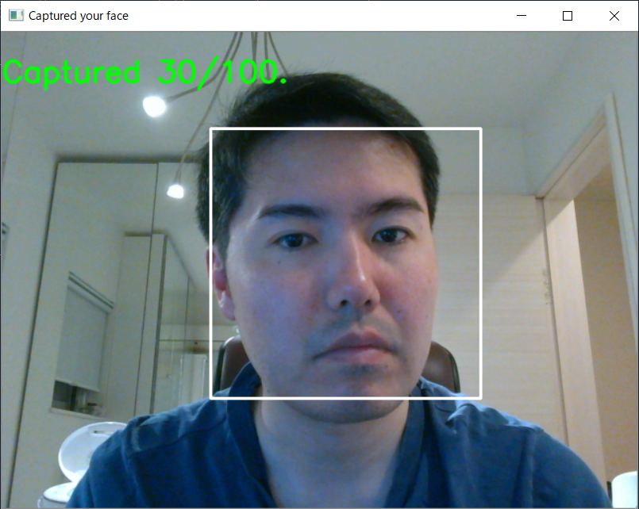

## 7.0. 目的
本ブログは、**顔認証システムの実装**を通して、**Convolutional Neural Network**と呼ばれる**画像分類アルゴリズム**の使用方法を理解することを目的とします。

## 7.1. 顔認証
顔認証（Face Authentication）とは、対象人物の顔の特徴点を基に認証を行う機能であり、空港における入出国ゲートや部屋の入館管理、PCやスマートフォンへのログイン機構などに利用されています。  

顔認証では、カメラから取り込んだデジタル画像から人間の顔と思われる部分を抜き出し、顔画像データベースや顔認識モデルなどと照合を行います。照合する手法は様々であり、例えば、対象人物の目・鼻・口などの特徴点を顔画像データベースと照合する方法や、3次元センサで顔の立体的情報を取得し、眼窩（目のくぼみ）・鼻・顎の輪郭などと特徴を照合する方法、そして、皮膚のキメ（しわやしみ）を分析して本人確認を行う方法などもあります。  

### 7.1.1. コンセプト
本ブログでは、顔認証をDeep Learning技術で実装することにします。  

Deep Learningで顔認証を実装するためには、カメラから取り込んだ対象人物のデジタル画像から**顔部分を抜き出し**、顔の**特徴点を基に対象人物を分類**すれば良いと考えられます。分類のラベルは**認証成功** or **認証失敗**の**2クラス**とし、事前に学習済みの人物の場合は認証成功に分類、学習していない人物は認証失敗に分類します。  

また、分類時に**確率**も併せて計算できた方が運用上は好ましいと言えます。なぜならば、確率が求まれば「認証成功 or 認証失敗」の閾値を設けることができるためです。例えば、「99%以上の確率で認証成功」に分類された場合は認証成功とし、「99%未満の確率で認証成功」と分類された場合は認証失敗に分類します。このように閾値を設けることで、認証成功とすべきか判断に迷うケース（認証成功とすべき人物に顔が似ているが、確証が持てない場合など）の場合は、安全側に判断を倒して認証失敗に分類することができます（本例における閾値は99%）。  

本ブログではConvolutional Neural Networkを使用し、上記のコンセプトを持った顔認証システムを実装していきます。  

## 7.2. Convolutional Neural Network（CNN）
CNNは通常の**Neural NetworkにConvolution（畳み込み）を追加**したものであり、分類対象の画像に対する**高い頑健性（ロバスト性）**を持つという特徴があります。この特徴により、**高精度の画像分類**を実現します。  

### 7.2.1. CNN入門の入門
ところで、画像分類における頑健性（ロバスト性）とは何でしょうか？  
下記の画像で頑健性を考えてみましょう。  

 <div align="center">
 <figure>
 <br>
 <figcaption>画像その１</figcaption><br>
 <br>
 </figure>
 </div>

この画像は**猫が横を向いている画像**です。誰の目にも「猫」として認識できるはずです。  
次の画像はどうでしょうか。  

 <div align="center">
 <figure>
 <br>
 <figcaption>画像その２</figcaption><br>
 <br>
 </div>
 </figure>

この画像は**猫が正面を向いている画像**です。こちらも誰の目にも「猫」として認識できるはずです。  
2つの画像はレイアウトが全く異なるにも関わらず、なぜ人間は猫として認識できるのでしょうか。それは、無意識のうちに「猫は耳が尖っている」「猫はピンと伸びたヒゲがある」「猫は目がまん丸である」「猫は鼻が三角である」といった**猫の特徴を領域**を捉えているからであり、単純に**認識対象の形状を重ね合わせて認識している訳ではありません**。  

これと同じことを(Convolutionが無い)通常のNeural Networkで実現しようとすると、ちょっと困った問題が発生します。  
Neural Networkは分類対象の画像を**1pixel単位**で受け取ります。例えば「32×32pixel」の白黒画像の場合、入力データは1024(=32x32)のベクトルとなります(RGBの場合は1024x3=3072のベクトル)。このため、**入力画像のレイアウトが少しでも異なると、入力データのベクトルは大きく異なってしまいます**。これにより、下図のようにレイアウトが異なる画像の場合、(入力データが大きく異なるため)2つを同じ猫として認識することが難しくなります。つまり、頑健性が低いと言えます。  

 <div align="center">
 <figure>
 <br>
 <figurecaption>Neural Networkは頑健性が低い</figurecaption><br>
 <br>
 <br>
 </figure>
 </div>

一方、CNNは分類対象の画像を1pixel単位ではなく、**複数のpixelを纏めた領域**(4x4pixelの領域など)として受け取ります。この纏めた領域を**フィルタ**と呼び、**フィルタを1つの特徴量として畳み込み**ます(畳み込みの方法は「フィルタ内の平均pixel値を取る」「フィルタ内の最大pixel値を取る」など様々ですが、本ブログでは説明を割愛します)。そして、**フィルタを少しずつスライドさせながら畳み込みを繰り返し**ていき、入力画像全体が畳み込まれたレイヤ「**Convolution Layer**」を作成します。このConvolution LayerをNeural Networkと同様に繋げていくことでネットワークを構築します。  

 <div align="center">
 <figure>
 <br>
 <figurecaption>CNNは頑健性が高い</figurecaption><br>
 <br>
 </figure>
 </div>

このように、CNNでは「点(pixel)」ではなく「フィルタ(領域)」での特徴抽出が可能になるため、入力画像のレイアウトが異なる場合でも、その**差異を吸収**することができます。これにより、画像１と２のようにレイアウトが異なる場合でも、同じ猫として認識することができます。つまり、頑健性が高いと言えます。  

この畳み込みによりCNNは高い頑健性を誇るため、分類対象画像に対する柔軟性を持ち、それ故に高精度の画像分類を実現できます。なお、CNNで構築したモデルを実行すると、出力結果として**分類したクラス**と**分類確率**を得ることができます。また、CNNは教師あり学習であるため、分類を行う前に学習データ（教師データ）を用いて分類対象の特徴を学習させておく必要があります。  

以上でCNN入門の入門は終了です。  
次節では、CNNを使用した顔認証システムの構築手順とサンプルコードを解説します。

## 7.3. 顔認証システムの実装
本ブログで実装する顔認証システムは、大きく以下の4ステップで認証を行います。  

 1. 顔認識モデルの作成  
 2. Webカメラから顔画像を取得  
 3. 顔認識モデルで顔画像を分類  
 4. 分類確率と閾値を比較して認証成否を判定    

### 7.3.1. 顔認識モデルの作成
本ブログの顔認証システムは教師あり学習のCNNを使用します。  
よって、先ずは学習データを用意する必要があります。  

#### 7.3.1.1. 学習データの準備
学習データとして**認証対象とする人物の顔画像**を準備します。  
本ブログでは、一般公開されている**顔画像データセット「[VGGFACE2](http://www.robots.ox.ac.uk/~vgg/data/vgg_face2/)」から無作為に選んだ人物**と、**筆者**の計11人を認証対象とします。  

| VGGFACE2|
|:--------------------------|
| 大規模な顔画像データセット。Google画像検索からダウンロードされた**9,000人以上**の人物の顔画像が**330万枚以上**収録されており、年齢・性別・民族・職業・顔の向き・顔の明るさ（照明具合）など、様々なバリエーションの顔画像が存在する。ダウンロードにはアカウントの登録が必要。|

以下に認証対象の人物を示します。  

 <div align="center">
 <figure>
 <br>
 <figurecaption>認証対象の人物</figurecaption><br>
 </figure>
 </div>

なお、当然ながら筆者の顔画像はVGGFACE2に含まれていないため、顔画像収集用のサンプルコード[`record_face.py`](src/defensive_chap7/record_face.py)を用いて収集します。このコードを実行すると、**0.5秒間隔**でWebカメラから画像を取り込み、顔を認識して顔部分のみを切り出します。  

```
your_root_path> python3 record_face.py
1/100 Capturing face image.
2/100 Capturing face image.
3/100 Capturing face image.
...snip...
98/100 Capturing face image.
99/100 Capturing face image.
100/100 Capturing face image.
```

 <div align="center">
 <figure>
 <br>
 <figurecaption>顔画像を収集している様子</figurecaption><br>
 <br>
 </figure>
 </div>

そして、コード実行ディレクトリ配下に、顔画像を格納する「`original_image`」ディレクトリと、サブディレクトリ「`Isao-Takaesu`」を自動生成し、サブディレクトリに切り出した顔画像をJPEG形式で保存します。  

```
/your_root_path/original_image/Isao-Takaesu> ls
Isao-Takaesu_1.jpg
Isao-Takaesu_2.jpg
Isao-Takaesu_3.jpg
... snip ...
Isao-Takaesu_98.jpg
Isao-Takaesu_99.jpg
Isao-Takaesu_100.jpg
```

なお、サブディレクトリ名「`Isao-Takaesu`」が、**顔認証時のクラス名**となります。  
もし、あなたが任意の人物を認証対象としたい場合は、コード中の`FILE_NAME`を変更して本コードを実行してください。  

#### 7.3.1.2 データセットの作成
顔画像の収集が完了しましたので、学習データとモデル評価用のテストデータを作成します。  

`original_image`ディレクトリ配下に、VGGFACE2から選んだ10人の人物のサブディレクトリを作成します。  

```
your_root_path\original_image> mkdir Carolina-Kluft Carol-Swenson Cris-Judd Frank-de-Boer Junny-Lang-Ping John-Winchester Joumana-Kidd Leo-Sayer Zhang-Xin Western-Hagen

your_root_path\original_image> ls
Carolina-Kluft
Carol-Swenson
Cris-Judd
Frank-de-Boer
Isao-Takaesu
Junny-Lang-Ping
John-Winchester
Joumana-Kidd
Leo-Sayer
Zhang-Xin
Western-Hagen
```

各人の顔画像をVGGFACE2からコピーし、上記で作成した各人のサブディレクトリにペーストします。  
そして、データセットを生成するサンプルコード「[`create_dataset.py`](src/defensive_chap7/create_dataset.py)」を実行します。  

```
your_root_path> python3 create_dataset.py
```

このコードは、`original_image`配下の**認証対象人物のサブディレクトリ名をクラス名**とし、データセットのディレクトリ「`dataset`」配下に学習データを格納する「`train`」ディレクトリと、モデル評価用のテストデータを格納する「`test`」ディレクトリを自動生成します。そして、7対3の割合で認証対象人物の顔画像を`train`と`test`に振り分けます。  

#### 7.3.1.3 学習の実行
学習データの準備ができましたので、CNNを用いて認証対象人物の顔を学習します。  
学習を実行するサンプルコード「[`train.py`](src/defensive_chap7/train.py)」を実行します。  

```
your_root_path> python3 train.py
```

このコードは、`dataset/train`配下の学習データと`dataset/test`配下のテストデータを使用して顔認識モデルを作成します。作成されたモデルは、モデル格納用のディレクトリ「`model`」配下に`cnn_face_auth.h5`というファイル名で保存されます。  

### 7.3.2. サンプルコード及び実行結果
#### 7.3.2.1. サンプルコード
本ブログではPython3を使用し、簡易的な顔認証システムを実装しました。
※本コードは[こちら](https://github.com/13o-bbr-bbq/machine_learning_security/blob/master/Security_and_MachineLearning/src/defensive_chap7/face_auth.py)から入手できます。

本システムの大まかな処理フローは以下のとおりです。

 1. Webカメラから対象人物の映像を取得
 2. 取得した映像から顔部分の切り出し
 3. 切り出した顔画像を学習済みCNNモデルで分類
 4. 閾値を基に許容 or 拒否を判定

```
#!/bin/env python
# -*- coding: utf-8 -*-
import os
import cv2
import numpy as np
from datetime import datetime
from keras.applications.vgg16 import VGG16
from keras.models import Sequential, Model
from keras.layers import Input, Dropout, Flatten, Dense
from keras.preprocessing import image

# Full path of this code.
full_path = os.path.dirname(os.path.abspath(__file__))

# dataset path.
dataset_path = os.path.join(full_path, 'dataset')
test_path = os.path.join(dataset_path, 'test')

# Model path.
model_path = os.path.join(full_path, 'model')
model_name = os.path.join(model_path, 'cnn_face_auth.h5')

MAX_RETRY = 50
THRESHOLD = 80.0

# Generate class list.
classes = os.listdir(test_path)
nb_classes = len(classes)

# Prepare model.
# Build VGG16.
print('Build VGG16 model.')
input_tensor = Input(shape=(128, 128, 3))
vgg16 = VGG16(include_top=False, weights='imagenet', input_tensor=input_tensor)

# Build FC.
print('Build FC model.')
fc = Sequential()
fc.add(Flatten(input_shape=vgg16.output_shape[1:]))
fc.add(Dense(256, activation='relu'))
fc.add(Dropout(0.5))
fc.add(Dense(nb_classes, activation='softmax'))

# Connect VGG16 and FC.
print('Connect VGG16 and FC.')
model = Model(input=vgg16.input, output=fc(vgg16.output))

# Load model.
print('Load trained model: {}'.format(model_name))
model.load_weights(model_name)

# Use Loss=categorical_crossentropy.
print('Compile model.')
model.compile(loss='categorical_crossentropy',
              optimizer='adam',
              metrics=['accuracy'])

# Execute face authentication.
capture = cv2.VideoCapture(0)
for idx in range(MAX_RETRY):
    # Read 1 frame from VideoCapture.
    ret, captured_image = capture.read()

    # Execute detecting face.
    gray_image = cv2.cvtColor(captured_image, cv2.COLOR_BGR2GRAY)
    cascade = cv2.CascadeClassifier(os.path.join(full_path, 'haarcascade_frontalface_default.xml'))
    faces = cascade.detectMultiScale(gray_image,
                                     scaleFactor=1.1,
                                     minNeighbors=2,
                                     minSize=(128, 128))

    if len(faces) == 0:
        print('Face is not found.')
        continue

    for face in faces:
        # Extract face information.
        x, y, width, height = face
        face_image = captured_image[y:y + height, x:x + width]
        if face_image.shape[0] < 128:
            continue
        resized_face_image = cv2.resize(face_image, (128, 128))

        # Save image.
        file_name = os.path.join(dataset_path, 'tmp_face.jpg')
        cv2.imwrite(file_name, resized_face_image)

        # Transform image to 4 dimension tensor.
        img = image.load_img(file_name, target_size=(128, 128))
        array_img = image.img_to_array(img)
        array_img = np.expand_dims(array_img, axis=0)
        array_img = array_img / 255.0

        # Prediction.
        pred = model.predict(array_img)[0]
        top_indices = pred.argsort()[-1:][::-1]
        results = [(classes[i], pred[i]) for i in top_indices]

        # Final judgement.
        judge = 'Reject'
        prob = results[0][1] * 100
        if prob > THRESHOLD:
            judge = 'Unlock'
        msg = '{} ({:.1f}%). res="{}"'.format(results[0][0], prob, judge)
        print(msg)

        # Draw frame to face.
        cv2.rectangle(captured_image,
                      (x, y),
                      (x + width, y + height),
                      (255, 255, 255),
                      thickness=2)

        # Get current date.
        date = datetime.now().strftime('%Y%m%d%H%M%S%f')[:-3]
        print_date = datetime.strptime(date[:-3], '%Y%m%d%H%M%S').strftime('%Y/%m/%d %H:%M:%S')

        # Display raw frame data.
        cv2.putText(captured_image, msg, (10, 40), cv2.FONT_HERSHEY_SIMPLEX, 1, (0, 255, 0), 2, cv2.LINE_AA)
        cv2.putText(captured_image, print_date, (10, 450), cv2.FONT_HERSHEY_SIMPLEX, 1, (0, 255, 0), 2, cv2.LINE_AA)
        cv2.imshow('Face Authorization', captured_image)

        file_name = os.path.join(dataset_path, 'tmp_face' + str(idx) + '_.jpg')
        cv2.imwrite(file_name, captured_image)

    # Waiting for getting key input.
    k = cv2.waitKey(500)
    if k == 27:
        break

# Termination (release capture and close window).
capture.release()
cv2.destroyAllWindows()
```

#### 7.3.2.2. コード解説
今回はCNNの実装に、Deep Learningライブラリの**Keras**を使用しました。  
Kerasの使用方法は[公式ドキュメント](https://keras.io/ja/)を参照のこと。  

#####  OpenCVのインポート
```
import cv2
```

Webカメラからの画像取得、および顔部分の切り出しを行うため、コンピュータビジョン向けライブラリ「`cv2`(OpenCV)」をインポートします。  
このパッケージには、Webカメラの制御や画像の加工、顔認識を行うための様々なクラスが収録されています。  

##### CNN用パッケージのインポート
```
from keras.applications.vgg16 import VGG16
from keras.models import Sequential, Model
from keras.layers import Input, Dropout, Flatten, Dense
```

KerasでCNNを構築するためのパッケージをインポートします。  
これらのパッケージを使用することで、CNNを構築することができます。  

##### Pathの定義
```
# Model path.
model_path = os.path.join(full_path, 'model')
model_name = os.path.join(model_path, 'cnn_face_auth.h5')
```

前節で作成した学習済みモデル(`cnn_face_auth.h5`)のPathを定義します。  

##### 認証の試行回数と閾値の定義
```
MAX_RETRY = 50
THRESHOLD = 80.0
```

`MAX_RETRY`は顔認証を試行する最大回数、`THRESHOLD`は認証成功の閾値となります(CNNの分類確率が閾値を超えた場合に認証成功とする)。  

##### CNNモデルアーキテクチャの定義
```
# Prepare model.
# Build VGG16.
print('Build VGG16 model.')
input_tensor = Input(shape=(128, 128, 3))
vgg16 = VGG16(include_top=False, weights='imagenet', input_tensor=input_tensor)

# Build FC.
print('Build FC model.')
fc = Sequential()
fc.add(Flatten(input_shape=vgg16.output_shape[1:]))
fc.add(Dense(256, activation='relu'))
fc.add(Dropout(0.5))
fc.add(Dense(nb_classes, activation='softmax'))

# Connect VGG16 and FC.
print('Connect VGG16 and FC.')
model = Model(input=vgg16.input, output=fc(vgg16.output))
```

本ブログで実装する顔認証システムの入力画像は、128x128pixelのRGB(3channel)の情報を持っているため、CNNの入力層として「`Input(shape=(128, 128, 3))`」を定義します。そして、これを**VGG16**と呼ばれる学習済みの画像認識モデルにバインドします。その後、顔画像の照合を行うアーキテクチャ(`fc`)を定義し、最後にVGG16とFCを結合(`Model()`)することで、顔画像を照合するためのCNNアーキテクチャが完成します。  

なお、今回使用するVGG16は[ImageNet](http://www.image-net.org/)と呼ばれる大規模な画像データセットで事前に学習されています。よって、VGG16とFCを結合することで、VGG16に備わっている高い物体認識能力を享受することが可能となります。  

| ImageNet|
|:--------------------------|
| 1,400万枚もの良質な画像が収録されたデータセットであり、各画像にはクラス名が紐づけられている。クラスの種類2万種類以上。Deep Learning技術の発展に大きく貢献している。|

##### CNNモデルのロード
```
# Load model.
print('Load trained model: {}'.format(model_name))
model.load_weights(model_name)

# Use Loss=categorical_crossentropy.
print('Compile model.')
model.compile(loss='categorical_crossentropy',
              optimizer='adam',
              metrics=['accuracy'])
```

CNNアーキテクチャを作るのみでは、それは"ただの箱"と同じであり、中身がありません。すなわち、正しく顔画像を照合することはできません。  
よって、本モデルに認証させたい人々の顔画像を学習させる必要があります。  

ここでは、前節で学習した結果(学習済みのモデル)をCNNアーキテクチャにロードして認識モデルを作成しています。学習済みモデルのPathを格納した`model_name`をCNNアーキテクチャにロード「`model.load_weights(model_name)`」することで、CNNモデルは学習した状態、すなわち、顔画像の照合が実行できる状態になります。  

##### Webカメラの定義
```
# Execute face authentication.
capture = cv2.VideoCapture(0)
```

`cv2.VideoCapture(0)`でWebカメラのインスタンスを作成します。  
この1行のみでOpenCVを介してWebカメラの制御を取得することができます。なお、`VideoCapture`の引数はカメラの識別IDですが、ラップトップに複数のカメラが接続されていれば、それぞれのカメラにユニークなIDが割り当てられます。今回は1つのWebカメラを使用しますので、引数は`0`となります。  

##### Webカメラからの画像取り込み 
```
# Read 1 frame from VideoCapture.
ret, image = capture.read()
```

Webカメラのインスタンス`capture`のメソッドである`read()`を呼び出すと、Webカメラで撮影した1フレーム分の画像が戻り値として返されます。なお、画像はBGRの画素値を持った配列になっています(RGBではないことに注意してください)。  

##### 取り込んだ画像から顔の検出
```
# Execute detecting face.
gray_image = cv2.cvtColor(image, cv2.COLOR_BGR2GRAY)
cascade = cv2.CascadeClassifier(os.path.join(full_path, 'haarcascade_frontalface_default.xml'))
faces = cascade.detectMultiScale(gray_image,
                                 scaleFactor=1.1,
                                 minNeighbors=2,
                                 minSize=(128, 128))
```

何らかの方法でWebカメラで取り込んだ画像から人物の**顔を抽出**する必要があります。  
本ブログでは**カスケード分類器**を使用します。  

| カスケード分類器|
|:--------------------------|
| [Paul Viola氏によって提案](https://www.cs.cmu.edu/~efros/courses/LBMV07/Papers/viola-cvpr-01.pdf)され、[Rainer Lienhart氏によって改良](http://www.multimedia-computing.de/mediawiki/images/5/52/MRL-TR-May02-revised-Dec02.pdf)された物体検出アルゴリズム。対象の画像を複数の探索ウィンドウ領域に分割し、各探索ウィンドウ領域の画像を学習済み分類器に入力していく。分類器は**N個**用意されており、各分類器はそれぞれ「顔画像である」or「顔画像ではない」と判定していく。そして、1～N個の分類器が一貫して「顔画像である」と判定した場合のみ、当該探索ウィンドウ領域の画像は「顔画像である」と判定する。一方、途中で分類器が「顔画像ではない」と判定すれば処理を終了し、「探索ウィンドウ領域には顔画像はなかった」と判定され、探索ウィンドウは次にスライドしていく。|

カスケード分類器のフルスクラッチによる実装は少々面倒ですが、OpenCVを使用することで容易にカスケード分類器を実装することが可能です。
※本ブログではカスケード分類器の詳細な説明は割愛しますが、詳細を知りたい方は「[Haar Feature-based Cascade Classifier for Object Detection](http://opencv.jp/opencv-2.2/c/objdetect_cascade_classification.html)」をご覧いただければと思います。  

上記のコードでは、カスケード分類器に画像を入力する前に、画像をグレースケールに変換します(`cv2.cvtColor()`)。これは、カスケード分類器は**顔の輪郭など(色の濃淡)を特徴**として「顔 or 顔ではない」を判定するため、BGRのようなカラー画像よりもグレースケールの方が精度が向上します。  

次に、カスケード分類器のインスタンスを作成します(`cv2.CascadeClassifier`)。引数の「`haarcascade_frontalface_default.xml`」は、OpenCVプロジェクトが予め用意した「顔の特徴を纏めたデータセット」です。このデータセットを引数として渡すのみで、顔検出が可能なカスケード分類器を作成することができます。  

なお、このデータセットは[OpenCVのGitHubリポジトリ](https://github.com/opencv/opencv/tree/master/data/haarcascades)で公開されています。本ブログでは「顔検出」を行うため、このデータセットのみを使用していますが、リポジトリを見ると分かる通り、「目」「体」「笑顔」等の特徴を纏めたデータセットも配布されています。つまり、このようなデータセットを使うことで、「目の検出」「体の検出」「笑顔の検出」等を実現することも可能です。  

最後に、作成したカスケード分類器のメソッド「`detectMultiScale`」にグレースケールにした画像を渡すと、戻り値として「検出した顔画像部分の座標」が返されます。なお、画像に複数の顔が写っている場合は、複数の座標が配列で返されます。  

##### 顔画像の前処理
```
# Extract face information.
x, y, width, height = face
predict_image = image[y:y + height, x:x + width]
if predict_image.shape[0] < 128:
    continue
predict_image = cv2.resize(predict_image, (128, 128))
predict_image2 = cv2.resize(image, (128, 128))

# Save image.
file_name = os.path.join(dataset_path, 'tmp_face.jpg')
cv2.imwrite(file_name, predict_image2)
```

カスケード分類器で検出した**顔画像部分の座標**を使用し、Webカメラから取り込んだ画像(`image`)から**顔画像部分のみを切り出し**ます(`image[y:y + height, x:x + width]`)。`x`、`y`、`width`、`height`は、カスケード分類器で検出した顔部分の座標。そして、切り出した顔画像を`cv2.resize`にて、128x128pixelの画像にリサイズします。  

なお、顔画像をリサイズするのは、**CNNに入力する画像は一定のサイズにする必要がある**ためであり、リサイズするサイズは任意です。  
本ブログでは、CNNアーキテクチャに合わせて`128`に設定しています。  

リサイズされた画像は一時的にローカルファイルとして保存します(`file_name`)。  

##### 入力画像の正規化
```
# Predict face.
# Transform image to 4 dimension tensor.
img = image.load_img(file_name, target_size=(128, 128))
x = image.img_to_array(img)
x = np.expand_dims(x, axis=0)
x = x / 255.0
```

顔画像をベクトル化(`x = image.img_to_array(img)`)した上で、これをを正規化します(`x`)。  

##### 顔画像の照合
```
# Prediction.
pred = model.predict(x)[0]
top = 1
top_indices = pred.argsort()[-top:][::-1]
results = [(classes[i], pred[i]) for i in top_indices]

judge = 'Reject'
prob = results[0][1] * 100
if prob > THRESHOLD:
    judge = 'Unlock'
```

正規化した顔画像をCNNモデルに入力し(`model.predict(x)[0]`)、照合結果である出力(`pred`)を取得します。`pred`には全てのクラスと予測精度が格納されていますので、**最も予測精度が高いクラス(認証対象人物の名前)と予測精度のセット**を取得します(`results`)。  

最後に、予測精度が閾値(今回は`THRESHOLD = 80.0`)を超えていた場合に、`Unlock`(認証成功)のラベルを返します(認証が成功した後の処理は任意)。  

#### 7.3.2.2. 実行結果
このサンプルコードを実行した結果を以下に示します。  

この結果から、「normal」や「nmap」「teardrop」「guess_passwd」は概ね正しく分類できていることが分かります。但し、「nmap」や「teardrop」「guess_passwd」の一部分類確率を見ると、「69%、50%、38%」等のように低い数値になっています。これは、今回筆者が主観で選択した特徴量よりも、**もっと適切な特徴量が存在する可能性**を示唆しています。また、「buffer_overflow」は殆ど正しく分類できておらず、「normal」や「guess_passwd」として誤検知していることが分かります。これは、「buffer_overflow」の**特徴量を見直す必要がある**ことを強く示唆しています。

## 7.4. おわりに
このように、特徴選択の精度によって分類精度が大きく左右されることが分かって頂けたかと思います（笑）。
 本ブログでは、KDD Cup 1999のデータセットを学習データとして使用しましたが、実際に収集したリアルなデータを学習に使用する場合は、侵入検知に**役立つ特徴量を見落とさないように、収集する情報を慎重に検討**する必要があります（ここがエンジニアの腕の見せ所だと思います）。

本ブログを読んでロジスティック回帰にご興味を持たれた方は、ご自身で特徴選択を行ってコードを実行し、検知精度がどのように変化するのかを確認しながら理解を深める事を推奨致します。

## 1.5. 動作条件
 * Python 3.6.1
 * pandas 0.23.4
 * numpy 1.15.1
 * scikit-learn 0.19.2

### CHANGE LOG
* 2018.09.25 : 初稿
