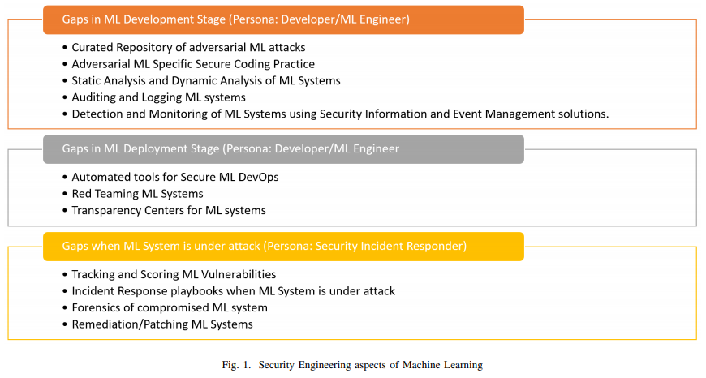

# Adversarial Machine Learning - Industry Perspectives
[original paper](https://arxiv.org/abs/2002.05646)  

## Abstract
28の組織へのインタビューにより、AIを導入している多くの組織は、機械学習（ML）システムに対する攻撃を防御・検知、および適切にインシデント・レスポンス（IR）するための戦略を備えていないことが明らかになった。我々はインタビューから得られた洞察を活用し、機械学習システムの保護という観点から、従来のソフトウェア・セキュア開発におけるギャップを列挙する。このホワイトペーパーは、MLシステムの設計・開発・リリース時にMLシステムのセキュリティを確保する必要のある「開発者/MLエンジニア」と、インシデントが発生した際の「IR担当者」という2つの観点から書かれている。このホワイトペーパーの目標は、MLシステムに対する攻撃が横行する時代に向け、ML研究者をソフトウェア・セキュア開発ライフサイクルの修正に関与させることである。  

## I Introduction
MLシステムに対する攻撃は、今やソフトウェア業界では当たり前に認識されている。例えば、Google[1]、Microsoft[2]、IBM[3]は、従来のソフトウェアシステムのセキュア化とは別に、MLシステムの保護への取り組みを行っている。2019年2月、市場調査会社であるGartnerは、MLシステムを開発するリーディングカンパニーが、データ汚染、モデル抽出（窃盗）、およびAdversarial Examplesの潜在的なリスクを予測し、これらに対応する必要があることを示した世界初のレポート[4]を公開した。このホワイトペーパーの目的は、様々な業界の組織が攻撃からMLシステムを保護し、不正行為をいち早く検出すること重要性を理解させることである。  

組織がMLシステムを体系的なセキュリティで保護する理由は多く存在する。先ず、過去3年間に機械学習に多大な投資をしている企業「Google、Amazon、Microsoft、Tesla」は、規模の大きなMLシステムに対する攻撃に直面した[5]～[8]。次に、ISO[9]やNIST[10]のような標準化団体は、MLシステムのセキュリティを評価するための認証基準を作成しており、その基準は業界で求められている[11]。また、政府は業界がMLシステムを安全に構築するためのルール策定に乗り出しており、EUはMLシステムの信頼性を評価するためのチェックリストをリリースした。これにより、MLシステムの開発は規制に"がんじがらめ"になる可能性がある。なお、2020年の機械学習への投資の年間成長率は39％と予測されているため[13]、組織がMLシステムの保護に投資するのは当然のことである。  

このホワイトペーパーでは、以下2つの貢献をしている:  

 1. MLシステムを保護する必要性があるにも関わらず、28もの組織に跨る調査において、殆どの組織はMLシステムの保護に対応していないことが判明した。28の組織のうち25が、MLシステムを保護するための適切な戦略を持っていないことも判明した。  

 2.セキュア開発ライフサイクル（SDL）フレームワークを使用し、MLシステムを構築するセキュア開発の一例を列挙する。これは、業界における事実上のソフトウェア構築プロセスである。  

このホワイトペーパーは、一般的なソフトウェア開発会社が直面するMLシステムの保護における問題点とギャップの概要である。機械学習システムを保護する際に、ソフトウェア開発者/MLエンジニアとIR担当者という2つの役割が直面する問題を解決するために、研究者のコミュニティに訴えたいと考えている。このホワイトペーパーの目標は、MLの研究者が、MLシステムに対する攻撃が横行する時代に向けて、ML研究者をソフトウェア・セキュア開発ライフサイクルの修正に関与させることである。  

このホワイトペーパーは2つのパートから構成される。最初のパートでは、我々の調査方法と調査結果の概要を説明する。2番目のパートは、MLシステムを設計・実装する際に、3つのフェーズでMLシステムを保護する際のギャップを説明する。  

# II INDUSTRY SURVEY ABOUT ADVERSARIAL ML
我々は、Fortune 500、中小企業、非営利団体、政府機関に跨る28の組織にインタビューし、攻撃からMLシステムを保護する方法を調査した（調査対象組織の概要は表Iおよび表IIを参照のこと）。  

我々が調査した28組織の内、22の組織は金融、コンサルティング、サイバーセキュリティ、ヘルスケア、政府などの機微な情報を保持する分野に属していた。残りの6組織は、ソーシャルメディア分析、出版、農業、都市計画、食品加工、翻訳サービスとなっていた（調査組織の分布は表IIを参照のこと）。  

**TABLE I. Organization size**  
|rganization size|Cunt|
|:---:|:---:|
|Large Organizations (> 1,000 employees)|18|
|Small-and-Medium size Businesses|10|  

**TABLE II. Organization types**  
|Organization|Count|
|:---:|:---:|
|Cybersecurity|10|
|Healthcare|5|
|Government|4|
|Consulting|2|
|Banking|2|
|Social Media Analytics|1|
|Publishing|1|
|Agriculture|1|
|Urban Planning|1|
|Food Processing|1|
|Translation|1|

各組織の調査では、「MLシステムを開発する開発者」と「セキュリティ担当者」にインタビューを行った。組織の規模に応じて、これらの2つの役割は、異なるチーム、同じチーム、または兼任であった。我々がインタビューした全ての組織は、従来のソフトウェア開発におけるセキュア開発ライフサイクルに精通していたが、その実践の程度は、中小企業よりも文書化されたセキュア開発プロセスを持つ大企業の方が高かった。また、機械学習への投資が比較的成熟し、AIを核にしたビジネスを展開する企業もあった。  

我々が調査した組織は様々な方法でMLシステムを実装している。殆どは、Keras・TensorFlow・PyTorchなどのMLフレームワークを使用していた。10の組織は、Microsoft Cognitive API[14]、Amazon AIサービス[15]、Google CloudAI[16]などのサービスに依存していた。なお、MLシステムをフルスクラッチで開発している組織は2つだけであった（表IIIを参照のこと）。  

**TABLE III. ML STRATEGY**  
|How do you build ML Systems|Count|
|:---:|:---:|
|Using ML Frameworks|16|
|Using ML as a Service|10|
|Building ML Systems from scratch|2|

### Limitations of Study:
我々が調査した28の組織は、機械学習を利用している組織全体を表しているとは限らない。例えば、今回の調査には新興企業は含まれておらず、調査にはセキュリティに注意を払う組織が圧倒的に多いという特徴がある。  

また、殆どの組織が米国またはヨーロッパで事業を展開しており、本社を構えている地理的分布も考慮していない。また、調査は攻撃者によって引き起こされる障害に限定し、一般的な破損[17]、報酬ハッキング[18]、分布変化[19]、または、自然発生するAdversarial Examples[20]などは調査に含めていない。  

### A. Findings:
 1. 28の組織全てが、AIシステムのセキュリティがビジネスにとって重要であるとの認識を示したが、依然として従来のセキュリティに重点が置かれている。あるセキュリティアナリストが言うように、我々の最大の脅威ベクターは、スピアフィッシングとマルウェアである。MLシステムに対する攻撃は未だ現実のものではない。MLシステムへの攻撃には大きな関心が寄せられているが、この問題に対処する人員を割り当てる準備ができている組織は6つだけである（大規模組織または政府）。  

 2. 機械学習セキュリティのノウハウ欠如：組織はMLシステムを保護するための知識を欠いているように思われる。調査対象組織のある1人が言うように、従来のソフトウェア攻撃は既知であるが、MLシステムへの攻撃は未知のものである。25組織中22組織（政府機関の3組織がこの質問に対する満足な回答は無かった）は、MLシステムを保護するための適切なツールが用意されていないと述べており、明示的なガイダンスを探しているとのことであった。また、殆どのセキュリティエンジニアは、MLシステムに対する攻撃を検知して対応することができない（表IVを参照のこと）。  

**TABLE IV. STATE OF ADVERSARIAL ML**  
|Do you secure your ML systems today|Count|
|:---:|:---:|
|Yes|3|
|No|22|

 3. [21]に概説されている攻撃の一覧を調べ、ビジネスに影響を与える可能性のある攻撃を選択するよう依頼した（表Vを参照のこと）。注：回答者は全ての攻撃をランク付けするのではなく、1つの攻撃のみを選択した。結果は次のとおりである。  

**TABLE V. TOP ATTACK**  
|Which attack would affect your org the most?|Distribution|
|:---:|:---:|
|Poisoning (e.g: [22])|10|
|Model Stealing (e.g: [23])|6|
|Model Inversion (e.g: [24])|4|
|Backdoored ML (e.g: [25])|4|
|Membership Inference (e.g: [26])|3|
|Adversarial Examples (e.g: [27])|2|
|Reprogramming ML System (e.g: [28])|0|
|Adversarial Example in Physical Domain (e.g: [5])|0|
|Malicious ML provider recovering training data (e.g: [29])|0|
|Attacking the ML supply chain (e.g: [25])|0|
|Exploit Software Dependencies (e.g: [30])|0|

 * データ汚染は多くの組織の注目を集めた。中規模のフィンテック企業はこのように述べている。「我々はMLシステムを使用して顧客に金融商品を提案している。 MLシステムの整合性は非常に重要である。Microsoftのチャットボット「Tay（偏った学習データを学習したことで、差別的な発言を行った）」のように、不適切なことを顧客に発言しないか心配である。」。  

 * 組織は、プライバシー侵害に繋がる可能性のある攻撃も重視している。ある銀行の担当者は「顧客情報やMLモデルで使用される従業員情報を保護したいと考えているが、未だ計画は整っていない。」。  

 * 知的財産の損失に繋がる可能性のあるモデル抽出（窃盗）も懸念されている。大規模な小売組織は独自のアルゴリズムでMLシステムを運用しているため、攻撃者にMLシステム内のモデルをリバースエンジニアリングされないか懸念している。  

 * 物理ドメインにおけるAdversarial Examplesに回答者は興味を示したが、リストの上位にはランクされなかった。理由の一つは、我々がインタビューした組織は、自動運転自動車やドローンのような物理的な要素を持っていなかったかもしれない。  

 4. セキュリティアナリストにとってMLシステムに対する攻撃は関心事項であるが、現実問題とはギャップがあると感じている。多くのセキュリティアナリストは、Keras、TensorFlow、PyTorchなどのMLフレームワークで利用可能なアルゴリズムはセキュアに実装されており、セキュリティテストも実施済みであることを期待している。 これはおそらく、FacebookやGoogleなどの大規模な組織によって公開されたライブラリは、既にセキュリティテストが実施されていると思い込んでいるからである。同様に、Machine Learning as a Serviceを使用している組織の回答者が言ったように、組織はMLシステムのセキュリティ責任をサービスプロバイダーに持たせようとしているようである。  

 5. 最後に、セキュリティアナリストと開発者は、MLシステムが攻撃された場合の影響を理解していない。あるMLエンジニアの一人が言ったように、「私はどのMLシステムもスプーフィングの影響を受けないとは思っていないが、潜在的な障害モードと同様に、信頼レベルと期待されるパフォーマンスを知る必要がある。MLシステムがスプーフィングされた場合の最悪の影響は何でしょうか？」。  

Figure.1 に示す要約は、MLシステムを構築する際の現在のSDLプロセスのギャップについて詳しく説明している。各ギャップについて、従来のソフトウェア開発における既存手法の概要を示し、将来の研究課題を描いている。  

 

 <figure>
  
  
 </figure>
 

## III ABOUT SDL
2001年7月、Microsoft Internet Information Server（IIS）4.0および5.0[31]はコンピューターワーム「CodeRed」の攻撃を受けた。これは、IIS4およびIIS5システムでデフォルトで実行されるコードのバグが原因で発生し、バッファオーバーフロー攻撃が可能となった。2002年1月、Microsoft はシステムに存在する既知の脆弱性を全て修正するために、2か月間に渡り新しいソフトウェア開発を停止し、セキュリティ専門家と開発者で対応を行った。この緊密な相互作用により、セキュリティガイダンスを提供する体系的なプロセスが進化し、エンジニアがソフトウェアのバグや実装のバグを探し出すのに大いに役立った。この一連の経験は、セキュア開発ライフサイクル（SDL）と呼ばれるようになった。SDLは全てのソフトウェアのバグを排除できる訳ではないが、脆弱性を含んだソフトウェアが顧客の手に届く前に、それを発見するのに役立つ。例えば、MicrosoftにSDLが導入された後、Windows XP～Windows Vistaで報告された脆弱性数は45％減少し、SQL Server 2000～SQL Server 2005で報告された脆弱性数は91％減少した[32]。現在、SDLは何らかの形でGoogle[34]、IBM[35]、Facebook[36]、Netflix[37]を含む122の組織[33]で採用されており、業界のデファクトスタンダードなソフトウェア開発プロセスとなっている。  

我々の主な調査は、従来のソフトウェアの保護に使用されるSDLプロセスの修正と改訂であり、MLシステムを攻撃から保護する。  

## IV GAPS DURING DEVELOPMENT OF ML SOLUTION
### A. Curated repository of attacks
従来のソフトウェアセキュリティでは、攻撃は共有可能な戦術と手順に分解され、MITRE ATT＆CKフレームワーク[38]に纏められている。これは、研究者および国家による攻撃を含む、検索可能な攻撃リポジトリを提供している。全ての攻撃に対し、手法の説明、検出の方法、および更なる詳細情報を持つ出版物へのリファレンスが記載されている。  

MLシステムへの攻撃は学術分野では盛り上がっているが[39]、開発者とセキュリティアナリストの間では意識が低く、28の組織の内5組織だけがMLシステムへの攻撃に関する知識があると述べている。可能であれば、広く利用されているMITERフレームワークを拡張することで、同様の攻撃リポジトリを作成することを提案する。 例えば、MLシステムに対する攻撃をML研究者が公開する場合、セキュリティアナリストが従来の攻撃とML攻撃の統一された見解を持てるように、攻撃をMITERフレームワークに登録するように依頼する。  

### B. Adversarial ML specific secure coding practices:
従来のソフトウェア設定では、開発者はセキュアコーディングを実践することでプログラムの脆弱性を削減し、他のエンジニアによるソースコードレビューを可能にする。例えば、Python[40]、Java、C、およびC++[41]は、メモリ破壊などの従来のソフトウェアバグに対するセキュアなコーディング方法を明確に定義している。機械学習の設定では、ML固有のセキュリティガイダンスはまばらである。殆どのフレームワークはベストプラクティス（TensorFlow[42]、Pytorch[43]、Keras[44]）を提供する。その中でもTensorFlowは、従来のソフトウェア攻撃[45]とMLシステム特有の攻撃[46]をテストするツールへのガイダンスを提供する、唯一のフレームワークである。  

MLシステム特有の攻撃に対する今後の作業は、脆弱性を排除するためのベストプラクティスの提供に焦点を当てることであると考えている。ベストプラクティスを提供する業界は様々であるため、具体的なガイダンスを提供することは難しい[47]。おそらく1つの方向性は、セキュリティの結果に基づいてガイダンスを列挙することである。例えば、セキュリティに準拠したコード例と準拠していないコード例を提供することから始めるのが良いと考える。  

### C. Static Analysis and Dynamic Analysis of ML Systems
従来のソフトウェアセキュリティでは、静的分析ツールは（コード実行をせずに）コードの潜在的なバグを検出し、コーディング規約違反を検出するのに役立つ。通常、ソースコードは抽象的な構文ツリーに変換され、制御フローグラフの作成に使用される。例えばPyt[49]のようなPythonツールでは、既知の脆弱性が検出される。一方、動的分析は、特定のコードPathの実行に関する脆弱性を検出できる。  

MLにおいては、cleverhans[46]、secml[50]、および堅牢化ツールキット[51]などのツールが、ホワイトボックス/ブラックボックスの動的テストを提供している。 これらの将来的な研究分野は、セキュリティ分析をモデル抽出（窃盗）、モデル回避、および推論を操作する攻撃に拡張する方法である。MLシステムに対する静的分析はあまり検討されていない。有望な方向性の一つは、MLプラットフォームでコールグラフを生成するCode2graph[52]のような手法であり、シンボリック実行と組み合わせて静的分析ツールへの最初のステップを提供する。静的分析ツールが最終的にIDE（統合開発環境）に統合され、アプリケーションコードがコードリポジトリにコミットされる前に脆弱性を検知するために、構文・セマンティクスに対する分析的洞察を提供することを期待する。  

### D. Auditing and Logging in ML Systems
従来のソフトウェアでは、プロセス作成などのOSの重要なセキュリティイベントがホストに記録され、それがセキュリティ情報およびイベント管理（SIEM）システムに転送される。これにより、IR担当者は異常検出[53][54]を実行し、異常なプロセス（マルウェアの兆候）がシステムで実行されたかどうかを検出することができる。  

MLシステムの監査は、最初にPapernot[55]によって提案され、テレメトリーをキャプチャするためにML環境を計測するためのソリューションスケッチが含まれている。従来のソフトウェアセキュリティで行われているように、MLシステムの開発者には、システム内の影響の大きいアクティビティを特定することを推奨する。組織にとって有害と考えられる攻撃のリストを実行し、テレメトリに現れるイベントが攻撃にまで遡ることができるようにすることを推奨する。最後に、これらのイベントは、セキュリティアナリストが将来の調査のための監査証跡を保持できるように、イベント管理システムにエクスポートできる必要がある。  

### E. Detection and Monitoring of ML systems
現在、ML環境には運用上の洞察がないため、セキュリティアナリストには判断できない。現在の攻撃検知メカニズムの脆弱性[47]およびそれらを改善する方法[20]を示す洞察力のある研究がある。また、検出方法は、セキュリティアナリスト間で簡単に共有できるように作成する必要がある。例えば、従来のソフトウェアセキュリティでは、検出ロジックはSigma[56]のような形式で記述されている。MITER ATT＆CKが攻撃者が使用する手法のリポジトリを提供するのに対し、Sigmaは攻撃者のテクニックを検出するための具体的な方法を提供することにより、多くのアナリストのシステムの防御に役立てることができる。  

## V GAPS WHEN PREPARING FOR DEPLOYMENT OF ML
### A. Automating Tools in Deployment Pipeline
従来のソフトウェア設定では、開発者が割り当てられたタスクの実装を完了すると、コードがソース管理システムにコミットされ、アプリケーションのビルドとユニットテストが実行される。これらが実行されると、統合テストへの自動展開が行われ、その後デプロイに移行します。ビルドの各ステップで、セキュリティツールが統合される。  

MLセキュリティ用に構築された動的分析ツールが、上記のパイプラインに統合されることを願っている。MLシステムに対するセキュリティテストを自動化することで、エンジニアの日常的なエンジニアリング経験以外のツールや異質なプロセスを過度に負担することなく、問題を解決することができる。  

### B. Red Teaming ML Systems
組織に対する攻撃のリスクは、「ビジネスへの影響」と「攻撃が発生する可能性」の2つの要因に依存する。ML開発者によって実行されるMLシステムの脅威モデリング[57]は、影響要因に対処する。レッドチームは、独立したセキュリティチームが実施する、あらゆる手段でシステムを攻撃するプロセスであり、尤度要因の評価に役立つ。重要なセキュリティアプリケーションの場合、レッドチーミングは業界標準であり、米国政府にソフトウェアを提供するための要件にもなっている[58]。 FacebookはAI Red Team [59]を開始した最初の組織だが、他組織にとっては未開拓の領域である。  

### C. Transparency Centers
従来のセキュリティでは、Microsoft[60]、Kaspersky[61]、Huawei[62]などの大規模な組織がトランスペアレンシーセンターを提供しており、参加者はセキュアな施設でソースコード検査と分析を実施している。参加者は、SSLおよびTCP/IP実装や擬似乱数ジェネレータなどの様々な製品のセキュリティを検証するための診断ツールを使用し、ソースコードと詳細な検査環境にアクセスできる。  

MLセキュリティにおいては、将来のトランスペアレンシーセンターは3つの安全を証明する必要があるだろう。「MLプラットフォームが安全な方法で実装されていること」、「MLaaSが基本的なセキュリティ要件を満たして実装されていること」、最後に「エッジデバイスに埋め込まれたMLモデルが基本的なセキュリティ要件を満たしていること」である。この分野における興味深い研究動向は、[63][64]などの正式な検証の上に構築された、製品のセキュリティ保証を促進するツール/テストハーネスを提供し、業界で使用される大規模MLモデルに拡張することである。  

## VI GAPS WHEN AN ML SYSTEM IS UNDER ATTACK
### A. Tracking and Scoring ML Vulnerabilities
従来のソフトウェアセキュリティでは、研究者がシステムの脆弱性を見つけると、一意の識別番号（CVE番号）が割り当てられ、Common Vulnerabilities and Exposure[65]と呼ばれるデータベースに登録される。これらの脆弱性には、Common Vulnerability Scoring System[66]（CVSS）を使用して計算された重大度の評価が付与される。例えば、リモートコード実行を許可するInternet Explorerのゼロデイ脆弱性[67]は「CVE-2020-0674」と呼ばれ、7.5のCVSSスコア[68]が割り当てられた。これにより、業界全体が同じ尺度で脆弱性の重大度を知ることができる。  

MLセキュリティでは、MLセキュリティの研究コミュニティにCVEのような脆弱性を識別する番号を登録し、メーカーに警告するように依頼する。しかし、MLシステムの脆弱性の重大度がどのようにスコアリングされるべきかは明確ではない。セキュリティアナリストがMLシステムへの攻撃に関するニュースを見た場合、「私の組織は攻撃の影響を受けるだろうか？」と思うのみであり、今現在では組織はMLシステムの既知の脆弱性について、MLシステムの環境をスキャンする能力を欠いている。  

### B. Incident Response
セキュリティエンジニアが「MLシステムが攻撃を受けている」という連絡を受けてトリアージを行う場合、影響範囲を確認して封じ込めの準備を行う2つの重要な手順がある。例えばランサムウェアの場合、「影響範囲の確認は感染したマシンに接続されている他マシンを特定」することであり、「封じ込めはフォレンジック分析のためにネットワークからマシンを切り離す」ことである。  

MLシステムは、一つの障害が意図しない結果に繋がる可能性のある本番環境に統合されているため、上記で挙げた2つの手順を取ることは困難である[69]。興味深い研究の一つは、アンチウイルスソフトウェアが感染したファイルを隔離するように、侵害されたMLシステムの影響が侵害されていないMLシステムを波及するのを防ぐために、MLシステムをコンテナ化できるかどうかを特定することである。  

### C. Forensics
In traditional software security, once the machine is contained, it is prepared for forensics to ascertain root cause. There are a lot of open questions in this area so as to meaningfully interrogate ML systems under attack to ascertain the root cause of failure:  

従来のソフトウェアセキュリティでは、システムが隔離されるとフォレンジックの準備が整う。攻撃の対象となるMLシステムを十分に調査し、障害の根本原因を確認するために、この分野には多くの未解決の課題がある：  

 1. MLシステムに対する攻撃毎に分析する必要があるコンポーネントは何ですか？MLモデル？クエリに対するスコアは？学習データ？アーキテクチャ？テレメトリ？ハードウェア？攻撃されたシステムで実行されている全てのアプリケーション？フォレンジックのために、作業データとモデルのソースをどのように活用できるか？  

 2. これらのコンポーネントをどのようにして収集すべきか？例えば、エンドポイントまたはIoTで開発されたMLモデルと、ML-as-a-Serviceを使用している組織では、コンポーネントの取得と分析方法は異なる。MLフォレンジックの手法は、MLフレームワーク（PyTorch、TensorFlowなど）、MLパラダイム（強化学習、教師あり学習）、およびMLの実行環境に依存していると仮定する。  

 3. 実行される可能性のある直交ステップはサイバー脅威の属性であり、セキュリティアナリストは攻撃の原因となる攻撃者を決定することができる。従来のソフトウェアでは、これは攻撃手法が確立された攻撃ツール、戦略、手順の確認などのフォレンジック的な証拠を分析することで行われる[70]。MLセキュリティの時代にこれがどのように修正されるかは不明である。  

### D. Remediation
従来のソフトウェアセキュリティでは、火曜日は「パッチ火曜日」と同義である。これは、Microsoft、SAS、Adobeなどの企業が脆弱性パッチをリリースする日であり、組織のパッチポリシーに基づいてこれらがインストールされるからである。  

MLセキュリティでは、データ汚染攻撃によってMicrosoftのチャットボット「Tay」が侵害されたとき、TayはMicrosoftによって緊急停止された。これは、全てのMLシステム、特にエッジデバイスに展開されたMLシステムでは不可能な場合がある。また、MLシステムに対する脆弱性パッチを適用するガイドラインが定まっていない。脆弱性パッチを適用したMLシステムがパッチ適用前と同じように機能するが、転移可能性の結果（Papernotらの研究[71]）に基づく同じ脆弱性の影響を受けない場合、どのように検証するのか明確ではない。  

## VII CONCLUSION
2019年の基調講演でニコラス・カーリーニ[72]は、MLセキュリティの分野を防御が容易に破られることに基づき「暗号化前のシャノン」に例えた。我々は、カーリーニの比喩を単なる攻撃と防御を超えて拡張する。28の組織の調査を通じて、殆どのMLエンジニアとIR担当者は、攻撃者による攻撃からMLシステムを保護する準備ができていないと結論付けた。また、MLセキュリティの時代に、研究者が信頼性の高いソフトウェアを構築するための事実上のプロセスである「セキュア開発ライフサイクル（SDL）」に貢献する方法を列挙する。同様に、機械学習ソフトウェアが2.0の場合[73]、従来のソフトウェア1.0開発プロセスから、セキュリティに関する開発の構造化プロセスを継承する必要もあると結論付ける。  

## REFERENCES
[1] “Responsible AI Practices.” [Online]. Available: https://ai.google/responsibilities/responsible-ai-practices/?category=security  
[2] “Securing the Future of AI and ML at Microsoft.” [Online]. Available: https://docs.microsoft.com/en-us/security/securing-artificial-intelligence-machine-learning  
[3] “Adversarial Machine Learning,” Jul 2016. [Online]. Available: https://ibm.co/36fhajg  
[4] S. A. Gartner Inc, “Anticipate Data Manipulation Security Risks to AI Pipelines.” [Online]. Available: https://www.gartner.com/doc/3899783  
[5] A. Athalye, L. Engstrom, A. Ilyas, and K. Kwok, “Synthesizing robust adversarial examples,” arXiv preprint arXiv:1707.07397, 2017.
[6] J. Li, S. Qu, X. Li, J. Szurley, J. Z. Kolter, and F. Metze, “Adversarial Music: Real World Audio Adversary Against Wake-word Detection System,” in Advances in Neural Information Processing Systems, 2019, pp. 11 908–11 918.  
[7] P. L. Microsoft, “Learning from Tay’s introduction,” Mar 2016. [Online]. Available: https://blogs.microsoft.com/blog/2016/03/25/learning-tays-introduction/  
[8] “Experimental Security Research of Tesla Autopilot,” Tech. Rep. [Online]. Available: https://bit.ly/37oGdla  
[9] “ISO/IEC JTC 1/SC 42 Artificial Intelligence,” Jan 2019. [Online]. Available: https://www.iso.org/committee/6794475.html  
[10] “AI Standards.” [Online]. Available: https://www.nist.gov/topics/artificial-intelligence/ai-standards,  
[11] R. Von Solms, “Information security management: why standards are important,” Information Management & Computer Security, vol. 7, no. 1, pp. 50–58, 1999.  
[12] “Ethics guidelines for trustworthy ai,” Nov 2019. [Online]. Available: https://ec.europa.eu/digital-single-market/en/news/ethics-guidelines-trustworthy-ai  
[13] “2018 AI predictions 8 insights to shape business strategy,” Tech. Rep. [Online]. Available: https://www.pwc.com/us/en/advisory-services/assets/ai-predictions-2018-report.pdf  
[14] [Online]. Available: https://azure.microsoft.com/en-us/services/cognitive-services/  
[15] [Online]. Available: https://aws.amazon.com/machine-learning/ai-services/  
[16] [Online]. Available: https://cloud.google.com/products/ai/  
[17] D. Hendrycks and T. Dietterich, “Benchmarking neural network robustness to common corruptions and perturbations,” arXiv preprint arXiv:1903.12261, 2019.  
[18] D. Amodei, C. Olah, J. Steinhardt, P. Christiano, J. Schulman, and D. Mane, “Concrete problems in ai safety,” ´ arXiv preprint arXiv:1606.06565, 2016.  
[19] J. Leike, M. Martic, V. Krakovna, P. A. Ortega, T. Everitt, A. Lefrancq, L. Orseau, and S. Legg, “Ai safety gridworlds,” arXiv preprint arXiv:1711.09883, 2017.  
[20] J. Gilmer, R. P. Adams, I. Goodfellow, D. Andersen, and G. E. Dahl, “Motivating the rules of the game for adversarial example research,” arXiv preprint arXiv:1807.06732, 2018.  
[21] R. S. S. Kumar, D. O. Brien, K. Albert, S. Viljoen, and J. Snover, “Failure modes in machine learning systems,” arXiv preprint arXiv:1911.11034, 2019.  
[22] M. Jagielski, A. Oprea, B. Biggio, C. Liu, C. Nita-Rotaru, and B. Li, “Manipulating machine learning: Poisoning attacks and countermeasures for regression learning,” in 2018 IEEE Symposium on Security and Privacy (SP). IEEE, 2018, pp. 19–35.  
[23] F. Tramer, F. Zhang, A. Juels, M. K. Reiter, and T. Ristenpart, “Stealing machine learning models via prediction apis,” in 25th {USENIX} Security Symposium ({USENIX} Security 16), 2016, pp. 601–618.  
[24] M. Fredrikson, S. Jha, and T. Ristenpart, “Model inversion attacks that exploit confidence information and basic countermeasures,” in Proceedings of the 22nd ACM SIGSAC Conference on Computer and Communications Security, 2015, pp. 1322–1333.  
[25] T. Gu, B. Dolan-Gavitt, and S. Garg, “Badnets: Identifying vulnerabilities in the machine learning model supply chain,” arXiv preprint arXiv:1708.06733, 2017.  
[26] R. Shokri, M. Stronati, C. Song, and V. Shmatikov, “Membership inference attacks against machine learning models,” in 2017 IEEE Symposium on Security and Privacy (SP). IEEE, 2017, pp. 3–18.  
[27] I. J. Goodfellow, J. Shlens, and C. Szegedy, “Explaining and harnessing adversarial examples,” arXiv preprint arXiv:1412.6572, 2014.  
[28] G. F. Elsayed, I. Goodfellow, and J. Sohl-Dickstein, “Adversarial reprogramming of neural networks,” arXiv preprint arXiv:1806.11146, 2018.  
[29] M. Sharif, S. Bhagavatula, L. Bauer, and M. K. Reiter, “Adversarial generative nets: Neural network attacks on state-of-the-art face recognition,” arXiv preprint arXiv:1801.00349, pp. 1556–6013, 2017.  
[30] Q. Xiao, K. Li, D. Zhang, and W. Xu, “Security risks in deep learning implementations,” in 2018 IEEE Security and Privacy Workshops (SPW). IEEE, 2018, pp. 123–128.  
[31] C. C. Zou, W. Gong, and D. Towsley, “Code red worm propagation modeling and analysis,” in Proceedings of the 9th ACM conference on Computer and communications security. ACM, 2002, pp. 138–147.  
[32] [Online]. Available: https://bit.ly/2G4NaMv  
[33] [Online]. Available: https://www.bsimm.com/  
[34] [Online]. Available: https://cloud.google.com/security/overview/whitepaper  
[35] [Online]. Available: https://www.ibm.com/security/secure-engineering/  
[36] [Online]. Available: https://about.fb.com/news/2019/01/designing-security-for-billions/  
[37] [Online]. Available: https://medium.com/@NetflixTechBlog/scaling-appsec-at-netflix-6a13d7ab6043  
[38] [Online]. Available: https://about.fb.com/news/2019/01/designing-security-for-billions/  
[39] N. Carlini. [Online]. Available: https://nicholas.carlini.com/writing/2019/all-adversarial-example-papers.html  
[40] [Online]. Available: http://www.pythonsecurity.org/  
[41] [Online]. Available: https://wiki.sei.cmu.edu/confluence/display/seccode  
[42] [Online]. Available: https://bit.ly/2RDl3cm  
[43] [Online]. Available: https://pytorch.org/docs/stable/notes/multiprocessing.html  
[44] [Online]. Available: https://keras.io/why-use-keras/  
[45] [Online]. Available: https://github.com/tensorflow/tensorflow/blob/master/SECURITY.md  
[46] N. Papernot, F. Faghri, N. Carlini, I. Goodfellow, R. Feinman, A. Kurakin, C. Xie, Y. Sharma, T. Brown, A. Roy, A. Matyasko, V. Behzadan, K. Hambardzumyan, Z. Zhang, Y.-L. Juang, Z. Li, R. Sheatsley, A. Garg, J. Uesato, W. Gierke, Y. Dong, D. Berthelot, P. Hendricks, J. Rauber, and R. Long, “Technical report on the cleverhans v2.1.0 adversarial examples library,” arXiv preprint arXiv:1610.00768, 2018.  
[47] N. Carlini and D. Wagner, “Adversarial examples are not easily detected: Bypassing ten detection methods,” in Proceedings of the 10th ACM Workshop on Artificial Intelligence and Security. ACM, 2017, pp. 3–14.  
[48] [Online]. Available: https://docs.microsoft.com/en-us/windows/win32/api/wincrypt/nf-wincrypt-cryptgenrandom  
[49] [Online]. Available: https://github.com/python-security/pyt  
[50] M. Melis, A. Demontis, M. Pintor, A. Sotgiu, and B. Biggio, “secml: A Python Library for Secure and Explainable Machine Learning,” arXiv preprint arXiv:1912.10013, 2019.  
[51] M.-I. Nicolae, M. Sinn, M. N. Tran, B. Buesser, A. Rawat, M. Wistuba, V. Zantedeschi, N. Baracaldo, B. Chen, H. Ludwig, I. Molloy, and B. Edwards, “Adversarial Robustness Toolbox v1.1.0,” CoRR, vol. 1807.01069, 2018. [Online]. Available: https://arxiv.org/pdf/1807.01069  
[52] G. Gharibi, R. Tripathi, and Y. Lee, “Code2graph automatic generation of static call graphs for python source code,” in Proceedings of the 33rd ACM/IEEE International Conference on Automated Software Engineering. ACM, 2018, pp. 880–883.  
[53] J. Twycross, U. Aickelin, and A. Whitbrook, “Detecting anomalous process behaviour using second generation artificial immune systems,” arXiv preprint arXiv:1006.3654, 2010.  
[54] W. M. Van der Aalst and A. K. A. de Medeiros, “Process mining and security: Detecting anomalous process executions and checking process conformance,” Electronic Notes in Theoretical Computer Science, vol. 121, pp. 3–21, 2005.  
[55] N. Papernot, “A marauder’s map of security and privacy in machine learning,” arXiv preprint arXiv:1811.01134, 2018.  
[56] F. Roth, “Sigma.” [Online]. Available: https://github.com/Neo23x0/sigma  
[57] N. Papernot, P. McDaniel, A. Sinha, and M. Wellman, “Towards the science of security and privacy in machine learning,” arXiv preprint arXiv:1611.03814, 2016.  
[58] “Nvd.” [Online]. Available: https://nvd.nist.gov/800-53/Rev4/control/CA-8  
[59] B. Dolhansky, R. Howes, B. Pflaum, N. Baram, and C. C. Ferrer, “The deepfake detection challenge (dfdc) preview dataset,” arXiv preprint arXiv:1910.08854, 2019.  
[60] [Online]. Available: https://docs.microsoft.com/en-us/security/gsp/contenttransparencycenters  
[61] [Online]. Available: https://bit.ly/2v89frf  
[62] [Online]. Available: https://www.huawei.com/en/about-huawei/trust-center/transparency/huawei-cyber-security-transparency-centre-brochure  
[63] G. Katz, C. Barrett, D. L. Dill, K. Julian, and M. J. Kochenderfer, “Reluplex: An efficient Smt solver for verifying deep neural networks,” in International Conference on Computer Aided Verification. Springer, 2017, pp. 97–117.  
[64] T.-W. Weng, H. Zhang, H. Chen, Z. Song, C.-J. Hsieh, D. Boning, I. S. Dhillon, and L. Daniel, “Towards fast computation of certified robustness for relu networks,” arXiv preprint arXiv:1804.09699, 2018.  
[65] “Common Vulnerabilities and Exposures (CVE).” [Online]. Available: https://cve.mitre.org/  
[66] “Common Vulnerability Scoring System (CVSS).” [Online]. Available: https://www.first.org/cvss/specification-document  
[67] [Online]. Available: https://portal.msrc.microsoft.com/en-us/security-guidance/advisory/ADV200001  
[68] “CVE-2020-0674.” [Online]. Available: https://kb.cert.org/vuls/id/338824/  
[69] D. Sculley, G. Holt, D. Golovin, E. Davydov, T. Phillips, D. Ebner, V. Chaudhary, and M. Young, “Machine Learning: The High interest Credit Card of Technical Debt,” in SE4ML: Software Engineering for Machine Learning (NIPS 2014 Workshop), 2014.  
[70] “A Guide to Cyber Attribution,” 2018. [Online]. Available: https://bit.ly/2G50UXB  
[71] N. Papernot, P. McDaniel, and I. Goodfellow, “Transferability in machine learning: from phenomena to black-box attacks using adversarial samples,” arXiv preprint arXiv:1605.07277, 2016.  
[72] [Online]. Available: https://youtu.be/-p2il-V-0fk?t=1574  
[73] “Software 2.0,” 2017. [Online]. Available: https://medium.com/@karpathy/software-2-0-a64152b37c35  
