# PoTrojan: powerful neural-level trojan designs in deep learning models

## Abstract
ディープラーニング（以下、DL）や人工知能（以下、AI）の人気は高まっており、これらの技術が我々の生活に深く入り込んでいる。DLの主要な構成要素である人工ニューラルネットワーク（以下、NN）は、自然言語処理（以下、NLP）やコンピュータビジョン（以下、CV）の分野で盛んに研究が行われている。しかし、それらの技術はITに起因する脆弱性が存在する。それ故、悪意のあるNNはAI時代における大きな脅威になりつつある。本論文では、事前学習されたNNに挿入することが可能な「強力なトロイの木馬（以下、PoTrojan）」のアプローチを提案する。PoTrojanは殆どの時間において非活性化されており、NNモデルの機能には影響を与えない。PoTrojanは、極めてレアな状況下においてのみ活性化される。しかし、PoTrojanは一度活性化されると、データ分類や予測等の結果に誤りを生じさせるため、AI時代における重大な脅威となり得る。我々はPoTrojanの動作原理を解説し、DLモデルの学習フェーズにおいて容易にPoTrojanを挿入可能である事を示す。PoTRojanはターゲットとなるNNのアーキテクチャ（層数やノード数等）を変更する必要はなく、また再学習の必要もない。それ故、我々の手法は非常に効率的であると言える。  

## 1. INTRODUCTION
DLやAIの人気は高まっており、これらの技術が我々の生活に深く入り込んでいる。例えば、Microsoft社のResNetは、エラー率3.6%という驚異的な精度を達成し、人間の認識率（一般的には5~10%のエラー率 by 2015年の調査）をも上回っている。他の事例としては、DeepMind社のAlphaGoは、2016年の囲碁世界チャンピョンに勝利している。AI時代の到来により、より多くの分野で自然言語認識やCV等の革新的なインテリジェンス製品が生み出されているが、悪意のあるNNモデルは、これらのインテリジェンス製品に大きなセキュリティ的な損害を与える事ができる。  

例えば、悪意のある顔認識ゲートシステムは、本来は拒否すべき人物を誤って認証した[3]。研究者らは、元の学習データに与えた僅かな摂動が、元のラベル（＝答え）とは異なる（高い識別確率を伴う）ラベルをNNモデルが出力してしまう事象を発見した。自動運転自動車の広がりにより、このセキュリティ問題の関心は高まっている。Evtimovらは、彼らが作成した物理的なAdversarial Examplesにより、道路標識認識システムに対する攻撃手法を提案した。  

多層で複雑なNNモデルは、その利用者にとってはブラックボックスのように見える。幾つかのノードをNNモデルに加えた場合でも、多くのユーザは通常のNNとの違いを識別する事は困難である。それ故、悪意のある設計者は、ユーザに提供するNNモデルの中に、容易に悪意のある機能を埋め込むことができる。実際に、物理セキュリティの分野においてはこの研究が盛んに行われている。例えば、システムに内蔵された電子回路の基本機能には影響を与えずに、VLSI回路の中に少量の悪意のあるTrojanトランジスタを埋め込んだ研究事例がある。これと同じように、NNモデルの設計者は、モデルの中に悪意のあるノードを隠す事が可能である。  

本論文では、我々はNNモデルの中に「PoTrojan」と呼ばれる悪意のあるノードを効率よく挿入する新手法を提案する。Fig1の赤枠・赤字で示した部分は、NNモデルに挿入されたPoTrojanを示している。PoTrojanは2つの要素「Trigger」「Payload」で構成される。殆どの時間、PoTrojanは非活性化されており、NNモデルの通常の動作には影響を与えない。そして、PoTrojanの設計者が意図して選定した極めてレアな入力パターンが与えられた場合のみ、PoTrojanは活性化する。PoTrojanの「Trigger」は入力パターンを確認し、一度Triggerが引かれる要件が満たされると、NNモデルの出力は（PoTrojanの）「Payload」に基づいて変更される。  

 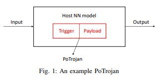

我々が残した最も重要なナレッジは、NNモデルにノードレベルでTrojanを挿入した初めての検証結果を示した事にある。本論文では、我々はNNモデルに簡単にPoTrojanを挿入できる事を示し、様々なセキュリティに関する問題を引き起こす事が可能である事を示す。  

我々の研究の貢献内容を以下に纏める。  

 * 本研究は、ノードレベルでTrojanを挿入するコンセプトを紹介した最初の事例である。  

 * 我々がこれから示す2つの事例は、PoTrojanがNNモデルにどのようにして挿入されるのか、その設計方法を提示する。  

 * 本研究は、攻撃者がターゲット予測またはラベルの学習サンプルにアクセス可能かどうかという観点に基づいて、極めてレアな条件と、Payloadを生成するTriggerを設計する一般的なアルゴリズムを提案する。  

本論文は、以下に示すセクションで構成される。  
セクション2は二つのNNサンプルを使用して我々のモチベーションを示す。  
セクション3は、NNモデルにPoTrojanを挿入するアルゴリズム設計を提示する。  
そして、セクション4は、本論文の結論を述べる。  

## 2. THREAT MODEL, RELATED WORKS, AND MOTIVATION  
### A. Threat Model  
大量の学習データへのアクセスに制限がある、または、学習データの収集コストの削減を行うケースにおいて、多くの企業はサードパーティが事前に学習させて作成したNNモデルを購入する事がある。サードパーティはインテリジェントプロパティ（以下、IP）を保護する目的で、提供するモデルをバイナリコード、または、ASICにする事がある。このため、企業（ユーザ）にとってモデルの中身はブラックボックスの状態にある。攻撃者は、一般公開されているNNモデルをダウンロードし、そのモデルのハイパーパラメータやアーキテクチャを解析する。しかし、攻撃者はターゲットの予測器や分類器の学習データにはアクセスしない。本論文のポイントは、ダウンロードされる（悪意のある設計者によって学習された）モデルやNNモデル共に、事前学習モデルとして表すことである（つまり、モデルの再学習は行わない）。  

殆どの時間、挿入されたPoTrojanは非活性状態にあるが、一度Triggerが引かれると、PoTrojanはNNモデルの出力に誤りを引き起こさせる。近年、DLモデルのセキュリティに関心が高まっているが、我々は攻撃者の観点から、PoTrojanの設計手順とNNモデルにPoTrojanを挿入する手法を提案する。

### B. Related Works
学習システムにバックドアを挿入する技術が開発されている。[6]らのバックドアは、学習データ内の特定の視覚パターンの欠乏をベースにしている。バックドアと通常の学習データが組み合わされることで、「学習サンプルのバックドア」と呼ばれるものが生成される。つまり、学習モデルは汚染された学習データを使用して再学習される事になる。  

他の検証事例である[7]は、生成されたTriggerと選択されたノード間の強い結びつきと、選択された（隠れ層の）ノードと出力ノード間の緩やかな繋がりにより、NNモデルにTrojanを隠匿する事を提案した。  

それら両方の仮説においては、攻撃者は学習モデルにアクセスする事ができる。我々の論文は、それらと同様な脅威モデルを設定する。しかし、先行研究と我々の大きな違いは、「モデルベース」と「ノードベース」という点である。先行研究である[6]と[7]は、NNモデルを再学習させる必要がある。一般的に再学習を行う場合は、元のモデルのハイパーパラメータに変更が加わるため、エラー率に影響を与える場合がある。彼らのアプローチでは、元のモデルのハイパーパラメータを変更しない事である。それ故、提案されたアプローチは、エラー率を増加させることはない。最近では、ターゲットとなる予測器や分類ラベルの学習サンプルにアクセスを伴うが、我々の方法では不要である。我々は入力層の次の層に挿入されているPoTrojanのみを必要とし、計算の複雑性に与える影響は最小限である。その上、既存手法と比較すると、攻撃の効率は非常に良い。  

### C. Definitions
以降の議論を容易にするため、本論文における幾つかの定義を紹介する。  

 * Definition 1:  
 「Triggerシナプス」は、その前の層にあるノードと接続している。  

 * Definition 2:  
 「Payloadシナプス」は、次の層にあるノードと接続している。  

 * Definition 3:  
 「Trigger入力」は、モデル内に隠匿されたPoTrojanを活性化させるための入力パターンである。  

 * Definition 4:  
 「活性化率」は、活性化関数によって計算されるノードの出力値である。  
 例えば、活性化率「0%」の場合は一切活性化されず、「50%」の場合は半分だけ活性化、「100%」は完全に活性化されることを意味する。  

 * Definition 5:  
 「ニューラル入力」は、NNへの入力パターンである。  

### D. Motivation
2つの簡単なNNモデルを使用して説明する。各モデルの機能は同じであり、4bitのバイナリ値を10進数に変換する機能を持つ。2つのNNモデルのタスクは回帰と分類である。それ故、我々は回帰NNモデルと分類NNモデルを設計し、どのようにして各NNモデル内にPoTrojanを挿入するのか解説する。  

1) 回帰モデル  
回帰モデルでは、入力パターンは{0, 0, 0, 0}から{1, 1, 1, 1}の範囲内の4bitバイナリベクトルであり、モデルの出力は0から15までの何れかの10進数となる。Fig2に示すように、本モデルは3層構造であり、1つの入力層、1つの隠れ層、そして、1つの出力層から構成される。入力層はI1~I4の「4ノード」、隠れ層はH1~H5の「5ノード」、そして、出力層はOの「1ノード」となる。入力されるバイナリベクトルは入力層から与えられる。我々は隠れ層「H1~H5」と出力層「O」の活性化関数にシグモイド関数を使用した。  

 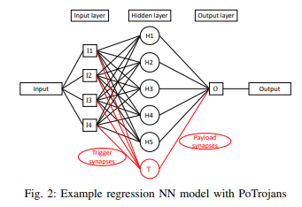

ハイパーパラメータの調整（層数、ノード数および活性化関数の選択）の後、最適化されたパラメータを求めるために、我々は(1)に示す数式（O^(i)で示される実際の出力と、O-^(i)で示される予測出力の差分（エラー率）を求める）を使用してモデルを学習させている。O^(i)とO-^(i)は実際の出力と予測出力を表している。θは各ノード間の重み、Nは学習サンプル数を示している。  

 

Table1の第2・第3列に、最適化された重み「θ*」における回帰モデルの精度を示す。  

 

それでは、この回帰モデルにPoTrojanを挿入してみる。Fig2に示すように、我々はノード「T」で示すPoTrojanを回帰モデルNNに挿入する。我々はPoTrojanがどのようにして回帰モデルの機能を危殆化させるのかを示す事にする。我々は**Tと入力ノード間に存在する4つの重みに1を設定**する。これは、ニューラル入力「Z」は、TとI1~I4と等価になる。**TのPayloadシナプスの重みは-1に設定**する。(2)に示すように、活性化関数としてシンプルなパルス関数を使用した。なお、A_TはTの活性化率である。  

 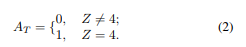  

それ故、I1~I4が4の場合のみ、T（PoTrojan）は活性化する。つまり、**入力ベクトルが{1, 1, 1, 1}の場合のみTは活性化**する。他の入力ベクトルパターンの場合はTは非活性のままであり、モデルの性能に影響は与えない。Tが活性化している間Tは1を出力し（Payloadシナプスの重みは-1なので、Tの出力1と重み-1の内積を取って「-1」となる）、これにより回帰モデルの出力は14になる（13.922が丸められる）。Table1の丸で囲まれた数字のように、回帰モデルは入力{1, 1, 1, 1}に対する出力を誤る事になる。PoTrojan（T）が1/16の確率で活性化し、それ以外の場合（15/16）は非活性状態である事を強調しておきたい。一度Triggerが引かれると、PoTrojanはモデルに大きな影響を及ぼし、回帰予測を誤らせる結果を引き起こす事になる。事実、PoTrojanのPayloadは非常に柔軟である。  

2) 分類モデル:  
Fig3に分類モデルを示す。本モデルへの入力パターンも{0, 0, 0, 0}から{1, 1, 1, 1}の4bitバイナリベクトルであるが、本モデルは16個の出力ノード（0から15までの範囲でラベルを保持）を保持しており、入力に対応する各ラベル（0~15）の確率を出力する。入力ベクトルに対し、最も高い確率を持つ出力ノードに対応するラベルを分類結果として出力する。本モデルも回帰モデルと同様に、1つの入力層、1つの隠れ層、1つの出力層を持っている。加えて、本モデルはソフトマックス層（各出力の確率の総和が1になる）を持っている。  

 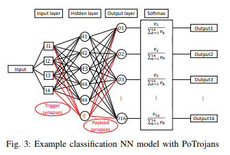  

入力層はI1~I4の4ノード、隠れ層はH1~H5の5ノード、そして、出力層はO1～O15の16ノードとなる。入力層は入力バイナリベクトルの畳み込み機能を提供し、入力バイナリベクトルの1番目・2番目・3番目・4番目の各bit値は、それぞれI1~I4に与えられる。我々は隠れ層のノード（H1~H5）の活性化関数にシグモイド関数を使用した。  

ハイパーパラメータ（層数、各層のノード数、活性化関数の選択）を設定した後、最適化されたパラメータを取得するために数式(3)を使用してモデルの学習を行う。この数式は、「O^(i)で示される実際の出力確率分布」と「O-^(i)で示される予測の出力確率分布」間の交差エントロピーをベースにしている。  

 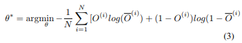

Table2の第2・第3列は、最適化されたθ*を使用した分類器の精度を示している。再度、PoTrojanをこのモデルに挿入してみる。TriggerとPoTrojan（T）の活性化関数は、回帰モデルの場合と同じである。異なる点はPayload部分である。このモデルを攻撃するために、PoTrojanニューロンとO1間のシナプスの重みを、PoTrojanニューロンとOk間のシナプスの重みよりも圧倒的に大きく設定する（1 ≦ k ≦ 15）。一度PoTrojanのTriggerが引かれると、ノード「O1」の活性化率は（出力層の）他ノードの値よりも大きくなる。ソフトマックス関数は数式(1)に示す確率分布の和とみなされるため、出力ノード「O1」は大きな確率を持つことになり、他の出力ノード「O2~O16」は小さな確率を持つことになる。これにより、活性化されたPoTrojanはTable2の丸で囲まれた部分のように、入力ベクトル{1, 1, 1, 1}に対して誤ったラベル「0」を出力してしまう。  

 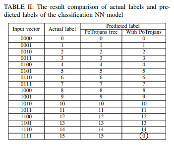  

## 3. GENERAL ALGORITHMS OF INSERTING POTROJAN IN PRE-TRAINED MODELS
本セクションでは、実際のNNモデルにPoTrojanを挿入する方法と、その設計に関する一般的なアルゴリズムを示す。実際のDLモデルはセクション2で示した単純なモデルと比べるとより複雑である。しかし、本セクションではDLモデルにPoTrojanを容易に挿入出来る事を示す。我々は最初にPoTrojanの「Trigger」と「Payload」の設計方法について提案し、事前学習されたDLモデルに「Trigger」と「Payload」を挿入する方法を議論する。  

### A. Design of trigger
PoTrojanは隠匿化する必要があるため、低い確率で活性化されるべきである。例えば、攻撃者はTrigger入力として1つの画像を入力する。危殆化されたモデルがその画像を受け取った場合にPoTrojanがTriggerを引くようにする。攻撃者は、Trigger入力以外の入力によって偶発的にTriggerが引かれてしまうことを防ぐ必要がある事を強調する。本セクションでは、挿入されたPoTrojanを活性化するための極めてレアな活性化条件を提供する2つの異なるTrigger設計を示す。  

1) Single-neural PoTrojans:  
Fig4に示すように、シングルノードのPoTrojanは、n番目層に1つのノードのみが挿入される。  

 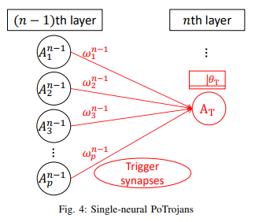

我々は(n-1)番目層にp個のノードを見ることができる。(n-1)番目層のi番目のノードの活性化率を「A_i^n-1（i ∈ [1, p])」、i番目のTriggerシナプスの重みを「w_i^n-1」、そして、PoTrojanニューロンの活性化率を「A_T」として表す。PoTrojanの活性化関数はパルス関数である。数式(4)に示すように、本関数の閾値はθ_Tとなる。  

 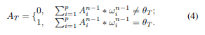

モデルにTrigger入力が選択された場合、(n-1)番目層のi番目のノードの活性化率を「a_i^n-1 (i ∈ [1, p])」として表す。我々はθ_Tを数式(5)のように設定する。  

それ故、PoTrojanは数式(6)の場合に活性化される。  

 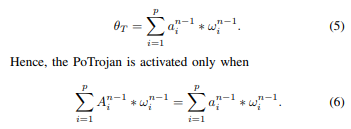

Trigger入力は、モデルの予測/分類範囲内の任意のクラスに紐付かないように注意深く選択する。それはNNモデルによって低い信頼値で予測/分類されるだろう。我々が言及した数式(6)は極めてレアな条件である。モデル関数の(n-1)番目層内のノードは特徴フィルタとなる。例えば、異なる画像間ではピクセル値の合計等、同じ低レベルの特徴を持つ場合がある。しかし、**NNモデルは上位レベルの特徴の違いに基づいてオブジェクトを予測/分類する**ため、異なる画像間の高レベルの特徴は微分的になる。それ故、Triggerシナプスが接続されているNNの上位層ほど、隠れ層のPoTrojanが偶発的にTriggerされる可能性は低くなる。その上、Trigger入力に似た入力でさえも、ProTrojansのために全く同じニューラル入力を生成するのは難しくなる。この種の複数のPoTojansを組み合わせることで、更にレアなTrigger条件を作成することができる。  

2) Multiple-neural PoTrojans:  
レアなTrigger条件を生成する代替策は、Fig5に示すような既存の活性化関数を使用した複数ノードのPoTrojanである。そのPoTrojanは「Tri1, Tri2, T」の3ノードで構成される。Tri1とTri2はTriggerニューロンと呼ばれる。Tri1, Tri2, Tは、活性化関数としてバイナリステップを使用する。(n-1)番目層のノードは、Tの代わりにTri1, Triに接続される。  

 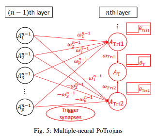)

Tri1のTriggerシナプスの重みは、「w_1^n-1, w_2^n-1, w_3^n^1 … w_p^n-1」として表される。逆に、Tri2のTriggerシナプスの重みは、「-w_1^n-1, -w_2^n-1, -w_3^n^1 … -w_p^n-1」のように**Triの重みのマイナス**として設定される。Tri, Tr2,Tの活性化率は、ATri1, ATri2, AT、Tri1, Tri2, Tの活性化する閾値は、θTri1, θTri2, θTとして表される。Tri1の活性化率は数式(7)で計算される。

 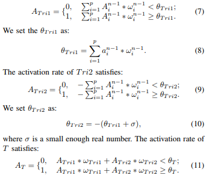

我々は数式(8)でθTri1を設定する。  
Tri2の活性化率は数式(9)で計算される。  
我々は「σ」が十分に小さい値の場合、θTri2を数式(10)で計算する。  
「ωTri1, ωTri1 ∈ (0, +∞)」の場合、Tの活性化率は数式(11)で計算される。ここで、「Atri1, Atri2 ∈ {0, 1}」である事に留意する。従って数式(12)で計算される。  

 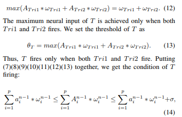  

Tの最大のニューラル入力は、Tri1とTri2が発火した場合のみ達成される。  

その上、PoTrojan（T）は、**Tri1とTri2が発火するという極めてレアな条件下の場合のみ発火**する。(7)~(13)を纏めると、PoTrojanのTriggerが引かれる条件は数式(14)となる。  

### B. Design of payload
PoTrojanのTriggerが引かれると、（Fig6に示すように）Payloadシナプスはそれが接続されている全ノードにその活性化率の値を渡すため、PayloadはNNモデルの出力に影響を及ぼす。  

 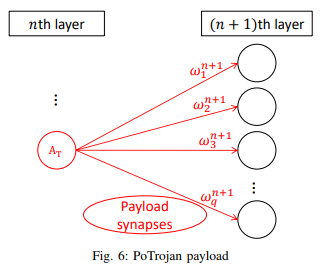

これを(n+1)番目層のノード「q」ニューラルとする。j番目のPayloadシナプスの重みは、「ω_j^n+1 (j ∈ [1, q])」として表される。ベクトル{ω_1^n+1, ω_2^n+1, ω_3^n+1, ..., ω_q^n+1}は「ξ」、「ξ∗」は最適化された重みベクトルとして表される。  

回帰モデルでは、選択されたTrigger入力が危殆化されたモデルに入力された場合、攻撃者の目的はモデルにターゲットとなる予測を出力させる事になる。分類モデルでは、攻撃者の目的はターゲットとなるラベルの出力確率が（元の）NNモデルの平均精度に近くさせる事である。入力が選択されたTrigger入力である場合、ターゲットの予測値、またはターゲットラベルの確率は「V*」であり、危殆化されたモデルのターゲットラベルの予測値、または出力確率は「Ｖ^」であると仮定する。そして、この目的は数式(15)のように表される。  

 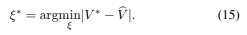

a）ターゲットとなる予測/ラベルの学習データへのアクセス権を持つ場合：  
攻撃者が合法的にターゲットを予測するか、または、ターゲットラベルとして分類されるターゲットオブジェクトの任意の1つの学習インスタンス「Itar」にアクセスできる場合のニューラル入力を仮定する。モデルにPoTrojanを挿入する前にItarを入力し、PoTrojanを挿入した後に「Zn+1」を入力すると、(n+1)番目層のノードのZ^n+1が出力される。  

我々が求めたい最適化された重みベクトル「ξ∗」を計算するために数式(16)を使用する。  

 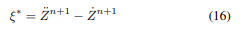  

b）ターゲットとなる予測/ラベルの学習データへのアクセス権を持たない場合：  
攻撃者がターゲット予測またはターゲットラベルの学習インスタンスにアクセスできない場合、「Z^n+1」を直接取得することはできない。(n+1)番目層のノードの入力が「…Z^n+1」であると仮定すると、危殆化されたモデルは所望の予測値、またはターゲットラベルの確率を出力する。「…Z^n+1」を計算するために先行研究[7]と同様のアルゴリズムを適用することを提案する。Y.Liuetalらの先行研究[7]では、顔認識モデルが信頼性の高い特定のラベルを出力する原因となるリバースエンジニアリング入力（我々の場合はリバースエンジニアリングをするだけで良いが、「…Z^n+1」）。損失関数は数式(17)に示す通りであり、ここで損失は「L」として定義される。勾配は数式(18)で計算される。  

 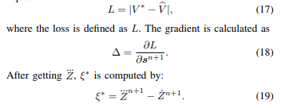  

「…Z, ξ∗」を取得した後、数式(19)が計算される。  

我々が(n+1)番目層のニューラル入力のみを訓練したことに注目して欲しい。その上、我々のアプローチは学習モデル全体の再学習を必要とする他関連研究と比較すると、非常に効率が良いと言える。  

## IV. CONCLUSIONS
本論文の目的は、PoTrojanの設計、そして、事前学習されたDLモデルの中にPoTrojanを挿入することである。我々が提案したアプローチは非常に効率的であり、必要最小限の追加ノードのみが必要であり、そして、既存モデルのエラー率を増やす事もない。更に我々は、挿入されたPoTrojanが偶発的に活性化することを防ぐ、極めてレアな条件を作り出すための2つの異なるTriggerを設計した。攻撃者がターゲット予測の学習インスタンスにアクセスするか、分類ラベルにアクセスするかに基づく2種類のペイロードも、PoTrojansのTriggerが引かれると既存モデルを誤動作させるように設計されている。  

我々は、提案されたPoTrojanが起動される前にそれらの戦術を検証し、それらが起動された場合にそれらがホストモデルに与える影響を検証する実験に取り組んでいる。  
