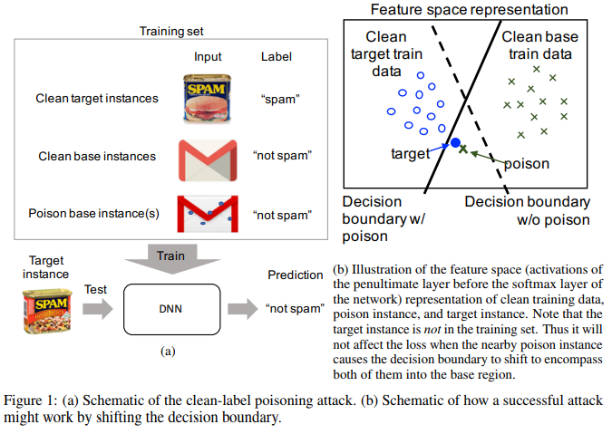
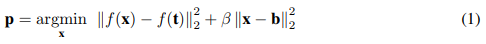
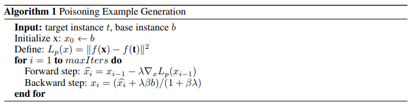
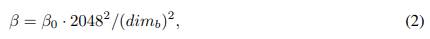
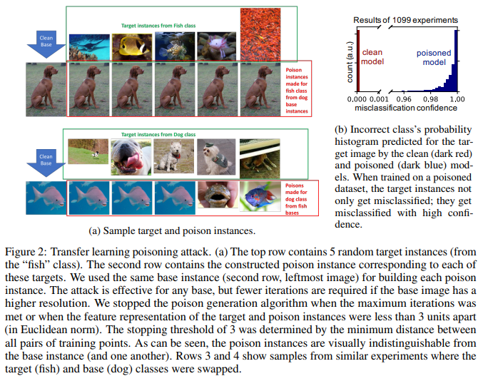
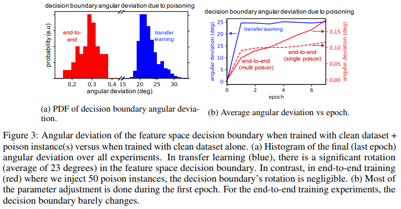
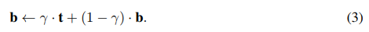
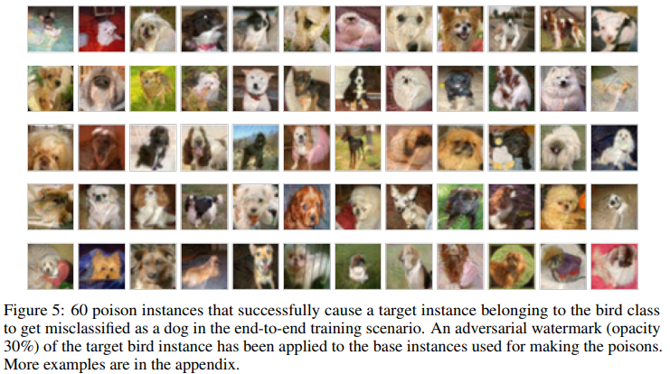
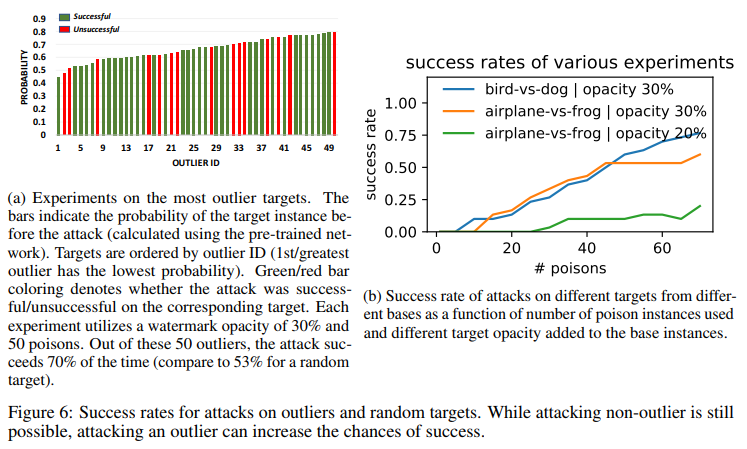
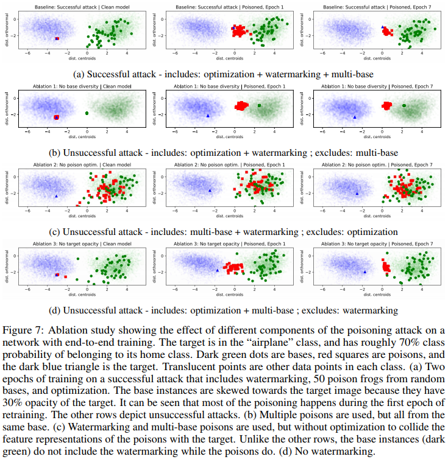

# Poison Frogs! Targeted Clean-Label Poisoning Attacks on Neural Networks

## Abstract
Data poisoning is a type of adversarial attack on machine learning models wherein the attacker adds examples to the training set to manipulate the behavior of the model at test time. This paper explores a broad class of poisoning attacks on neural nets. The proposed attacks use “clean-labels”; they don’t require the attacker to have any control over the labeling of training data. They are also targeted; they control the behavior of the classifier on a specific test instance without noticeably degrading classifier performance on other instances.

For example, an attacker could add a seemingly innocuous image (that is properly labeled) to a training set for a face recognition engine, and control the identity of a chosen person at test time. Because the attacker does not need to control the labeling function, poisons could be entered into the training set simply by putting them online and waiting for them to be scraped by a data collection bot. We present an optimization-based method for crafting poisons, and show that just one single poison image can control classifier behavior when transfer learning is used. For full end-to-end training, we present a “watermarking” strategy that makes poisoning reliable using multiple (≈ 50) poisoned training instances. We demonstrate our method by generating poisoned frog images from the CIFAR dataset and using them to manipulate image classifiers.

## 1 Introduction
Before deep learning algorithms can be deployed in high stakes, security-critical applications, their robustness against adversarial attacks must be put to the test. The existence of adversarial examples in deep neural networks (DNNs) has triggered debates on how secure these classifiers are [Szegedy et al., 2013, Goodfellow et al., 2015, Biggio et al., 2013]. Adversarial examples fall within a category of attacks called evasion attacks. Evasion attacks happen at test time – a clean target instance is modified to avoid detection by a classifier, or spur misclassification. However, these attacks do not map to certain realistic scenarios in which the attacker cannot control test time data. For example, consider a retailer aiming to mark a competitor’s email as spam through an ML-based spam filter. Evasion attacks are not applicable because the attacker cannot modify the victim emails. Similarly, an adversary may not be able to alter the input to a face recognition engine that operates under supervised conditions, such as a staffed security desk or building entrance.

Such systems are still susceptible to data poisoning attacks. These attacks happen at training time; they aim to manipulate the performance of a system by inserting carefully constructed poison instances into the training data. This paper studies poisoning attacks on neural nets that are targeted, meaning they aim to control the behavior of a classifier on one specific test instance. For example, they manipulate a face recognition engine to change the identity one specific person, or manipulate a spam filter to allow/deny a specific email of the attacker’s choosing. We propose clean label attacks that do not require control over the labeling function; the poisoned training data appear to be labeled correctly according to an expert observer. This makes the attacks not only difficult to detect, but opens the door for attackers to succeed without any inside access to the data collection/labeling process. For example, an adversary could place poisoned images online and wait for them to be scraped by a bot that collects data from the web. The retailer described above could contribute to a spam filter dataset simply by emailing people inside an organization.

Such systems are still susceptible to data poisoning attacks. These attacks happen at training time; they aim to manipulate the performance of a system by inserting carefully constructed poison instances into the training data.

This paper studies poisoning attacks on neural nets that are targeted, meaning they aim to control the behavior of a classifier on one specific test instance. For example, they manipulate a face recognition engine to change the identity one specific person, or manipulate a spam filter to allow/deny a specific email of the attacker’s choosing. We propose clean label attacks that do not require control over the labeling function; the poisoned training data appear to be labeled correctly according to an expert observer. This makes the attacks not only difficult to detect, but opens the door for attackers to succeed without any inside access to the data collection/labeling process. For example, an adversary could place poisoned images online and wait for them to be scraped by a bot that collects data from the web. The retailer described above could contribute to a spam filter dataset simply by emailing people inside an organization.

### 1.1 Related work
Classical poisoning attacks indiscriminately degrade test accuracy rather than targeting specific examples, making them easy to detect. While there are studies related to poisoning attacks on support vector machines [Biggio et al., 2012] or Bayesian classifiers [Nelson et al., 2008], poisoning attacks on Deep Neural Networks (DNN) have been rarely studied. In the few existing studies, DNNs have been shown to fail catastrophically against data poisoning attacks. Steinhardt et al. [2017] reported that, even under strong defenses, there is an 11% reduction in test accuracy when the attacker is allowed 3% training set modifications. Muñoz-González et al. [2017] propose a back-gradient based approach for generating poisons. To speed up the process of generating poisoning instances, Yang et al. [2017] develop a generator that produces poisons.

A more dangerous approach is for the attacker to target specific test instances. For example, the retailer mentioned above, besides achieving her target goal, does not want to render the spam filter useless or tip off the victim to the presence of her attack. Targeted backdoor attacks [Chen et al., 2017] with few resources (∼50 training examples) have been recently shown to cause the classifier to fail for special test examples. Gu et al. [2017] trains a network using mislabeled images tagged with a special pattern, causing the classifier to learn the association between the pattern and the class label. In Liu et al. [2017] a network is trained to respond to a trojan trigger.

These attacks present the same shortcomings as evasion attacks; they require test-time instances to be modified to trigger the mispredictions. Moreover, in most prior work, the attacker is assumed to have some degree of control over the labeling process for instances in the training set. This inadvertently excludes real-world scenarios where the training set is audited by human reviewers, who will label each example as it appears to the eye, or where the labels are assigned by an external process (such as malware detectors which often collect ground truth labeled by third party antiviruses). Assumed control over the labeling function leads to a straightforward one-shot attack wherein the target instance with a flipped label is added as poison. Overfitting on the poison would then ensure that the target instance would get misclassified during inference time.

The most closely related work to our own is by Suciu et al. [2018], who study targeted attacks on neural nets. This attack requires the attacker to have complete control over the formation of training batches used during SGD, and so can only be executed by an engineer that exerts control over the entire training process.

### 1.2 Contributions
本検証において、我々が研究した新しいタイプの攻撃手法を以降「Clean-Label Attacks」と呼ぶことにする。ここで、攻撃者が挿入した学習データは、正常データとして識別される正常のラベルであり、攻撃者自身によって作成される悪意のあるラベルとは正反対のものである。我々の戦略は、攻撃者は学習データに関する知識を有していないものとするが、モデルとハイパーパラメータに関する知識は有しているものとする。これは、ImageNetで学習されたInception、または、ResNetのように、共有された標準的なデータセットで事前学習されている多くのモデルが与えられている現実世界に置いては、合理的な仮説である。攻撃者の目標は、汚染された学習データを含む拡張されたデータセットでモデルが再学習された後、再学習されたモデルが特別なテストデータを1つのクラス（マルウェアなど）から別のクラス（良性クラス）に誤分類させる事である。ターゲットに対する意図的な誤分類以外に、ターゲットとなる分類器のパフォーマンス低下はそれほど顕著にならない。この手法は、学習されたモデルのパフォーマンスを計測する最新のデータ汚染対策を無効化することができる。  

なお、ネットワークの全結合層を操作して関数の挙動に影響を与える類似の手法（Koh and Liang [2017]）では、汚染されたデータセットで再学習されたモデルの精度は57%に留まる。  

我々は、Koh and Liang [2017]によって研究された転移学習シナリオ下で最適化ベースのClean-Label Attacksを実証するが、我々は先行事例と同じ「Dog vs Fish」分類タスクにおいて、100%の精度を達成する。その上、我々はネットワークの全ての層（入力から出力まで）が再学習されるシナリオにおいて、Clean-Labelによる汚染を実証する。可視化を通して、なぜこのシナリオがDNNの表現の為に難しいのかを明らかにする。これらの可視化情報に基づき、全層の学習シナリオで最大60%の攻撃成功率を達成することができる、DNNへの50汚染データ攻撃を実証する。  

 

## 2 A simple clean-label attack
学習データに追加された場合、分類器のテストフェーズ時の振る舞いを操作する、汚染されたデータを作成するための最適化ベースの手順を提案する。その後、このシンプルな攻撃の破壊力を高めるためのトリックについて説明する。  

攻撃者は先ず、テストセットからターゲットとするデータを選択する。汚染攻撃が成功すると、このターゲットのデータはテスト時に誤ったラベルに分類される。次に、攻撃者はベースクラスからベースデータをサンプリングし、それに感知できない程の微細な変更を加えて有害なデータを作成する。この汚染は、テスト時にモデルを騙してターゲットデータをベースラベルでラベル付けする目的で学習データに挿入される。最後に、モデルは汚染されたデータセット（正常データセット＋汚染データ）を使用して再学習される。テストフェーズにおいて、モデルがターゲットデータをベースクラスにあると誤分類した場合、汚染攻撃は成功したとみなす。Figure1(a)は、我々の攻撃手法を示している。  

### 2.1 Crafting poison data via feature collisions
数式1は、f(x)が入力「x」をネットワークを通じて最後から2番目の層（ソフトマックス層の手前）に伝播する関数を示している。この層の活性化は、それが高水準の意味的特徴を符号化するため、入力の特徴空間表現と呼ぶ。fの複雑さと非線形性が高いため、数式1を計算することで、入力空間でベースインスタンス「b」に近いのと同時に、特徴空間でターゲットと「衝突する」データ「x」を見つけることができる。  

 

数式1の第2項は、汚染データ「p」を人間の分類係りにとってベースクラスのデータであるように見せかけ（βは見せかけの程度をパラメータ化する）、そのようにそれ自体をラベル付けされる。一方で、数式1の第1項では、汚染データは特徴空間内のターゲットデータに向かって移動し、ターゲットクラスの分布に埋め込まれる。Clean-Modelでは、この汚染されたデータはターゲットとして誤って分類される。ただし、モデルを正常データ＋汚染データで再学習させると、誤分類を避けるために特徴空間内の線形決定境界（Figure1(b)）が決定インスタンスのベースクラス側に含まれるように回転する。ターゲットデータが近くにあるため、決定境界の回転は汚染データと共に誤ってターゲットクラスをベースクラスに含める可能性がある（学習は汚染データの正しい分類のために努力するが、ターゲットデータの一部ではないので注意する）。これにより、テスト時にベースクラスに誤って分類された混乱の無いターゲットデータが、ベースクラスに「バックドア」を取得する事が可能になる。  

### 2.2 Optimization procedure
汚染データ「p」を獲得するために、数式1における最適化を実行するための我々の手順をアルゴリズム1に示す。アルゴリズムは、十方向・逆方向の分割反復処理を使用する（Goldsteinら[2014]）。  

第1の（前方）ステップは、特徴空間内のターゲットデータまでのL2距離を最小にするための単純な勾配降下更新である。第2（後方）ステップは、入力空間内のベースデータからのフロベニウス距離を最小化する近似更新である。係数「β」は、疑り深い人間の観察者が攻撃ベクトル画像が改ざんされていないと考える事を欺くに十分なほど、汚染データが入力空間において現実的に見えるように調整される。  

 

## 3 Poisoning attacks on transfer learning
我々は、事前学習された特徴抽出ネットワークが使用され、そして、最後の層（ソフトマックス）のみがネットワークを特定のタスクに適応させるように学習される転移学習のケースを調査する事から始める。この手順は、限られたデータに対して精度の高い分類器を作成したい場合に使用される一般的な方法である。この場合、我々の攻撃は非常に効果的である。セクション4では、これらの攻撃をEnd-to-Endの学習のケースに一般化する。  

本検証の実験を2回行う。先ず、最後の層を除くすべての層の重みが固定されているシナリオ下で、事前学習済みのInception V3ネットワークを攻撃する。我々のネットワークとデータセット（ImageNet、Dog vs Fish）は、Koh and Liang[2017]の研究と同じものである。次に、Krizhevsky and Hinton[2009]によってCIFAR-10データセット用に修正されたAlexNetネットワークを、全ての層が学習されるというシナリオ下で攻撃する。  

### 3.1 A one-shot kill attack
我々は今、転移学習ネットワークへのシンプルな汚染攻撃を提案する。この場合、One-Shot-Kill」攻撃が可能である。データセットにただ1つの汚染データを追加する事によって（信頼できる専門家によってラベル付けされたもの）、我々は100%の成功率でターゲットの誤分類を引き起こさせることが可能である。  

Koh and Liang[2017]と同様に、我々は特徴抽出としてInception V3を利用し、「犬と魚」を分類するために全結合層のみを再学習させる。ImageNetの各クラスから900のデータを学習データとして選択し、前処理3として学習データに存在するテストデータから重複を排除する。これ以降は、1099個のテストデータ（犬クラスのデータ698個、魚クラスのデータ401個）が残る。  

テストセットからターゲットデータとベースデータの両方を選択し、「maxIters=100」のアルゴリズム1を使用して汚染データを作成します。ImageNetの画像は次元が異なるため、数式2を利用して数式1のβを計算する。  

   

数式2の2048がInception V3の特徴空間の次元数を表し、dimbがベースデータ入力画像の次元数を表す。我々の検証では、「β0=0.25」を使用する。  

次に、汚染データを学習データに追加し、コールドスタート学習を実行する（全ての未凍結の重みはランダムな値に初期化される）。Adamを学習率0.01で使用し、100エポックの間にネットワークを学習させる。  

検証は1099回実行され、それぞれターゲットデータとして異なるテストセット画像が使用され、攻撃成功率は100%になった。比較するために、Koh and Liang[2017]で提案された影響関数法は、57%の成功率であった。誤分類信頼度の中央値は99.6%であった（Figure2(b)）。さらに、全体的な試験精度は汚染による影響を殆ど受けず、全ての検証に渡って元の99.5%から平均で0.2%、最悪の場合でも0.4%低下するに留まった。幾つかのサンプルターゲットデータとそれに対応する汚染データをFigure2(a)に示す。  

   

一般的に、転移学習タスクで100%の精度を得ることは不可能である。Dog vs Fishタスクにおいて、Inception V3を使用して上記のような精度を得ることができるのは、学習データ（1801）よりも学習可能な重み（2048）が多いためである。データ行列がフルランク（重複なし）である限り、重みベクトルを見つけるために解く必要がある連立方程式は決定不足であり、結果として複数の解決策がある。全ての学習データへの過剰適合が発生する事は確実である。  

何が攻撃を成功させるのかをより理解するために、Figure3に「Cleanなネットワーク」と、「汚染されたネットワーク」の決定境界間の角度偏差（重みベクトル間の角度差）をプロットする（青いバーとライン）。角度偏差は、汚染データを再学習することにより、決定境界が回転してベース領域内の汚染データを包含した程度である。この逸脱は、Figure3(b)にみられるように、最初のエポックで大部分が発生し、より多くのエポックが与えられた時、攻撃が最適以下の再学習ハイパーパラメータの下でも成功する事を示唆している。平均23度の最終偏差（Figure3(a)）は、最終層の決定境界に対する大幅な変更が汚染データによって行われている事を示している。これらの結果は、決定境界の変化が原因でターゲットの誤分類が発生しているという、我々の仮説を裏付ける事になる。  

以下、ネットワークの全ての層が再学習された場合の効果的な攻撃手法を提案する。この「End-to-End」の学習シナリオ（Figure3(a)の赤いバーとライン）では、決定境界は固定されており、成功した汚染が発生する異なるメカニズムを意味している。このシナリオについては、次のセクションで説明する。  

## 4 Poisoning attacks on end-to-end training
ネットワークの特徴抽出層が再学習されていない場合、汚染攻撃はシンプルで極めて効果的であることがセクション3で示された。全ての層が学習可能となると、これらの攻撃は更に難しくなる。しかし、「透かし」のトリックと複数の汚染されたデータを使用する事で、我々は依然として効果的に「End-to-End」のネットワークを汚染させることができる。  

   

我々のEnd-to-Endの検証は、より小さなネットワークとデータセット4に焦点を当てている。CIFAR-10データセット用に縮小されたAlexNetネットワークを学習し、事前学習済みの重みで初期化し（ウォームスタート）、Adamで10エポック以上の学習率1.85*10^-5で最適化した。ウォームスタートのため、ネットワークが汚染データを正しく分類するように再調整された後の最後の数エポックに渡って、損失は一定であった。我々は、汚染データが高い信頼性で正しく分類されている事を証明する事によって、十分な訓練が実施された事を検証した。  

### 4.1 Single poison instance attack
我々は、1つの汚染データでネットワークを攻撃する事象を調査する事から開始する。我々の目標は、ネットワークの動作に対する汚染の影響を視覚化し、End-to-Endの学習シナリオ下での汚染攻撃が、転移学習のシナリオよりもはるかに難しい理由を説明する事である。実証では、ターゲットクラスとして「飛行機」、ベースクラスとして「カエル」をランダムに選択した。汚染データを作成するために、我々はβ値0.1とmaxIters12,000を使用した。  

Figure4(a)は、193次元の特徴ベクトルを2次元平面に投影する事によって視覚化されたターゲット、ベース、および汚染特徴空間表現を示している。最初の次元はベースクラスとターゲットクラスの重心を結ぶベクトル（u=μbase-μtarget）に沿ったものであり、2番目の次元はuと直行する平面上のuとΘ（の重みベクトル）に沿ったものである（操作される層の重みベクトル、例えば決定境界の法線）。この射影により、2つのクラス（ターゲットとベース）の分離を最もよく表す観点から、データ分布を視覚化できる。  

次に、Cleanデータ＋1つの汚染データを使用してモデルを学習する事により、汚染攻撃を評価する。Figure4(a)は、Cleanな（塗り潰されていないマーカー）モデル、および汚染されている（塗り潰されているマーカー）モデル下での学習データと共に、ターゲット・ベース、および汚染データの特徴空間表現を示す。それらのCleanなモデル特徴空間表現において、ターゲットと汚染データは重なり合っており、我々の汚染データ作成の最適化手順（アルゴリズム1）が成功している事を示している。  

奇妙な事に、最後の層の決定境界がベース領域内の汚染データを収容するために回転する転移学習シナリオとは異なり、End-to-Endの学習シナリオにおける決定境界は、汚染データセットについて再学習した後も変化していない。これから、我々は以下の重要な観察を行う：汚染データで再学習する間に、汚染データが深い層のベースクラス分布に戻されるように、浅い層のその下位レベルの特徴抽出カーネルを修正する。  

言い換えると、汚染データの作成は、汚染データが特徴空間内でターゲットと並んで配置されるように、以前の層内の特徴抽出カーネルの不完全さを利用する。この汚染データでネットワークが再学習されると、それはベースとしてラベル付けされるため、それらの初期層の関数カーネルの不完全性は修正され、汚染データはベースクラスの分布に返される。この結果は、汚染データの生成とネットワーク学習の目的が互いに反対であることを示している。従って、極端な異常値のターゲットデータでも妥協するには1つの汚染だけでは不十分な場合がある。攻撃を成功させるためには、再学習の際にターゲットデータと汚染データが特徴空間で分離されないようにする方法を見つける必要がある。  

### 4.2 Watermarking: a method to boost the power of poison attacks
学習中に汚染データとターゲットデータが分離しないようにするために、シンプルで効果的なトリックを使用する。ターゲットデータの不透明度の低い透かしを汚染データに追加して、不可視の特徴の重複を視覚的に不明瞭にする。これにより、ターゲットデータの一部の特徴が汚染データにブレンドされ、汚染データは、再学習後もターゲットデータに近接した特徴空間内に留まる。透かしは、以前にChenetal[2017]らが提案したが、彼らの検証は推論時間の間に透かしが適用されることが前提条件であった。これは、攻撃者がターゲットデータを制御できない状況下では非現実的である。  

   

「γ」のターゲット不透明度を伴う透かし画像は、数式3として表せられる。  

   

ランダムに選ばれた幾つかの汚染データは付録に示されている。透かしは、一部のターゲットデータでは最大30%の不透明度であっても視覚的に目立たない。Figure5は、「鳥」のターゲットデータを攻撃するのに使用される、60個の汚染データを示している。  

#### 4.2.1 Multiple poison instance attacks
End-to-Endの学習シナリオでの汚染は、ネットワークがターゲットと汚染を適切に区別する関数の埋め込みを学習するため困難である。しかし、異なるベースデータから派生した複数の汚染データを学習データに挿入するとどうなるだろうか？  

   

   

分類器が複数の汚染に対抗するためには、ターゲットデータがターゲット分布に残っている事を確実にしながら、全ての汚染データを標的から分類する特徴の埋め込みを学習しなければならない。我々は検証において、多様性の高いベースを使用する事により、中規模ネットワークがベースの特徴とは異なるターゲットの特徴を学習することを妨げる事を示す。その結果、ネットワークが再学習されると、ターゲットデータは汚染データと共にベース分布に引き寄せられ、攻撃はしばしば成功する。これらのダイナミクスはFigure4(b)に示されている。  

Figure3では、多数の汚染実験でも最終層の決定境界が変わらない事が分かった。これは、転移学習とEnd-to-Endの学習シナリオでは、汚染が成功するための根本的に異なるメカニズムがある事を示唆しています。転移学習は、ターゲットを囲むように決定境界を回転させることによって汚染に反応する。一方、End-to-Endの学習は、ターゲットを（特徴空間内の）ベース分布に引き込む事によって反応する。  

ターゲットデータの誤分類が決定境界の変更によるものである転移学習シナリオとは異なり、End-to-Endの学習シナリオの決定境界は示されているように、汚染データセットの再学習中に停止している（1度の分数で変化。Figure3に示す）。  

汚染データの数が攻撃の成功率にどのように影響するのかを定量化するために、1~70の間の汚染データ数毎に実験を実行した（増分は5）。各実験では、テストセットからランダムに選択されたターゲットデータを使用した。各汚染データは、テストセット内のランダムベースから生成した（結果として、汚染データ間で大きな特徴の多様性が生じた）。30%または20%の透かし入れの不透明度も、汚染とターゲットデータの間の特徴の重なりを強調するために使用された。攻撃成功率（30回以上のランダム試行）をFigure6(b)に示す。成功率がクラスに依存しないことを確認するために、CIFAR-10内の異なるターゲット、ベースクラスのペアについて、30の実験セットを繰り返した。我々はより低い不透明度を試み、成功率が下がるのを観察した。成功率は、汚染の発生数と共に単調増加する。例えば50の汚染データでは、成功率はBird vs Dogのタスクで、約60%であった。成功の定義をベースとして分類されたターゲットデータの数に制限する。ターゲットデータがベース以外のクラスに誤って分類された場合でも、攻撃は失敗したと見なす。  

データの数れ値をターゲットにすることで、この攻撃の成功率を上げる事ができる。これらのターゲットは、クラス内の他の学習サンプルとはかけ離れているため、クラスラベルを反転する方が簡単である。我々は、最も低い分類信頼度で50個の「飛行機」をターゲットとし（しかし、それでも正しく分類されて）、攻撃毎に50匹の「汚染カエル」を使ってそれらを攻撃する。この攻撃の成功率は70%であり（Figure6(a)）、これはランダムに選んだターゲットよりも17%高い。  

纏めると、End-to-Endの学習シナリオでのCleanラベル攻撃では、(1)アルゴリズム1による最適化、(2)様々な汚染データ、(3)透かし入れ、という複数の手法が必要である。  

### 4.3 Ablation study: How many frogs does it take to poison a network?
上記の各汚染攻撃の効果を示すために、leave-one-out切除検証を行う。（敵対的学習の前後の）特定のターゲットデータを攻撃するための特徴表現はFigure7に視覚化されている。上記の全ての方法（行a）を使用したプロセスの結果が表示され、攻撃が成功する。  

行(b)は、1つのベースのみを使用して全ての汚染データを生成するプロセスを示している。同じベースから複数の敵対的データを用いた学習は「敵対的学習」と呼ばれ、敵対的なデータに対してネットワークを頑健にする事ができる。このため、ベース画像を再利用すると汚染が失敗する。行(c)は特徴衝突を生じさせるための最適化を除外するプロセスを示し、(d)は透かし入れを省くプロセスを示す。  

## 5 Conclusion
我々はテスト時の動作を操作する事を目的として、学習時にネットワークを攻撃する、ターゲットを絞ったCleanラベルの汚染攻撃方法を調査した。他の汚染攻撃とは異なり、これらの攻撃は疑わしくない（正しいラベル付けされた）学習データを含んでいるために検出が困難であり、非ターゲットデータに対する分類器の性能を低下させる事はない。  

提案した攻撃手法は、特徴空間内のターゲット画像と衝突する汚染画像を作成するため、ネットワークがこれら2つの間を識別する事を困難にする。これらの攻撃は、転移学習のシナリオでは非常に強力であり、複数の汚染画像と透かしのトリックを使用する事で、より一般的な状況で強力になる可能性がある。  

汚染データを用いた我々の学習は、回避攻撃に対する防御として使用される敵対的学習技術に似ている事に注意してほしい。この汚染データは、ここではベースクラスに対する敵対的なデータと見なすことができる。我々の汚染データセットの学習は、実際にはターゲットとして誤って分類されるように設計されたベースクラスの敵対的なデータに対してネットワークをより堅牢にするが、変更されていないターゲットデータをベースとして誤って分類する原因にもなる。本検証では、敵対的学習のこの副作用が悪用されており、さらに調査する価値がある。  

多くのニューラルネットワークは、攻撃者によって容易に操作されるデータソース（Webから取得された画像・テキスト・コードなど）を使用して学習される。汚染攻撃が成功すると、通常のテスト時の攻撃よりも作成が困難になるが、この作業によってデータの信頼性と由来に関する重要な問題に注目が集まることを期待している。  

   
